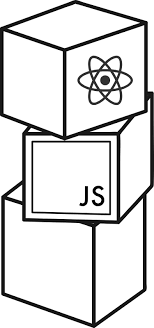
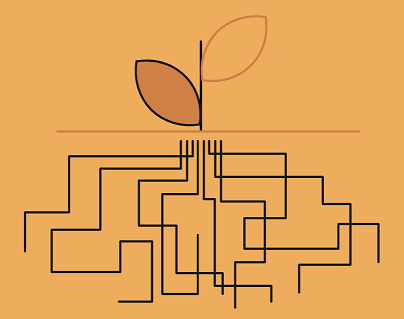
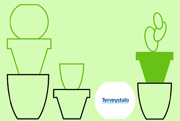
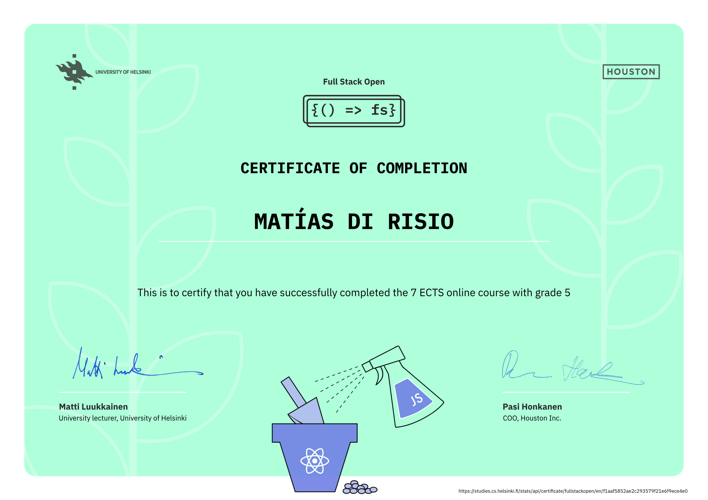
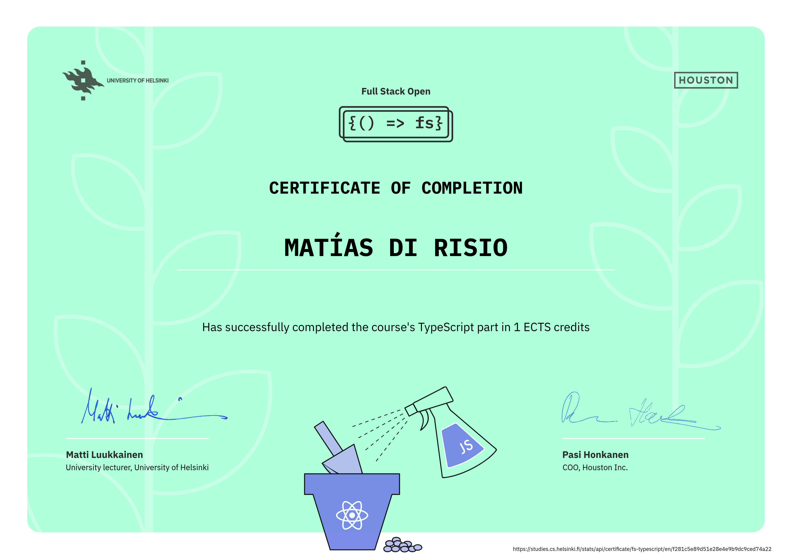

# Full Stack Open 🧐

En este repositorio, se encuentran mis respuestas a los ejercicios del curso [Full Stack Open](https://fullstackopen.com/es/), dictado por la [Universidad de Helsinki](https://www.helsinki.fi/en) en colaboración con [Houston Inc.](https://www.houston-inc.com/)

## Desarrollador 👨‍💻:

- **Desarrollador:** Matías Di Risio 👍
- **GitHub:** [DiriARG](https://github.com/DiriARG)

## Contenidos del curso 📚:

- [Parte 0: Fundamentos de las aplicaciones web](#parte-0-fundamentos-de-las-aplicaciones-web)
- [Parte 1: Introducción a React](#parte-1-introducción-a-react)
- [Parte 2: Comunicándose con el servidor](#parte-2-comunicándose-con-el-servidor)
- [Parte 3: Programando un servidor con NodeJS y Express](#parte-3-programando-un-servidor-con-nodejs-y-express)
- [Parte 4: Probando servidores Express, administración de usuarios](#parte-4-probando-servidores-express-administración-de-usuarios)
- [Parte 5: Probando aplicaciones React](#parte-5-probando-aplicaciones-react)
- [Parte 6: Gestión avanzada del estado](#parte-6-gestión-avanzada-del-estado)
- [Parte 7: React router, custom hooks, estilando la aplicación con CSS y webpack](#parte-7-react-router-custom-hooks-estilando-la-aplicación-con-css-y-webpack)
- [Parte 8: GraphQL](#parte-8-graphql)
- [Parte 9: TypeScript](#parte-9-typescript)
- [Parte 10: React Native](#parte-10-react-native)
- [Certificados del curso](#certificados-del-curso-)

## Parte 0: Fundamentos de las aplicaciones web:

En esta parte, nos familiarizaremos con los aspectos prácticos de realizar el curso. Después de eso, tendremos una descripción general de los conceptos básicos del desarrollo web y también hablaremos sobre los avances en el desarrollo de aplicaciones web durante las últimas décadas.

## Parte 1: Introducción a React:

En esta parte, nos familiarizaremos con la librería React, que usaremos para escribir el código que se ejecuta en el navegador. También veremos algunas características de JavaScript que son importantes para comprender React.

## Parte 2: Comunicándose con el servidor:

Continuemos nuestra introducción a React. Primero, veremos cómo representar una colección de datos, como una lista de nombres, en la pantalla. Después de esto, inspeccionaremos cómo un usuario puede enviar datos a una aplicación React utilizando formularios HTML. A continuación, nuestro enfoque se centra en ver cómo el código JavaScript en el navegador puede obtener y manejar los datos almacenados en un servidor backend remoto. Por último, echaremos un vistazo rápido a algunas formas sencillas de agregar estilos CSS a nuestras aplicaciones React.

## Parte 3: Programando un servidor con NodeJS y Express:

En esta parte, nuestro enfoque se desplaza hacia el backend, es decir, hacia la implementación de la funcionalidad en el lado del servidor. Implementaremos una API REST simple en Node.js utilizando la librería Express, y los datos de la aplicación se almacenarán en una base de datos MongoDB. Al final de esta parte, desplegaremos nuestra aplicación en Internet.

## Parte 4: Probando servidores Express, administración de usuarios:

En esta parte, continuaremos nuestro trabajo en el backend. Nuestro primer tema principal será escribir pruebas de unidad e integración para el backend. Una vez que hayamos cubierto las pruebas, analizaremos la implementación de la autenticación y autorización de usuario.

## Parte 5: Probando aplicaciones React:

En esta parte volvemos al frontend, primero mirando a diferentes posibilidades para probar el código React. También implementaremos la autenticación basada en tokens que permitirá a los usuarios iniciar sesión en nuestra aplicación.

## Parte 6: Gestión avanzada del estado:

Hasta ahora, hemos colocado el estado de la aplicación y la lógica de estado directamente dentro de los componentes de React. Cuando las aplicaciones crecen, la administración del estado debe trasladarse fuera de los componentes de React. En esta parte, presentaremos la librería Redux, que actualmente es la solución más popular para administrar el estado de las aplicaciones React.

Aprenderemos sobre la versión ligera de Redux compatible directamente con React, es decir el contexto de React y el hook useRedux, también sobre la librería React Query que simplifica la gestión de estados de la aplicación.

## Parte 7: React router, custom hooks, estilando la aplicación con CSS y webpack:

La séptima parte del curso aborda varios temas diferentes. Primero, nos familiarizaremos con React Router. React Router nos ayuda a dividir la aplicación en diferentes vistas que se muestran según la URL en la barra de direcciones del navegador. Después de esto, veremos algunas formas más de agregar estilos CSS a las aplicaciones React. Durante todo el curso hemos utilizado Vite para construir nuestras aplicaciones. También es posible configurar todas las herramientas uno mismo, y en esta parte veremos cómo se puede hacer esto con una herramienta llamada Webpack. También echaremos un vistazo a las funciones hook y a cómo definir un hook personalizado.

## Parte 8: GraphQL:

Esta parte del curso trata sobre GraphQL, la alternativa de Facebook a REST para la comunicación entre navegador y servidor.

## Parte 9: TypeScript:

Esta parte trata sobre TypeScript: un superconjunto de JavaScript de código abierto desarrollado por Microsoft que se compila en JavaScript simple.

En esta parte, utilizaremos las herramientas introducidas anteriormente para añadir funcionalidades end-to-end a un ecosistema existente, con linters predefinidos y una base de código existente, mientras escribimos TypeScript. Después de hacer esta parte, deberías poder comprender, desarrollar y configurar proyectos utilizando TypeScript.

Esta parte fue creada por [Tuomo Torppa](https://www.linkedin.com/in/tuomotorppa), [Tuukka Peuraniemi](https://www.linkedin.com/in/tuukkapeuraniemi/) y [Jani Rapo](https://www.linkedin.com/in/jani-rapo-5520817b/), los increíbles desarrolladores de [Terveystalo](https://www.terveystalo.com/fi/Yritystietoa/Terveystalo-tyontantajana/Digital-Health), el proveedor de servicios de salud privado más grande de Finlandia. La red nacional de Terveystalo cubre 300 ubicaciones en Finlandia. La red de clínicas se complementa con servicios digitales 24/7.

## Parte 10: React Native:

En esta parte, aprenderemos cómo compilar Android nativo y aplicaciones móviles iOS con JavaScript y React usando el marco React Native. Nos sumergiremos en el ecosistema React Native desarrollando una aplicación móvil completa desde cero. En el camino, aprenderemos conceptos tales como cómo renderizar componentes de interfaz de usuario nativos con React Native, cómo crear hermosas interfaces de usuario, cómo comunicarse con un servidor y cómo probar una aplicación React Native.

## Certificados del curso 😁:

### Certificado Full Stack (Parte 0 - Parte 7):

### Certificado GraphQL (Parte 8):

### Certificado TypeScript (Parte 9):

### Certificado React Native (Parte 10):

