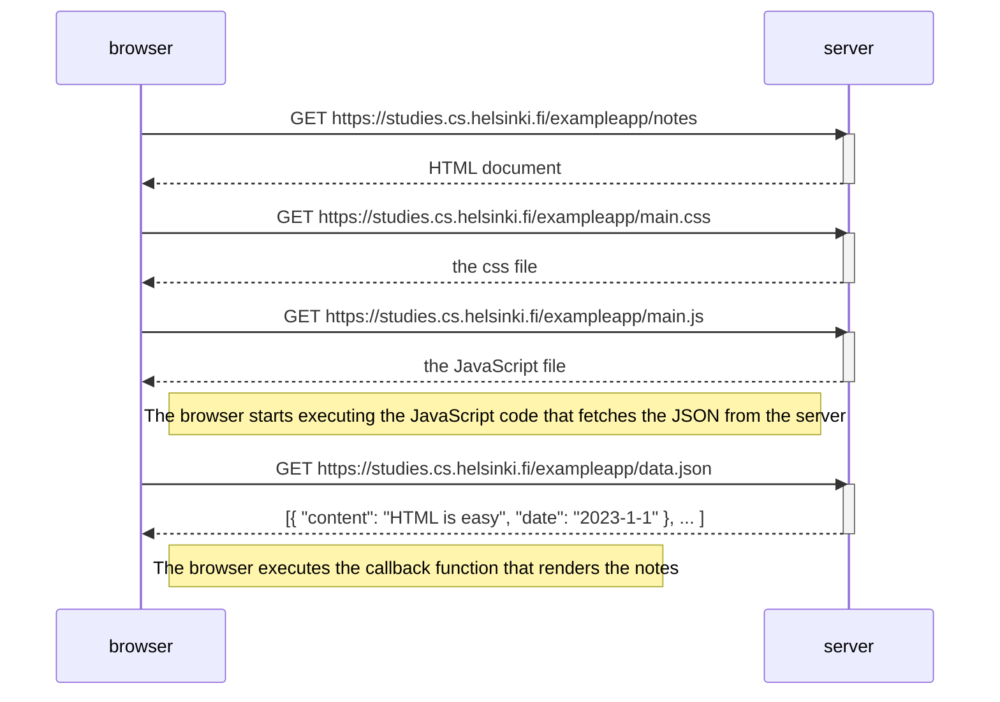

# Ejercicios 0.1. - 0.6.

## 0.1: HTML

Revisa los conceptos básicos de HTML leyendo este tutorial de Mozilla: [tutorial de HTML](https://developer.mozilla.org/es/docs/Learn_web_development/Getting_started/Your_first_website/Creating_the_content).  
_Este ejercicio no se envía a GitHub, leer el tutorial es suficiente_

## 0.2: CSS

Revisa los conceptos básicos de CSS leyendo este tutorial de Mozilla: [tutorial de CSS](https://developer.mozilla.org/es/docs/Learn_web_development/Getting_started/Your_first_website/Styling_the_content).  
_Este ejercicio no se envía a GitHub, leer el tutorial es suficiente_

## 0.3: Formularios HTML

Aprende sobre los conceptos básicos de los formularios HTML leyendo el tutorial de Mozilla [Mi primer formulario HTML](https://developer.mozilla.org/es/docs/Learn_web_development/Extensions/Forms/Your_first_form).  
_Este ejercicio no se envía a GitHub, leer el tutorial es suficiente_

## 0.4: Nuevo diagrama de nota

En el capítulo [Cargando una página que contiene JavaScript - revisión](https://fullstackopen.com/es/part0/fundamentos_de_las_aplicaciones_web#cargando-una-pagina-que-contiene-java-script-revision) la cadena de eventos causada al abrir la página https://studies.cs.helsinki.fi/exampleapp/notes se representa como un [diagrama de secuencia](https://www.geeksforgeeks.org/system-design/unified-modeling-language-uml-sequence-diagrams/)  
El diagrama se hizo como un archivo Markdown de GitHub usando la sintaxis [Mermaid](https://docs.github.com/en/get-started/writing-on-github/working-with-advanced-formatting/creating-diagrams), de la siguiente manera:

**Crea un diagrama similar** que describa la situación en la que el usuario crea una nueva nota en la página https://studies.cs.helsinki.fi/exampleapp/notes escribiendo algo en el campo de texto y haciendo clic en el botón Save.  
Si es necesario, muestra las operaciones en el navegador o en el servidor como comentarios en el diagrama.  
El diagrama no tiene por qué ser un diagrama de secuencia. Cualquier forma sensata de presentar los eventos está bien.  
Toda la información necesaria para hacer esto, y los dos ejercicios siguientes, se pueden encontrar en el texto de [esta parte](https://fullstackopen.com/es/part0/fundamentos_de_las_aplicaciones_web#formularios-y-http-post). La idea de estos ejercicios es leer el texto una vez más y pensar en lo que está sucediendo allí. No es necesario leer el [código](https://github.com/mluukkai/example_app) de la aplicación pero, por supuesto, es posible.  
Puedes crear los diagramas con cualquier programa, pero quizás la mejor y más fácil forma de hacer diagramas es utilizando la sintaxis de [Mermaid](https://github.com/mermaid-js/mermaid#sequence-diagram-docs---live-editor) que ahora está implementada en las páginas de Markdown de [GitHub](https://github.blog/developer-skills/github/include-diagrams-markdown-files-mermaid/).

# 0.5: Diagrama de aplicación de una sola página

Crea un diagrama que describa la situación en la que el usuario accede a la versión de [aplicación de una sola página](https://fullstackopen.com/es/part0/fundamentos_de_las_aplicaciones_web#aplicacion-de-una-sola-pagina) de la aplicación de notas en https://studies.cs.helsinki.fi/exampleapp/spa.

# 0.6: Nueva nota en diagrama de aplicación de una sola página

Crea un diagrama que represente la situación en la que el usuario crea una nueva nota utilizando la versión de una sola página de la aplicación.  
Este fue el último ejercicio, y es hora de enviar tus respuestas a GitHub y marcar los ejercicios como hechos en el [sistema de envío de ejercicios](https://studies.cs.helsinki.fi/stats/courses/fullstackopen).
