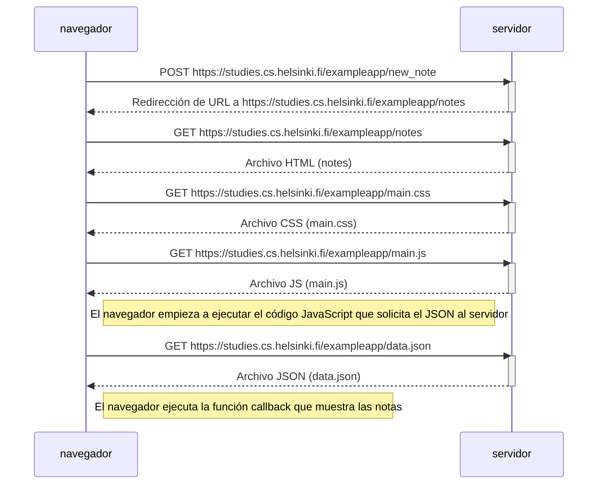

```mermaid
sequenceDiagram
participant navegador
participant servidor

navegador->>servidor: POST https://studies.cs.helsinki.fi/exampleapp/new_note
activate servidor
servidor-->>navegador: Redirección de URL a https://studies.cs.helsinki.fi/exampleapp/notes
deactivate servidor

navegador->>servidor: GET https://studies.cs.helsinki.fi/exampleapp/notes
activate servidor
servidor-->>navegador: Archivo HTML (notes)
deactivate servidor

navegador->>servidor: GET https://studies.cs.helsinki.fi/exampleapp/main.css
activate servidor
servidor-->>navegador: Archivo CSS (main.css)
deactivate servidor

navegador->>servidor: GET https://studies.cs.helsinki.fi/exampleapp/main.js
activate servidor
servidor-->>navegador: Archivo JS (main.js)
deactivate servidor

Note right of navegador:  El navegador empieza a ejecutar el código JavaScript que solicita el JSON al servidor

navegador->>servidor: GET https://studies.cs.helsinki.fi/exampleapp/data.json
activate servidor
servidor-->>navegador: Archivo JSON (data.json)
deactivate servidor

Note right of navegador: El navegador ejecuta la función callback que muestra las notas
```
