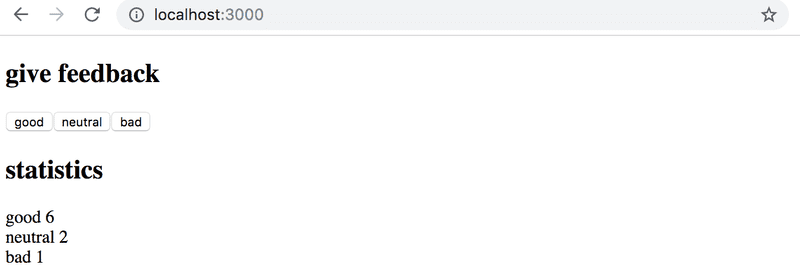
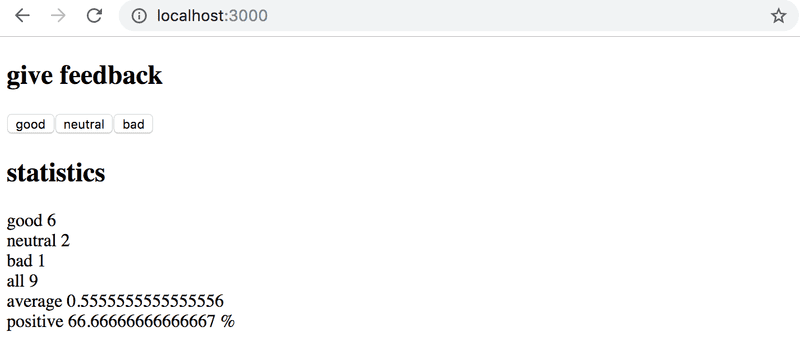
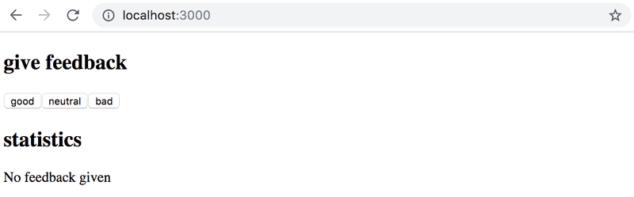
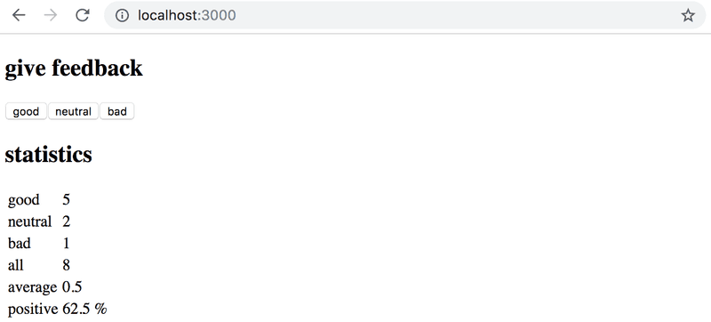
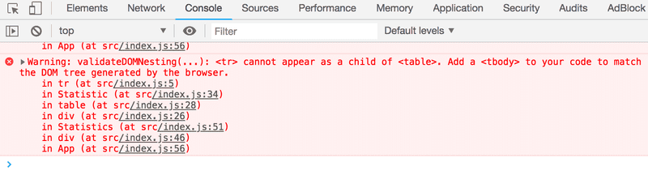
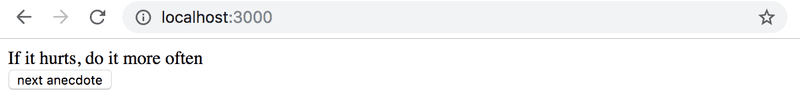
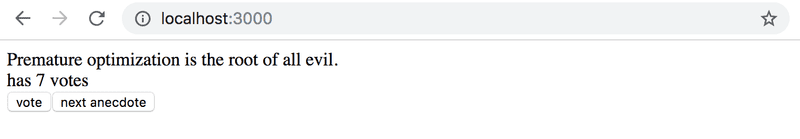
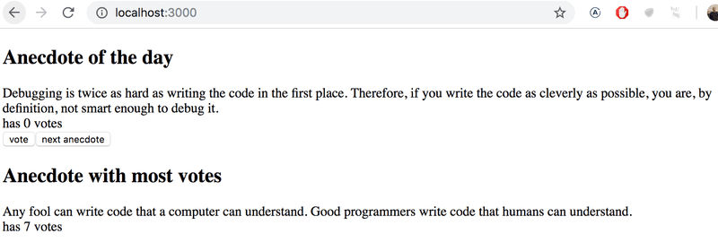

> [!IMPORTANT]
> **Información del Curso** → Ejercicios 1.1, 1.2, 1.3, 1.4, 1.5 → Carpeta llamada **"info-curso"**.  
> **unicafe** → Ejercicios 1.6, 1.7, 1.8, 1.9, 1.10, 1.11* →  **"unicafe"**.
> **anecdotes** -> Ejercicios 1.12*, 1.13*, 1.14* →  **"anecdotes"**.
> La carpeta llamada **"imagenes"** contiene únicamente las imágenes que se muestran en este archivo README.md.

# Ejercicios 1.1. - 1.2.

## 1.1: Información del Curso, paso 1

_La aplicación en la que comenzaremos a trabajar en este ejercicio se continuara desarrollando en algunos de los siguientes ejercicios. En este y otros conjuntos de ejercicios futuros de este curso, es suficiente enviar solo el estado final de la aplicación. Si lo deseas, también puedes crear un commit para cada ejercicio de la serie, pero esto es completamente opcional._  
Usa Vite para inicializar una nueva aplicación. Modifica _main.jsx_ para que coincida con lo siguiente

```jsx
import ReactDOM from "react-dom/client";

import App from "./App";

ReactDOM.createRoot(document.getElementById("root")).render(<App />);
```

y _App.jsx_ para que coincida con lo siguiente

```jsx
const App = () => {
  const course = "Half Stack application development";
  const part1 = "Fundamentals of React";
  const exercises1 = 10;
  const part2 = "Using props to pass data";
  const exercises2 = 7;
  const part3 = "State of a component";
  const exercises3 = 14;

  return (
    <div>
      <h1>{course}</h1>
      <p>
        {part1} {exercises1}
      </p>
      <p>
        {part2} {exercises2}
      </p>
      <p>
        {part3} {exercises3}
      </p>
      <p>Number of exercises {exercises1 + exercises2 + exercises3}</p>
    </div>
  );
};

export default App;
```

y elimina los archivos adicionales App.css, e index.css, también elimina el directorio assets.

Desafortunadamente, toda la aplicación está en el mismo componente. Refactoriza el código para que conste de tres componentes nuevos: _Header, Content y Total_. Todos los datos aún residen en el componente _App_, que pasa los datos necesarios a cada componente mediante _props_. _Header_ se encarga de mostrar el nombre del curso, _Content_ muestra las partes y su número de ejercicios y _Total_ muestra el número total de ejercicios.

Define los nuevos componentes en el archivo _App.jsx_.

El cuerpo del componente _App_ será aproximadamente como el siguiente:

```jsx
const App = () => {
  // const-definitions

  return (
    <div>
      <Header course={course} />
      <Content ... />
      <Total ... />
    </div>
  )
}
```

**ADVERTENCIA** No trates de programar todos los componentes de corrido, porque esto podría ciertamente romper toda la aplicación. Procede en pequeños pasos, primero haz por ejemplo: el componente _Header_ y solo cuando confirmes que funciona, podrás continuar con el siguiente componente.

El progreso cuidadoso y en pequeños pasos puede parecer lento, pero en realidad es con _diferencia la forma más rápida_ de progresar. El famoso desarrollador de software Robert "Uncle Bob" Martin ha declarado

_"La única manera de ir rápido, es hacerlo bien"_

es decir, según Martin, avanzar con cuidado y con pequeños pasos es incluso la única manera de ser rápido.

## 1.2: Información del Curso, paso 2

Refactoriza el componente _Content_ para que no muestre ningún nombre de partes o su número de ejercicios por sí mismo. En su lugar, solo representa tres componentes _Part_ de los cuales cada uno representa el nombre y el número de ejercicios de una parte.

```jsx
const Content = ... {
  return (
    <div>
      <Part .../>
      <Part .../>
      <Part .../>
    </div>
  )
}
```

Nuestra aplicación pasa información de una manera bastante primitiva en este momento, ya que se basa en variables individuales.
Esta situación mejorará pronto en la [parte 2](https://fullstackopen.com/es/part2), pero antes de eso, vamos a la parte 1b para aprender acerca de JavaScript.

# Ejercicios 1.3.-1.5.

## 1.3: Información del Curso, paso 3

Avancemos para usar objetos en nuestra aplicación. Modifica las definiciones de las variables del componente _App_ de la siguiente manera y también refactoriza la aplicación para que siga funcionando:

```jsx
const App = () => {
  const course = "Half Stack application development";
  const part1 = {
    name: "Fundamentals of React",
    exercises: 10,
  };
  const part2 = {
    name: "Using props to pass data",
    exercises: 7,
  };
  const part3 = {
    name: "State of a component",
    exercises: 14,
  };

  return <div>...</div>;
};
```

## 1.4: Información del Curso paso 4

Coloca los objetos en un array. Modifica las definiciones de las variables de _App_ de la siguiente forma y modifica las otras partes de la aplicación que sean necesarias para que continue funcionando:

```jsx
const App = () => {
  const course = "Half Stack application development";
  const parts = [
    {
      name: "Fundamentals of React",
      exercises: 10,
    },
    {
      name: "Using props to pass data",
      exercises: 7,
    },
    {
      name: "State of a component",
      exercises: 14,
    },
  ];

  return <div>...</div>;
};
```

**Nota:** en este punto _puedes asumir que siempre hay tres elementos_, por lo que no es necesario pasar por los arrays usando bucles. Volveremos al tema de la renderización de componentes basados en elementos dentro de arrays con una exploración más profunda en la [siguiente parte del curso](https://fullstackopen.com/es/part2).  
Sin embargo, no pases diferentes objetos como props separados del componente _App_ a los componentes _Content_ y _Total_. En su lugar, pásalos directamente como un array:

```jsx
const App = () => {
  // definiciones de const

  return (
    <div>
      <Header course={course} />
      <Content parts={parts} />
      <Total parts={parts} />
    </div>
  );
};
```

## 1.5: Información del Curso paso 5

Llevemos los cambios un paso más allá. Cambia el curso y sus partes a un solo objeto JavaScript. Arregla todo lo que se rompa.

```jsx
const App = () => {
  const course = {
    name: "Half Stack application development",
    parts: [
      {
        name: "Fundamentals of React",
        exercises: 10,
      },
      {
        name: "Using props to pass data",
        exercises: 7,
      },
      {
        name: "State of a component",
        exercises: 14,
      },
    ],
  };

  return <div>...</div>;
};
```

# Ejercicios 1.6. - 1.14.

## 1.6: unicafe, paso 1

Como la mayoría de las empresas, [Unicafe](https://unicafe.fi/) recopila comentarios de sus clientes. Tu tarea es implementar una aplicación web para recopilar comentarios de los clientes. Solo hay tres opciones para los comentarios: _good (bueno), neutral y bad(malo)_.  
La aplicación debe mostrar el número total de comentarios recopilados para cada categoría. Tu aplicación final podría verse así:
  
Ten en cuenta que tu aplicación debe funcionar solo durante una única sesión del navegador. Una vez que se actualice la página, los comentarios recopilados pueden desaparecer.  
Te recomendamos usar la misma estructura usada en el material y en el anterior ejercicio. El archivo _main.jsx_ sería asi:

```jsx
import React from "react";
import ReactDOM from "react-dom/client";

import App from "./App";

ReactDOM.createRoot(document.getElementById("root")).render(<App />);
```

Podrías usar el siguiente código como punto de partida para el archivo _App.jsx_:

```jsx
import { useState } from "react";

const App = () => {
  // guarda los clics de cada botón en su propio estado
  const [good, setGood] = useState(0);
  const [neutral, setNeutral] = useState(0);
  const [bad, setBad] = useState(0);

  return <div>code here</div>;
};

export default App;
```

## 1.7: unicafe, paso 2

Amplía tu aplicación para que muestre más estadísticas sobre los comentarios recopilados: el número total de comentarios recopilados, la puntuación promedio (buena: 1, neutral: 0, mala: -1) y el porcentaje de comentarios positivos.


## 1.8: unicafe, paso 3

Refactoriza tu aplicación para que la visualización de las estadísticas se extraiga en su propio componente _Statistics_. El estado de la aplicación debe permanecer en el componente raíz _App_.  
Recuerda que los componentes no deben definirse dentro de otros componentes:

```jsx
// un lugar adecuado para definir un componente
const Statistics = (props) => {
  // ...
}

const App = () => {
  const [good, setGood] = useState(0)
  const [neutral, setNeutral] = useState(0)
  const [bad, setBad] = useState(0)

  // no definas componentes adentro de otro componente
  const Statistics = (props) => {
    // ...
  }

  return (
    // ...
  )
}
```

## 1.9: unicafe paso 4

Cambia tu aplicación para mostrar estadísticas solo una vez que se hayan recopilado los comentarios.  


## 1.10: unicafe paso 5

Continuemos refactorizando la aplicación. Extrae los siguiente dos componentes:

- _Button_ para definir los botones utilizados para enviar comentarios
- _StatisticLine_ para mostrar una única estadística, por ejemplo, la puntuación media.  
  Para ser claros: el componente _StatisticLine_ siempre muestra una única estadística, lo que significa que la aplicación utiliza varios componentes para representar todas las estadísticas.

```jsx
const Statistics = (props) => {
  /// ...
  return(
    <div>
      <StatisticLine text="good" value ={...} />
      <StatisticLine text="neutral" value ={...} />
      <StatisticLine text="bad" value ={...} />
      // ...
    </div>
  )
}
```

El estado de la aplicación aún debe mantenerse en el componente raíz App.

## 1.11\*: unicafe, paso 6

Muestra las estadísticas en una [tabla](https://developer.mozilla.org/es/docs/Learn_web_development/Core/Structuring_content/HTML_table_basics) HTML, de modo que tu aplicación se vea más o menos así:



Recuerda mantener la consola abierta en todo momento. Si ves esta advertencia en tu consola:



Entonces realiza las acciones necesarias para que la advertencia desaparezca.
Intenta buscar en Google el mensaje de error si te quedas atascado.  
_Una fuente típica de un error **Unchecked runtime.lastError: Could not establish connection. Receiving end does not exist**. es la extensión de Chrome. Intenta ir a chrome://extensions y deshabilitarlas una por una y luego actualizar la página de la aplicación React; el error debería desaparecer eventualmente_.  
**¡Asegúrate de que a partir de ahora no veas ninguna advertencia en tu consola!**

## 1.12\*: anecdotes, paso 1

El mundo de la ingeniería de software está lleno de [anécdotas](https://www.comp.nus.edu.sg/~damithch/pages/SE-quotes.htm) que destilan verdades atemporales de nuestro campo en breves frases.  
Expande la siguiente aplicación agregando un botón en el que se pueda hacer clic para mostrar una anécdota _aleatoria_ del campo de la ingeniería de software:

```jsx
import { useState } from "react";

const App = () => {
  const anecdotes = [
    "If it hurts, do it more often.",
    "Adding manpower to a late software project makes it later!",
    "The first 90 percent of the code accounts for the first 10 percent of the development time...The remaining 10 percent of the code accounts for the other 90 percent of the development time.",
    "Any fool can write code that a computer can understand. Good programmers write code that humans can understand.",
    "Premature optimization is the root of all evil.",
    "Debugging is twice as hard as writing the code in the first place. Therefore, if you write the code as cleverly as possible, you are, by definition, not smart enough to debug it.",
    "Programming without an extremely heavy use of console.log is same as if a doctor would refuse to use x-rays or blood tests when diagnosing patients.",
    "The only way to go fast, is to go well.",
  ];

  const [selected, setSelected] = useState(0);

  return <div>{anecdotes[selected]}</div>;
};

export default App;
```

El contenido del archivo _main.jsx_ es el mismo de los ejercicios anteriores.  
Busca como generar números aleatorios en JavaScript, por ejemplo, en un buscador o en [Mozilla Developer Network](https://developer.mozilla.org/es/). Recuerda que puedes probar la generación de números aleatorios, por ejemplo, directamente en la consola de tu navegador.  
Tu aplicación finalizada podría verse así  


## 1.13\*: anecdotes, paso 2
Expande tu aplicación para que puedas votar por la anécdota mostrada.  
  
**Nota**: almacena los votos de cada anécdota en un array u objeto en el estado del componente. Recuerda que la forma correcta de actualizar el estado almacenado en estructuras de datos complejas como objetos y arrays es hacer una copia del estado.  
Puedes crear una copia de un objeto de esta forma:

```jsx
const votes = { 0: 1, 1: 3, 2: 4, 3: 2 };

const copy = { ...votes };
// incrementa en uno el valor de la propiedad 2
copy[2] += 1;
```

O una copia de un array de esta forma:

```jsx
const votes = [1, 4, 6, 3];

const copy = [...votes];
// incrementa en uno el valor de la posición 2
copy[2] += 1;
```

El uso de un array podría ser la opción más sencilla en este caso. Buscar en internet te proporcionará muchos consejos sobre cómo [crear un array lleno de ceros de la longitud deseada](https://stackoverflow.com/questions/20222501/how-to-create-a-zero-filled-javascript-array-of-arbitrary-length/22209781).

## 1.14\*: anecdotes, paso 3

Ahora implementa la versión final de la aplicación que muestra la anécdota con el mayor número de votos  
  
Si varias anécdotas empatan en el primer lugar, es suficiente con solo mostrar una de ellas.
