> [!IMPORTANT]  
> La resolución de **todos los ejercicios de esta parte (del 10.1 al 10.27)** se encuentra en el siguiente repositorio: [rate-repository-app](https://github.com/DiriARG/rate-repository-app).  
> La carpeta llamada **"imagenes"** contiene únicamente las imágenes que se muestran en este archivo README.md.

# Ejercicio 10.1: inicialización de la aplicación

Inicialice su aplicación con la interfaz de línea de comandos de Expo y configure el entorno de desarrollo utilizando un emulador o la aplicación móvil de Expo. Se recomienda probar ambos y averiguar qué entorno de desarrollo es el más adecuado para usted. El nombre de la aplicación no es tan relevante. Puede, por ejemplo, usar _rate-repository-app_.

Para enviar este ejercicio y todos los ejercicios futuros, debe [crear un nuevo repositorio](https://github.com/login?return_to=https%3A%2F%2Fgithub.com%2Fnew) de GitHub. El nombre del repositorio puede ser, por ejemplo, el nombre de la aplicación que inicializó con `expo init`. Si decide crear un repositorio privado, agregue al usuario de GitHub [mluukkai](https://github.com/mluukkai) como [colaborador del repositorio](https://docs.github.com/en/repositories/managing-your-repositorys-settings-and-features/repository-access-and-collaboration/inviting-collaborators-to-a-personal-repository). El estado de colaborador solo se utiliza para verificar sus envíos.

Ahora que se creó el repositorio, ejecute `git init` dentro del directorio raíz de su aplicación para asegurarse de que el directorio se inicialice como un repositorio Git. A continuación, para agregar el repositorio creado como la ejecución remota `git remote add origin git@github.com:<YOURGITHUBUSERNAME>/<NAMEOFYOUR_REPOSITORY>.git` (recuerde reemplazar los valores de marcador de posición en el comando). Finalmente, simplemente confirme e inserte sus cambios en el repositorio y ya está.

# Ejercicio 10.2

## Ejercicio 10.2: configuración de ESLint

Configure ESLint en su proyecto para que pueda realizar comprobaciones de linter ejecutando `npm run lint`. Para aprovechar al máximo el linting, también se recomienda integrar ESLint con su editor.

Este fue el último ejercicio de esta sección. Es hora de enviar tu código a GitHub y marcar todos tus ejercicios terminados en el [sistema de envío de ejercicios](https://studies.cs.helsinki.fi/stats/courses/fs-react-native-2020). Tenga en cuenta que los ejercicios de esta sección deben enviarse a la parte 1 del sistema de envío de ejercicios.

# Ejercicio 10.3.

## Ejercicio 10.3: la lista de repositorios revisados

En este ejercicio, implementaremos la primera versión de la lista de repositorios revisados. La lista debe contener el nombre completo del repositorio, la descripción, el idioma, la cantidad de bifurcaciones, la cantidad de estrellas, la calificación promedio y la cantidad de reseñas. Afortunadamente, React Native proporciona un componente útil para mostrar una lista de datos, que es el componente [FlatList](https://reactnative.dev/docs/flatlist).

Implemente los componentes `RepositoryList` y `RepositoryItem` en los archivos del directorio _components RepositoryList.jsx_ y _RepositoryItem.jsx_. El componente `RepositoryList` debe representar el componente `FlatList` y `RepositoryItem` como un solo elemento en la lista (pista: use el prop del componente de `FlatList` [renderItem](https://reactnative.dev/docs/flatlist#renderitem)). Use esto como base para el archivo _RepositoryList.jsx_:

```jsx
import React from "react";
import { FlatList, View, StyleSheet } from "react-native";

const styles = StyleSheet.create({
  separator: {
    height: 10,
  },
});

const repositories = [
  {
    id: "jaredpalmer.formik",
    fullName: "jaredpalmer/formik",
    description: "Build forms in React, without the tears",
    language: "TypeScript",
    forksCount: 1589,
    stargazersCount: 21553,
    ratingAverage: 88,
    reviewCount: 4,
    ownerAvatarUrl: "https://avatars2.githubusercontent.com/u/4060187?v=4",
  },
  {
    id: "rails.rails",
    fullName: "rails/rails",
    description: "Ruby on Rails",
    language: "Ruby",
    forksCount: 18349,
    stargazersCount: 45377,
    ratingAverage: 100,
    reviewCount: 2,
    ownerAvatarUrl: "https://avatars1.githubusercontent.com/u/4223?v=4",
  },
  {
    id: "django.django",
    fullName: "django/django",
    description: "The Web framework for perfectionists with deadlines.",
    language: "Python",
    forksCount: 21015,
    stargazersCount: 48496,
    ratingAverage: 73,
    reviewCount: 5,
    ownerAvatarUrl: "https://avatars2.githubusercontent.com/u/27804?v=4",
  },
  {
    id: "reduxjs.redux",
    fullName: "reduxjs/redux",
    description: "Predictable state container for JavaScript apps",
    language: "TypeScript",
    forksCount: 13902,
    stargazersCount: 52869,
    ratingAverage: 0,
    reviewCount: 0,
    ownerAvatarUrl: "https://avatars3.githubusercontent.com/u/13142323?v=4",
  },
];

const ItemSeparator = () => <View style={styles.separator} />;

const RepositoryList = () => {
  return (
    <FlatList
      data={repositories}
      ItemSeparatorComponent={ItemSeparator}
      // other props
    />
  );
};

export default RepositoryList;
```

No altere el contenido de la variable `repositories`, debe contener todo lo que necesita para completar este ejercicio. Renderice el componente `RepositoryList` en el componente `Main` que agregamos previamente al archivo _Main.jsx_. La lista de repositorios revisada debería verse más o menos así:  
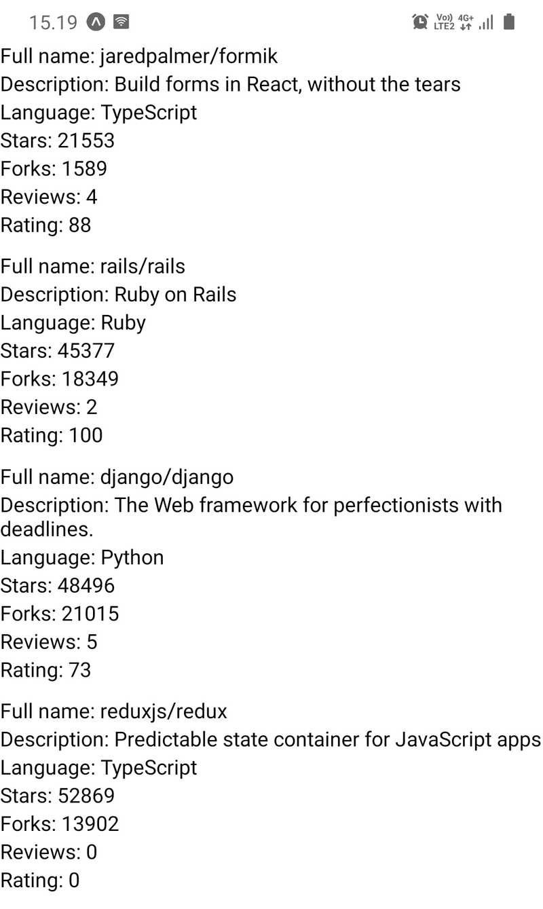

# Ejercicios 10.4. - 10.5.

## Ejercicio 10.4: la barra de aplicaciones

Pronto necesitaremos navegar entre diferentes vistas en nuestra aplicación. Es por eso que necesitamos una [barra de aplicaciones](https://m2.material.io/components/app-bars-top) para mostrar pestañas para cambiar entre diferentes vistas. Cree un archivo _AppBar.jsx_ en la carpeta _components_ con el siguiente contenido:

```jsx
import React from "react";
import { View, StyleSheet } from "react-native";
import Constants from "expo-constants";

const styles = StyleSheet.create({
  container: {
    paddingTop: Constants.statusBarHeight,
    // ...
  },
  // ...
});

const AppBar = () => {
  return <View style={styles.container}>{/* ... */}</View>;
};

export default AppBar;
```

Ahora que el componente `AppBar` evitará que la barra de estado se superponga al contenido, puede eliminar el estilo `marginTop` que agregamos anteriormente para el componente `Main` en el archivo `Main.jsx`. El componente `AppBar` debería contener actualmente una pestaña con el texto "Repositorios". Haga que la pestaña sea táctil usando el componente [Pressable](https://reactnative.dev/docs/pressable) pero no tiene que manejar el evento `onPress` de ninguna manera. Agregue el componente `AppBar` al componente `Main` para que sea el componente superior en la pantalla. El componente `AppBar` debería verse algo como esto:  
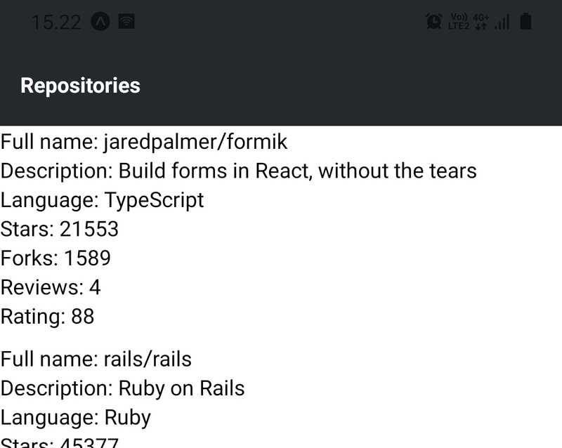  
El color de fondo de la barra de la aplicación en la imagen es `#24292e`, pero también puede usar cualquier otro color. Puede ser una buena idea agregar el color de fondo de la barra de la aplicación en la configuración del tema para que sea fácil cambiarlo si es necesario. Otra buena idea podría ser separar la pestaña de la barra de la aplicación en su propio componente, como `AppBarTab` para que sea fácil agregar nuevas pestañas en el futuro.

## Ejercicio 10.5: lista de repositorios revisados ​​y pulida

La versión actual de la lista de repositorios revisada parece bastante sombría. Modifique el componente _RepositoryListItem_ para que también muestre la imagen de avatar del autor del repositorio. Puede implementar esto utilizando el componente [Image](https://reactnative.dev/docs/image). Los recuentos, como el número de estrellas y forks, mayores o iguales a 1000 deben mostrarse en miles con una precisión de un decimal y con un sufijo "k". Esto significa que, por ejemplo, el recuento de bifurcaciones de 8439 debería mostrarse como "8.4k". También pule el aspecto general del componente para que la lista de repositorios revisados ​​se vea así:  
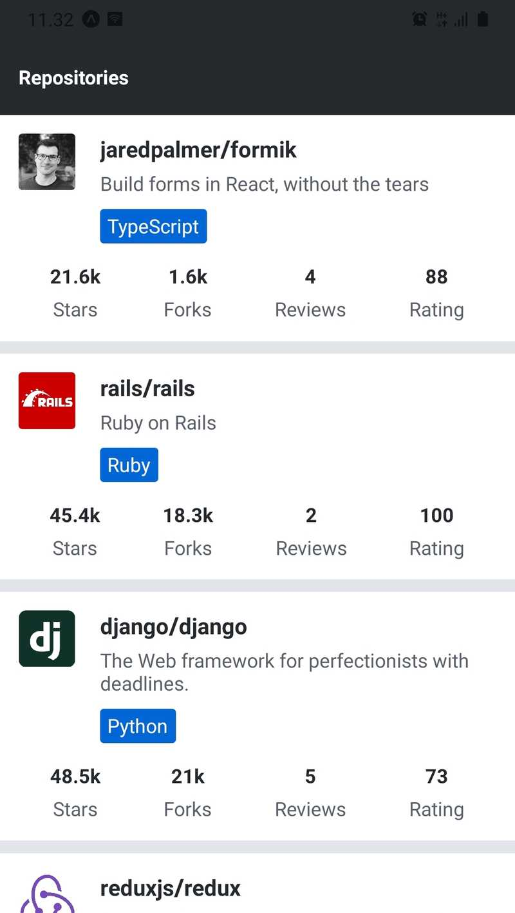  
En la imagen, el color de fondo del componente `Main` se establece en `#e1e4e8` mientras que el color de fondo del componente `RepositoryListItem` se establece en `white`. El color de fondo de la etiqueta de idioma es `#0366d6`, que es el valor de la variable `colors.primary` en la configuración del tema. Recuerde explotar el componente `Text` que implementamos anteriormente. Además, cuando sea necesario, divida el componente `RepositoryListItem` en componentes más pequeños.

# Ejercicios 10.6. - 10,7.

## Ejercicio 10.6: la vista de inicio de sesión

Pronto implementaremos un formulario, que un usuario puede usar para _iniciar sesión_ en nuestra aplicación. Antes de eso, debemos implementar una vista a la que se pueda acceder desde la barra de aplicaciones. Cree un archivo _SignIn.jsx_ en el directorio _components_ con el siguiente contenido:

```jsx
import React from "react";

import Text from "./Text";

const SignIn = () => {
  return <Text>The sign in view</Text>;
};

export default SignIn;
```

Configure una ruta para este componente `SignIn` en el componente `Main`. También agregue una pestaña con el texto "Sign In" en la barra de la aplicación junto a la pestaña "Repositories". Los usuarios deben poder navegar entre las dos vistas presionando las pestañas (pista: use el componente [Link](https://reactrouter.com/api/components/Link#link) y su prop component).

## Ejercicio 10.7: barra de aplicaciones desplazable

Como estamos agregando más pestañas a nuestra barra de aplicaciones, es una buena idea permitir el desplazamiento horizontal una vez que las pestañas no quepan en la pantalla. El componente [ScrollView](https://reactnative.dev/docs/scrollview) es el componente adecuado para el trabajo.

Envuelva las pestañas en las pestañas del componente `AppBar` con un componente `ScrollView`:

```jsx
const AppBar = () => {
  return (
    <View style={styles.container}>
      <ScrollView horizontal>{/* ... */}</ScrollView>
    </View>
  );
};
```

Establecer el prop [horizontal](https://reactnative.dev/docs/scrollview#horizontal) en `true` hará que el componente `ScrollView` se desplace horizontalmente una vez que el contenido no encaje en la pantalla. Tenga en cuenta que deberá agregar propiedades de estilo adecuadas al componente `ScrollView` para que las pestañas se coloquen en una _fila_ dentro del contenedor flexible. Puede asegurarse de que la barra de la aplicación pueda desplazarse horizontalmente agregando pestañas hasta que la última pestaña no se ajuste a la pantalla. Solo recuerde eliminar las pestañas adicionales una vez que la barra de la aplicación esté funcionando según lo previsto.

# Ejercicio 10.8.

## Ejercicio 10.8: el formulario de inicio de sesión

Implemente un formulario de inicio de sesión en el componente `SignIn` que agregamos anteriormente en el archivo _SignIn.jsx_. El formulario de inicio de sesión debe incluir dos campos de texto, uno para el nombre de usuario y otro para la contraseña. También debería haber un botón para enviar el formulario. No es necesario implementar una función de devolución de llamada `onSubmit`, es suficiente que los valores del formulario se registren usando `console.log `cuando se envía el formulario:

```javascript
const onSubmit = (values) => {
  console.log(values);
};
```

Recuerde utilizar el componente `FormikTextInput` que implementamos anteriormente. Puede utilizar el prop [secureTextEntry](https://reactnative.dev/docs/textinput#securetextentry) en el componente `TextInput` para ocultar la entrada de la contraseña.

El formulario de inicio de sesión debería verse así:  
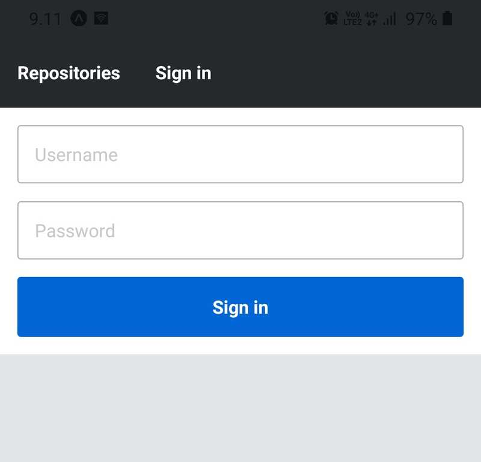

# Ejercicio 10.9.

## Ejercicio 10.9: validación del formulario de inicio de sesión

Valide el formulario de inicio de sesión para que se requieran los campos de nombre de usuario y contraseña. Tenga en cuenta que la devolución de llamada `onSubmit` implementada en el ejercicio anterior, _no debe llamarse_ si falla la validación del formulario.

La implementación actual del componente `FormikTextInput` debería mostrar un mensaje de error si un campo tocado tiene un error. Enfatice este mensaje de error dándole un color rojo.

En la parte superior del mensaje de error rojo, dé a un campo no válido una indicación visual de un error dándole un color de borde rojo. Recuerde que si un campo tiene un error, el componente `FormikTextInput` establece el prop `error` del componente `TextInput` como verdadero. Puede utilizar el valor del prop `error` para adjuntar estilos condicionales al componente `TextInput`.

Así es como debería verse el formulario de inicio de sesión con un campo no válido:  
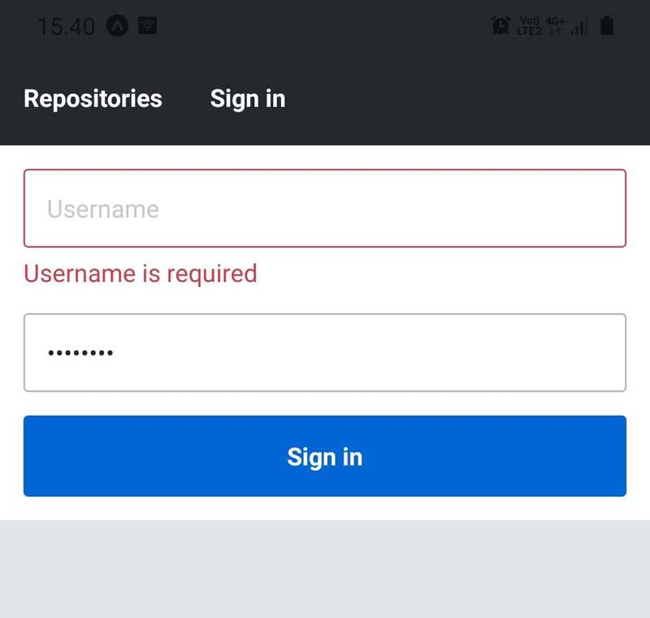  
El color rojo utilizado en esta implementación es `#d73a4a`.

# Ejercicio 10.10.

## Ejercicio 10.10: una fuente específica de la plataforma

Actualmente, la familia de fuentes de nuestra aplicación está configurada en _System_ en la configuración del tema ubicada en el archivo _theme.js_. En lugar de la fuente _System_, utilice una fuente [Sans-serif](https://en.wikipedia.org/wiki/Sans-serif) específica de la plataforma. En la plataforma Android use la fuente _Roboto_ y en la plataforma iOS use la fuente _Arial_ . La fuente predeterminada puede ser _System_.

Este fue el último ejercicio de esta sección. Es hora de enviar tu código a GitHub y marcar todos tus ejercicios terminados en el [sistema de envío de ejercicios](https://studies.cs.helsinki.fi/stats/courses/fs-react-native-2020). Tenga en cuenta que los ejercicios de esta sección deben enviarse a la parte 2 del sistema de envío de ejercicios.

# Ejercicio 10.11.

## Ejercicio 10.11: obtención de repositorios con Apollo Client

Queremos reemplazar la implementación de la API Fetch en el hook `useRepositories` con una consulta GraphQL. Abra el Sandbox de Apollo en http://localhost:4000 y y consulte la documentación junto al editor de operaciones. Busque la consulta `repositorios`. La consulta tiene algunos argumentos, sin embargo, todos estos son opcionales, por lo que no es necesario que los especifique. En el Sandbox de Apollo, forme una consulta para buscar los repositorios con los campos que está mostrando actualmente en la aplicación. El resultado se paginará y contiene los primeros 30 resultados de forma predeterminada. Por ahora, puede ignorar la paginación por completo.

Una vez que la consulta funcione en el entorno de pruebas de Apollo, úsela para reemplazar la implementación de la API Fetch en el hook `useRepositories`. Esto se puede lograr usando el hook [useQuery](https://www.apollographql.com/docs/react/api/react/hooks#usequery). La etiqueta literal de plantilla `gql` se puede importar desde la biblioteca _@apollo/client_ como se indicó anteriormente. Considere usar la estructura recomendada anteriormente para el código relacionado con GraphQL. Para evitar problemas futuros de almacenamiento en caché, use la [política de recuperación](https://www.apollographql.com/docs/react/data/queries#setting-a-fetch-policy) `cache-and-network` en la consulta. Se puede usar con el hook `useQuery` como este:

```javascript
useQuery(MY_QUERY, {
  fetchPolicy: "cache-and-network",
  // Other options
});
```

Los cambios en el hook `useRepositories` no deberían afectar al componente `RepositoryList` de ninguna manera.

# Ejercicio 10.12.

## Ejercicio 10.12: variables de entorno

En lugar de la URL codificada de Apollo Server, utilice una variable de entorno definida en el archivo _.env_ al inicializar el cliente Apollo. Puede nombrar la variable de entorno, por ejemplo, `APOLLO_URI`

No intente acceder a variables de entorno como `process.env.APOLLO_URI` fuera del archivo _app.config.js_. En su lugar, utilice el objeto `Constants.expoConfig.extra` como en el ejemplo anterior. Además, no importe la biblioteca dotenv fuera del archivo _app.config.js_ o probablemente enfrentará errores.

# Ejercicios 10.13. - 10.14.

## Ejercicio 10.13: la mutación del formulario de inicio de sesión

La implementación actual del formulario de inicio de sesión no procesa las credenciales de usuario enviadas. Hagamos algo al respecto en este ejercicio. Primero, lea la [documentación de autenticación](https://github.com/fullstack-hy2020/rate-repository-api#-authentication) del servidor rate-repository-api y pruebe las consultas proporcionadas en GraphQL Playground. Si la base de datos no tiene usuarios, puede completar la base de datos con algunos datos semilla. Las instrucciones para esto se pueden encontrar en la sección [Getting started](https://github.com/fullstack-hy2020/rate-repository-api#-getting-started) del README.

Una vez que sepa cómo se supone que funcionan las consultas de autorización, cree un archivo `useSignIn.js` en el directorio _hooks_. En ese archivo, implemente un hook `useSignIn` que envíe la mutación `authenticate` usando el hook [useMutation](https://www.apollographql.com/docs/react/api/react/useMutation). Tenga en cuenta que la mutación `authenticate` tiene un _único argumento_ llamado `credentials`, que es de tipo `AuthenticateInput`. Este [tipo de entrada](https://www.graphql-js.org/docs/mutations-and-input-types/) contiene los campos `username` y `password`.

El valor de retorno del hook debe ser una tupla [`signIn`, `result`] donde `result` es el resultado de las mutaciones tal como lo devuelve el hook `useMutation` y una función `signIn` que ejecuta la mutación con un argumento de objeto { `username`, `password` }. Sugerencia: no pase la función de mutación al valor de retorno directamente. En su lugar, devuelva una función que llame a la función de mutación como esta:

```javascript
const useSignIn = () => {
  const [mutate, result] = useMutation(/* mutation arguments */);

  const signIn = async ({ username, password }) => {
    // call the mutate function here with the right arguments
  };

  return [signIn, result];
};
```

Una vez implementado el hook, utilícelo en la devolución de llamada `onSubmit` del componente `SignIn`, por ejemplo, como este:

```javascript
const SignIn = () => {
  const [signIn] = useSignIn();

  const onSubmit = async (values) => {
    const { username, password } = values;

    try {
      const { data } = await signIn({ username, password });
      console.log(data);
    } catch (e) {
      console.log(e);
    }
  };

  // ...
};
```

Este ejercicio se completa una vez que puede registrar el resultado de las mutaciones _authenticate_ del usuario después de que se haya enviado el formulario de inicio de sesión. El resultado de la mutación debe contener el token de acceso del usuario.

## Ejercicio 10.14: almacenando el token de acceso, paso 1

Ahora que podemos obtener el token de acceso, necesitamos almacenarlo. Cree un archivo _authStorage.js_ en el directorio _utils_ con el siguiente contenido:

```javascript
import AsyncStorage from "@react-native-async-storage/async-storage";

class AuthStorage {
  constructor(namespace = "auth") {
    this.namespace = namespace;
  }

  getAccessToken() {
    // Get the access token for the storage
  }

  setAccessToken(accessToken) {
    // Add the access token to the storage
  }

  removeAccessToken() {
    // Remove the access token from the storage
  }
}

export default AuthStorage;
```

A continuación, implemente los métodos `AuthStorage.getAccessToken`, `AuthStorage.setAccessToken` y `AuthStorage.removeAccessToken`. Utilice la variable `namespace` para dar a sus claves un espacio de nombres como hicimos en el ejemplo anterior.

# Ejercicios 10.15. - 10.16.

## Ejercicio 10.15: almacenamiento del token de acceso paso 2

Mejore el hook `useSignIn` para que almacene el token de acceso del usuario recuperado de la mutación _authenticate_. El valor de retorno del hook no debería cambiar. El único cambio que debe realizar en el componente `SignIn` es que debe redirigir al usuario a la vista de lista de repositorios revisados ​​después de un inicio de sesión exitoso. Puede lograrlo usando el hook [useNavigate](https://api.reactrouter.com/v7/functions/react_router.useNavigate.html)

Después de que se haya ejecutado la mutación _authenticate_ y haya almacenado el token de acceso del usuario en el almacenamiento, debe restablecer la tienda del cliente Apollo. Esto borrará la memoria caché del cliente Apollo y volverá a ejecutar todas las consultas activas. Puede hacer esto usando el método [resetStore](https://www.apollographql.com/docs/react/api/core/ApolloClient#resetstore) del cliente Apollo. Puede acceder al cliente Apollo en el hook `useSignIn` usando el hook [useApolloClient](https://www.apollographql.com/docs/react/api/react/useApolloClient). Tenga en cuenta que el orden de ejecución es crucial y debe ser el siguiente:

```javascript
const { data } = await mutate(/* options */);
await authStorage.setAccessToken(/* access token from the data */);
apolloClient.resetStore();
```

## Ejercicio 10.16: cerrar sesión

El paso final para completar la función de inicio de sesión es implementar una función de cierre de sesión. La consulta `me` se puede utilizar para verificar la información del usuario autorizado. Si el resultado de la consulta es `null`, eso significa que el usuario no está autorizado. Abra el entorno de pruebas de Apollo y ejecute la siguiente consulta:

```graphql
{
  me {
    id
    username
  }
}
```

Probablemente terminará con el resultado `null`. Esto se debe a que Apollo Sandbox no está autenticado, lo que significa que no envía un token de acceso válido con la solicitud. Revise la [documentación de autenticación](https://github.com/fullstack-hy2020/rate-repository-api#-authentication) y recupere un token de acceso utilizando la mutación `authenticate`. Utilice este token de acceso en el encabezado `Authorization` como se indica en la documentación. Ahora, ejecute la consulta `me` nuevamente y debería poder ver la información del usuario autorizado.

Abra el componente `AppBar` en el archivo _AppBar.jsx_ donde actualmente tiene las pestañas "Repositories" e "Sign in". Cambie las pestañas para que, si el usuario ha iniciado sesión, se muestre la pestaña "Sign out", de lo contrario, muestre la pestaña "Sign in". Puede lograr esto usando la consulta `me` con el hook [useQuery](https://www.apollographql.com/docs/react/api/react/hooks#usequery).

Al presionar la pestaña "Sign out" se debe eliminar el token de acceso del usuario del almacenamiento y restablecer la tienda del Cliente Apollo con [resetStore](https://www.apollographql.com/docs/react/api/core/ApolloClient#resetstore). Llamar al método `resetStore` debería volver a ejecutar automáticamente todas las consultas activas, lo que significa que la consulta `me` debería volver a ejecutarse. Tenga en cuenta que el orden de ejecución es crucial: el token de acceso debe eliminarse del almacenamiento antes que se restablezca la tienda del cliente Apollo.

Este fue el último ejercicio de esta sección. Es hora de enviar tu código a GitHub y marcar todos tus ejercicios terminados en el [sistema de envío de ejercicios](https://studies.cs.helsinki.fi/stats/courses/fs-react-native-2020). Tenga en cuenta que los ejercicios de esta sección deben enviarse a la parte 3 del sistema de envío de ejercicios.

# Ejercicios 10.17. - 10.18.

## Ejercicio 10.17: prueba de la lista de repositorios revisados

Implemente una prueba que garantice que el componente `RepositoryListContainer` muestre el nombre del repositorio, la descripción, el idioma, el recuento de bifurcaciones, el recuento de observadores de estrellas, el promedio de calificación y el recuento de reseñas correctamente. Recuerde que puede usar el comparador [toHaveTextContent](https://github.com/testing-library/jest-native#tohavetextcontent) para verificar si un nodo tiene cierto contenido textual. Puede usar la consulta [getAllByTestId](https://oss.callstack.com/react-native-testing-library/docs/api/queries#getallby) para obtener todos los nodos con un determinado prop `testID` como una matriz. Si no está seguro de lo que se está procesando, use la función [debug](https://oss.callstack.com/react-native-testing-library/docs/api#debug) para ver el resultado de la representación serializada.

Use esto como base para su prueba:

```javascript
describe("RepositoryList", () => {
  describe("RepositoryListContainer", () => {
    it("renders repository information correctly", () => {
      const repositories = {
        totalCount: 8,
        pageInfo: {
          hasNextPage: true,
          endCursor:
            "WyJhc3luYy1saWJyYXJ5LnJlYWN0LWFzeW5jIiwxNTg4NjU2NzUwMDc2XQ==",
          startCursor: "WyJqYXJlZHBhbG1lci5mb3JtaWsiLDE1ODg2NjAzNTAwNzZd",
        },
        edges: [
          {
            node: {
              id: "jaredpalmer.formik",
              fullName: "jaredpalmer/formik",
              description: "Build forms in React, without the tears",
              language: "TypeScript",
              forksCount: 1619,
              stargazersCount: 21856,
              ratingAverage: 88,
              reviewCount: 3,
              ownerAvatarUrl:
                "https://avatars2.githubusercontent.com/u/4060187?v=4",
            },
            cursor: "WyJqYXJlZHBhbG1lci5mb3JtaWsiLDE1ODg2NjAzNTAwNzZd",
          },
          {
            node: {
              id: "async-library.react-async",
              fullName: "async-library/react-async",
              description: "Flexible promise-based React data loader",
              language: "JavaScript",
              forksCount: 69,
              stargazersCount: 1760,
              ratingAverage: 72,
              reviewCount: 3,
              ownerAvatarUrl:
                "https://avatars1.githubusercontent.com/u/54310907?v=4",
            },
            cursor:
              "WyJhc3luYy1saWJyYXJ5LnJlYWN0LWFzeW5jIiwxNTg4NjU2NzUwMDc2XQ==",
          },
        ],
      };

      // Add your test code here
    });
  });
});
```

Puede poner el archivo de prueba donde desee. Sin embargo, se recomienda seguir una de las formas de organizar los archivos de prueba presentados anteriormente. Utilice la variable `repositories` como datos del repositorio para la prueba. No debería ser necesario modificar el valor de la variable. Tenga en cuenta que los datos del repositorio contienen dos repositorios, lo que significa que debe comprobar que la información de ambos repositorios esté presente.

## Ejercicio 10.18: probar el formulario de inicio de sesión

Implemente una prueba que garantice que al completar los campos de nombre de usuario y contraseña del formulario de inicio de sesión y presionar el botón de envío _se llamará_ al controlador `onSubmit` con _argumentos correctos_. El _primer argumento_ del controlador debe ser un objeto que represente los valores del formulario. Puede ignorar los otros argumentos de la función. Recuerde que los métodos [fireEvent](https://oss.callstack.com/react-native-testing-library/docs/api#fireevent) se pueden usar para activar eventos y una [función simulada](https://jestjs.io/docs/mock-function-api) para comprobar si se llama o no al controlador `onSubmit`.

No tiene que probar ningún código relacionado con Apollo Client o AsyncStorage que se encuentre en el enlace `useSignIn`. Como en el ejercicio anterior, extraiga el código puro en su propio componente y pruébelo en la prueba.

Tenga en cuenta que los envíos de formularios de Formik son _asíncronos_, por lo que esperar que se llame a la función `onSubmit` inmediatamente después de presionar el botón enviar no funcionará. Puede solucionar este problema haciendo que la función de prueba sea una función asíncrona utilizando la palabra clave `async` y utilizando [waitFor](https://oss.callstack.com/react-native-testing-library/docs/api#waitfor) función auxiliar. La función `waitFor` se puede utilizar para esperar a que pasen las expectativas. Si las expectativas no pasan dentro de un período determinado, la función arrojará un error. Aquí hay un ejemplo aproximado de cómo usarlo:

```javascript
import React from "react";
import { render, fireEvent, waitFor } from "@testing-library/react-native";
// ...

describe("SignIn", () => {
  describe("SignInContainer", () => {
    it("calls onSubmit function with correct arguments when a valid form is submitted", async () => {
      // render the SignInContainer component, fill the text inputs and press the submit button

      await waitFor(() => {
        // expect the onSubmit function to have been called once and with a correct first argument
      });
    });
  });
});
```

Es posible que se enfrente a los siguientes mensajes de advertencia: `Warning: An update to Formik inside a test was not wrapped in act(...)` `[Advertencia: una actualización de Formik dentro de una prueba no se incluyó en act (...)]`. Esto sucede porque las llamadas al método `fireEvent` provocan llamadas asincrónicas en la lógica interna de Formik. Puede deshacerse de estos mensajes envolviendo cada una de las llamadas al método `fireEvent` con la función [act](https://www.native-testing-library.com/docs/next/api-main#%20act) como esta:

```javascript
await act(async () => {
  // call the fireEvent method here
});
```

# Ejercicios 10.19. - 10.24.

## Ejercicio 10.19: la vista del repositorio único

Implemente una vista para un repositorio único, que contiene la misma información del repositorio que en la lista de repositorios revisados, pero también un botón para abrir el repositorio en GitHub. Sería una buena idea reutilizar el componente `RepositoryItem` utilizado en `RepositoryList`

La URL del repositorio está en el campo `url` del tipo `Repository` en el esquema GraphQL. Puede obtener un único repositorio del servidor Apollo con la consulta `repository`. La consulta tiene un solo argumento, que es el id del repositorio. Aquí hay un ejemplo simple de la consulta de `repository`:

```graphql
{
  repository(id: "jaredpalmer.formik") {
    id
    fullName
    url
  }
}
```

Como siempre, primero pruebe sus consultas en Apollo Sandbox antes de usarlas en su aplicación. Si no está seguro sobre el esquema GraphQL o cuáles son las consultas disponibles, consulte la documentación junto al editor de operaciones. Si tiene problemas para usar el id como una variable en la consulta, tómese un momento para estudiar la [documentación](https://www.apollographql.com/docs/react/data/queries) de Apollo Client sobre las consultas.

Para saber cómo abrir una URL en un navegador, lea la [documentación de la API de vinculación](https://docs.expo.dev/versions/latest/sdk/linking/) de Expo. Necesitará esta función al implementar el botón para abrir el repositorio en GitHub. Consejo: El método [Linking.openURL](https://docs.expo.dev/versions/latest/sdk/linking/#linkingopenurlurl) te resultará útil.

La vista debe tener su propia ruta. Sería una buena idea definir la identificación del repositorio en la ruta de la dirección como un parámetro del mismo, al que puede acceder utilizando el hook [useParams](https://reactrouter.com/6.14.2/hooks/use-params). El usuario debería poder acceder a la vista presionando un repositorio en la lista de repositorios revisados. Puede lograr esto, por ejemplo, envolviendo el `RepositoryItem` con un componente [Pressable](https://reactnative.dev/docs/pressable) en el componente `RepositoryList` y usando la función `navigate` para cambiar la ruta en un controlador de eventos `onPress`. Se puede acceder a la función `navigate` con el gancho [useNavigate](https://api.reactrouter.com/v7/functions/react_router.useNavigate.html).

La versión final de la vista del repositorio único debería verse así:  
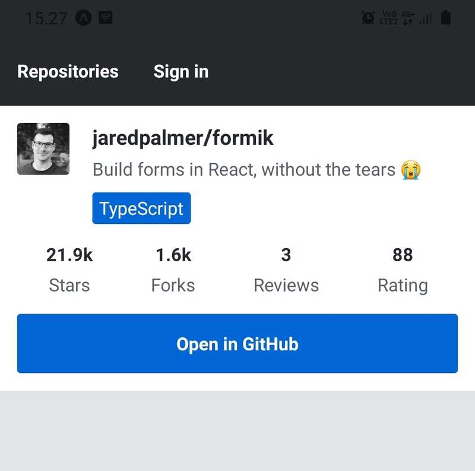

## Ejercicio 10.20: lista de revisión del repositorio

Ahora que tenemos una vista para un solo repositorio, mostraremos las revisiones del repositorio allí. Las revisiones del repositorio se encuentran en el campo `reviews` del tipo `Repository` en el esquema GraphQL. `reviews` es una lista paginada similar a la de la consulta `repositories`. Aquí hay un ejemplo de cómo obtener reseñas de un repositorio:

```graphql
{
  repository(id: "jaredpalmer.formik") {
    id
    fullName
    reviews {
      edges {
        node {
          id
          text
          rating
          createdAt
          user {
            id
            username
          }
        }
      }
    }
  }
}
```

El campo `text` de la reseña contiene la revisión textual, el campo `rating` una clasificación numérica entre 0 y 100, y `createdAt` la fecha en que se creó la revisión. El campo `user` de la reseña contiene la información del revisor, que es del tipo `User`.

Queremos mostrar las reseñas como una lista desplazable, lo que hace que [FlatList](https://reactnative.dev/docs/flatlist) sea un componente adecuado para el trabajo. Para mostrar la información del repositorio del ejercicio anterior en la parte superior de la lista, puede utilizar los componentes `FlatList` y el prop [ListHeaderComponent](https://reactnative.dev/docs/flatlist#listheadercomponent). Puede usar [ItemSeparatorComponent](https://reactnative.dev/docs/flatlist#itemseparatorcomponent) para agregar algo de espacio entre los elementos como en el componente `RepositoryList`. Aquí hay un ejemplo de la estructura:

```javascript
const RepositoryInfo = ({ repository }) => {
  // Repository's information implemented in the previous exercise
};

const ReviewItem = ({ review }) => {
  // Single review item
};

const SingleRepository = () => {
  // ...

  return (
    <FlatList
      data={reviews}
      renderItem={({ item }) => <ReviewItem review={item} />}
      keyExtractor={({ id }) => id}
      ListHeaderComponent={() => <RepositoryInfo repository={repository} />}
      // ...
    />
  );
};

export default SingleRepository;
```

La versión final de la lista de reseñas del repositorio debería verse así:  
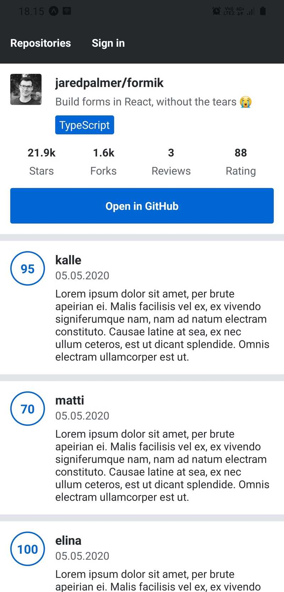  
La fecha bajo el nombre de usuario del revisor es la fecha de creación de la revisión, que se encuentra en el campo `createdAt` del tipo `Review`. El formato de la fecha debe ser fácil de usar, como _date.month.year_. Por ejemplo, puede instalar la librería [date-fns](https://date-fns.org/) y usar la función [format](https://date-fns.org/v2.28.0/docs/format) para formatear la fecha de creación.

La forma redonda del contenedor de la calificación se puede lograr con la propiedad de estilo `borderRadius`. Puede redondearlo fijando la propiedad de estilo `width` y `height` del contenedor y estableciendo el radio del borde como `width/2`.

## Ejercicio 10.21: el formulario de revisión

Implemente un formulario para crear una revisión usando Formik. El formulario debe tener cuatro campos: nombre de usuario de GitHub del propietario del repositorio (por ejemplo, "jaredpalmer"), nombre del repositorio (por ejemplo, "formik"), una calificación numérica y una revisión textual. Valide los campos utilizando el esquema Yup para que contenga las siguientes validaciones:

- El nombre de usuario del propietario del repositorio es una cadena obligatoria
- El nombre del repositorio es una cadena obligatoria
- La calificación es un número obligatorio entre 0 y 100
- La revisión es una cadena opcional

Explore la [documentación](https://github.com/jquense/yup#yup) de Yup para encontrar validadores adecuados. Utilice mensajes de error sensibles con los validadores. El mensaje de validación se puede definir como el argumento `message` del método de validación. Puede hacer que el campo de revisión se expanda a varias líneas utilizando el componente [multiline](https://reactnative.dev/docs/textinput#multiline) del componente `TextInput`.

Puede crear una revisión mediante la mutación `createReview`. Verifique los argumentos de esta mutación en Apollo Sandbox. Puede usar el hook [useMutation](https://www.apollographql.com/docs/react/api/react/hooks#usemutation) para enviar una mutación al servidor Apollo.

Después de una mutación de `createReview` exitosa, redirija al usuario a la vista del repositorio que implementó en el ejercicio anterior. Esto puede hacerse con la función `navigate` , una vez obtenida mediante el gancho [useNavigate](https://api.reactrouter.com/v7/functions/react_router.useNavigate.html) . La revisión creada tiene un campo `repositoryId` que puede usar para construir la ruta.

Para evitar la obtención de datos almacenados en caché con la consulta de `repository` en la vista de repositorio único, use la [política de recuperación](https://www.apollographql.com/docs/react/data/queries#setting-a-fetch-policy) `caché-and-network` en la consulta. Se puede usar con el hook `useQuery` como este:

```javascript
useQuery(GET_REPOSITORY, {
  fetchPolicy: "cache-and-network",
  // Other options
});
```

Tenga en cuenta que solo _un repositorio público de GitHub_ se puede revisar y un usuario puede revisar el mismo repositorio _solo una vez_. No tiene que manejar estos casos de error, pero la carga útil del error incluye códigos y mensajes específicos para estos errores. Puede probar su implementación revisando uno de sus propios repositorios públicos o cualquier otro repositorio público.

El formulario de revisión debe ser accesible a través de la barra de la aplicación. Cree una pestaña en la barra de la aplicación con la etiqueta "Create a review". Esta pestaña solo debe ser visible para los usuarios que hayan iniciado sesión. También deberá definir una ruta para el formulario de revisión.

La versión final del formulario de revisión debería verse así:  
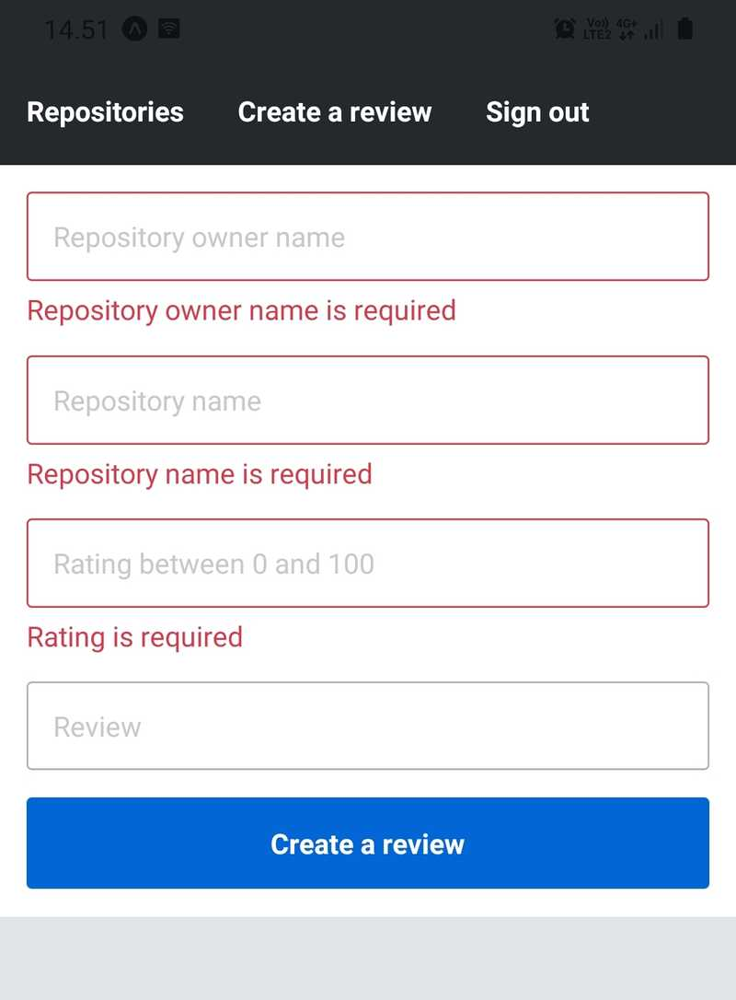  
Esta captura de pantalla se ha tomado después del envío de un formulario no válido para presentar cómo debería verse el formulario en un estado no válido.

## Ejercicio 10.22: el formulario de registro

Implemente un formulario de registro para registrar un usuario mediante Formik. El formulario debe tener tres campos: nombre de usuario, contraseña y confirmación de contraseña. Valide el formulario utilizando el esquema Yup para que contenga las siguientes validaciones:

- El nombre de usuario es una cadena obligatoria con una longitud entre 1 y 30
- La contraseña es una cadena obligatoria con una longitud entre 5 y 50
- La confirmación de la contraseña coincide con la contraseña

La validación del campo de confirmación de contraseña puede ser un poco complicada, pero se puede hacer, por ejemplo, usando los métodos [oneOf](https://github.com/jquense/yup#schemaoneofarrayofvalues-arrayany-message-string--function-schema-alias-equals) y [ref](https://github.com/jquense/yup#refpath-string-options--contextprefix-string--ref) como se sugiere en [este problema](https://github.com/jaredpalmer/formik/issues/90#issuecomment-354873201).

Puede crear un nuevo usuario utilizando la mutación `createUser`. Descubra cómo funciona esta mutación explorando la documentación en Apollo Sandbox. Después de una mutación de `createUser` exitosa, inicie sesión con el usuario creado utilizando el hook `useSignIn` como hicimos en el formulario de inicio de sesión. Una vez que el usuario haya iniciado sesión, redirija al usuario a la vista de lista de repositorios revisados.

El usuario debería poder acceder al formulario de registro a través de la barra de la aplicación presionando la pestaña "Sign up". Esta pestaña solo debe ser visible para los usuarios que no han iniciado sesión.

La versión final del formulario de registro debe tener un aspecto parecido a esto:  
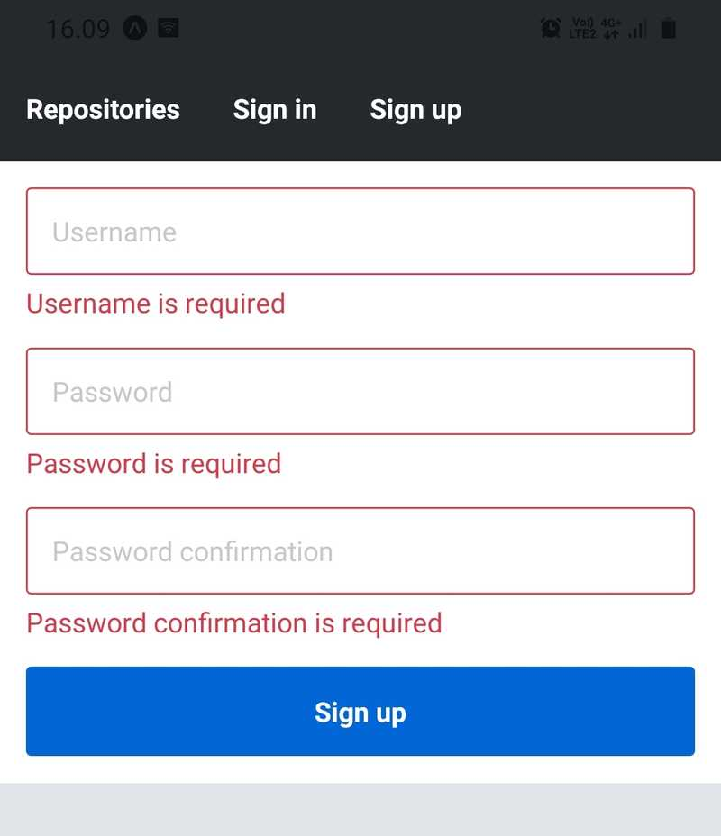  
Se tomó una captura de pantalla después del envío de un formulario no válido para presentar cómo debería verse el formulario en un estado no válido.

## Ejercicio 10.23: clasificación de la lista de repositorios revisados

En este momento, los repositorios de la lista de repositorios revisados ​​están ordenados por la fecha de la primera revisión del repositorio. Implemente una función que permita a los usuarios seleccionar el principio que se utiliza para ordenar los repositorios. Los principios de ordenación disponibles deben ser:

- Últimos repositorios. El repositorio con la primera revisión más reciente está en la parte superior de la lista. Este es el comportamiento actual y debería ser el principio predeterminado.
- Repositorios mejor calificados. El repositorio con la calificación promedio _más alta_ está en la parte superior de la lista.
- Repositorios de menor calificación. El repositorio con la calificación promedio _más baja_ está en la parte superior de la lista.

La consulta `repositories` que se utiliza para obtener los repositorios revisados ​​tiene un argumento llamado `orderBy`, que puede utilizar para definir el principio de ordenación. El argumento tiene dos valores permitidos: `CREATED_AT` (ordenar por la fecha de la primera revisión del repositorio) y `RATING_AVERAGE`, (ordenar por la calificación promedio del repositorio). La consulta también tiene un argumento llamado `orderDirection` que puede usarse para cambiar la dirección del pedido. El argumento tiene dos valores permitidos: `ASC` (ascendente, el valor más pequeño primero) y `DESC` (descendente, el valor más grande primero).

El estado del principio de orden seleccionado se puede mantener, por ejemplo, usando el hook [useState](https://react.dev/reference/react/useState) de React. Las variables utilizadas en la consulta `repositories` se pueden proporcionar al hook `useRepositories` como argumento.

Puede utilizar, por ejemplo, la librería [@react-native-picker/picker](https://docs.expo.dev/versions/latest/sdk/picker/) o el componente [Menu](https://oss.callstack.com/react-native-paper/docs/components/Menu/) de la libería [React Native Paper](https://oss.callstack.com/react-native-paper/) para implementar la selección del principio de ordenación. Puede utilizar el prop [ListHeaderComponent](https://reactnative.dev/docs/flatlist#listheadercomponent) del componente `FlatList` para proporcionar a la lista un encabezado que contenga el componente de selección.

La versión final de la función, dependiendo del componente de selección en uso, debería verse así:  
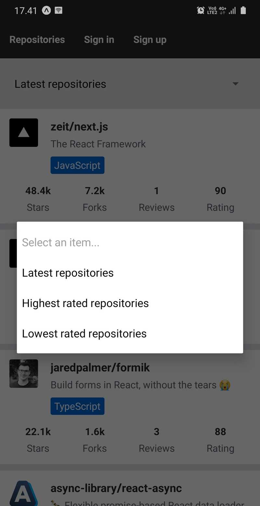

## Ejercicio 10.24: filtrado de lista de repositorios revisados

El servidor Apollo permite filtrar repositorios utilizando el nombre del repositorio o el nombre de usuario del propietario. Esto se puede hacer usando el argumento `searchKeyword` en la consulta `repositories`. A continuación, se muestra un ejemplo de cómo usar el argumento en una consulta:

```graphql
{
  repositories(searchKeyword: "ze") {
    edges {
      node {
        id
        fullName
      }
    }
  }
}
```

Implemente una función para filtrar la lista de repositorios revisados ​​según una palabra clave. Los usuarios deben poder escribir una palabra clave en una entrada de texto y la lista debe filtrarse a medida que el usuario escribe. Puede usar un componente `TextInput` simple o algo un poco más elegante como el componente [Searchbar](https://oss.callstack.com/react-native-paper/docs/components/Searchbar/) de React Native Paper como la entrada de texto. Coloque el componente de entrada de texto en el encabezado del componente `FlatList`.

Para evitar una multitud de solicitudes innecesarias mientras el usuario escribe la palabra clave rápidamente, solo elija la última entrada después de un breve retraso. Esta técnica a menudo se conoce como [debouncing](https://lodash.com/docs/4.17.21#debounce). La biblioteca [use-debounce](https://www.npmjs.com/package/use-debounce) es un hook útil para eliminar el rebote de una variable de estado. Úselo con un tiempo de retardo razonable, como 500 milisegundos. Almacene el valor de la entrada de texto usando el hook `useState` y pase el valor sin rebote a la consulta como el valor del argumento `searchKeyword`.

Probablemente se enfrente al problema de que el componente de entrada de texto pierde el foco después de cada pulsación de tecla. Esto se debe a que el contenido proporcionado por el prop `ListHeaderComponent` se desmonta constantemente. Esto se puede solucionar convirtiendo el componente que renderiza al componente `FlatList` en un componente de clase y definiendo la función de representación del encabezado como una propiedad de clase como esta:

```javascript
export class RepositoryListContainer extends React.Component {
  renderHeader = () => {
    // this.props contains the component's props
    const props = this.props;

    // ...

    return (
      <RepositoryListHeader
      // ...
      />
    );
  };

  render() {
    return (
      <FlatList
        // ...
        ListHeaderComponent={this.renderHeader}
      />
    );
  }
}
```

La versión final de la función de filtrado debería verse así:  


# Ejercicios 10.25. - 10.27.

## Ejercicio 10.25: desplazamiento infinito para la lista de revisiones del repositorio

Implemente el desplazamiento infinito para la lista de revisiones del repositorio. El campo `reviews` del tipo `Repository` tiene los argumentos `first` y `after` similares a las consultas `repositories`. El tipo `ReviewConnection` también tiene el campo `pageInfo` al igual que el tipo `RepositoryConnection`.

Aquí hay un ejemplo de consulta:

```graphql
{
  repository(id: "jaredpalmer.formik") {
    id
    fullName
    reviews(
      first: 2
      after: "WyIxYjEwZTRkOC01N2VlLTRkMDAtODg4Ni1lNGEwNDlkN2ZmOGYuamFyZWRwYWxtZXIuZm9ybWlrIiwxNTg4NjU2NzUwMDgwXQ=="
    ) {
      totalCount
      edges {
        node {
          id
          text
          rating
          createdAt
          repositoryId
          user {
            id
            username
          }
        }
        cursor
      }
      pageInfo {
        endCursor
        startCursor
        hasNextPage
      }
    }
  }
}
```

La política de campo de la caché puede ser similar a la de la consulta de `repositories`:

```javascript
const cache = new InMemoryCache({
  typePolicies: {
    Query: {
      fields: {
        repositories: relayStylePagination(),
      },
    },

    Repository: {
      fields: {
        reviews: relayStylePagination(),
      },
    },
  },
});
```

Al igual que con la lista de repositorios revisada, use un valor de argumento `first` relativamente pequeño mientras está probando el desplazamiento infinito. Es posible que deba crear algunos usuarios nuevos y usarlos para crear algunas reseñas nuevas para que la lista de reseñas sea lo suficientemente larga como para desplazarse. Establezca el valor del argumento `first` lo suficientemente alto para que el controlador `onEndReach` no se llame inmediatamente después de que se cargue la vista, pero lo suficientemente bajo para que pueda ver que más reseñas se recuperan una vez que llega al final de la lista. Una vez que todo funcione según lo previsto, puede utilizar un valor mayor para el argumento `first`.

## Ejercicio 10.26: vista de reseñas de usuarios

Implemente una función que permita al usuario ver sus reseñas. Una vez que haya iniciado sesión, el usuario debería poder acceder a esta vista presionando la pestaña "My reviews" en la barra de la aplicación. La implementación de un desplazamiento infinito para la lista de revisión es `opcional` en este ejercicio. Así es como debería verse aproximadamente la vista de lista de revisión:  
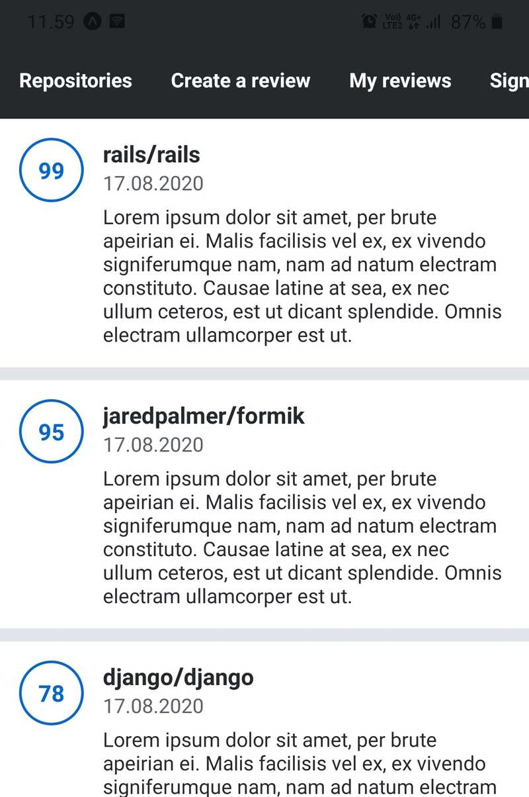  
Recuerde que puedes obtener el usuario autenticado del servidor Apollo con la consulta `me`. Esta consulta devuelve un tipo `User`, que tiene un campo `reviews`. Si ya ha implementado una consulta `me` reutilizable en su código, puede personalizar esta consulta para obtener el campo `reviews` de forma condicional. Esto se puede hacer usando la directiva de GraphQL [include](https://graphql.org/learn/queries/#directives).  
Digamos que la consulta actual se implementa aproximadamente de la siguiente manera:

```javascript
const GET_CURRENT_USER = gql`
  query {
    me {
      # user fields...
    }
  }
`;
```

Puede proporcionar la consulta con un argumento `includeReviews` y utilizarlo con la directiva `include`:

```javascript
const GET_CURRENT_USER = gql`
  query getCurrentUser($includeReviews: Boolean = false) {
    me {
      # user fields...
      reviews @include(if: $includeReviews) {
        edges {
          node {
            # review fields...
          }
          cursor
        }
        pageInfo {
          # page info fields...
        }
      }
    }
  }
`;
```

El argumento `includeReviews` tiene un valor predeterminado de `false`, porque no queremos causar una sobrecarga adicional del servidor a menos que queramos explícitamente obtener las revisiones de los usuarios autorizados. El principio de la directiva `include` es bastante simple: si el valor del argumento `if` es `true`, incluya el campo, de lo contrario omítalo.

## Ejercicio 10.27: revisar acciones

Ahora que el usuario puede ver sus reseñas, agreguemos algunas acciones a las reseñas. Debajo de cada revisión en la lista de revisión, debe haber dos botones. Un botón es para ver el repositorio de la revisión. Presionar este botón debería llevar al usuario a la revisión del repositorio único implementada en el ejercicio anterior. El otro botón es para eliminar el repositorio. Al presionar este botón se debería eliminar la revisión. Así es como deberían verse las acciones:  
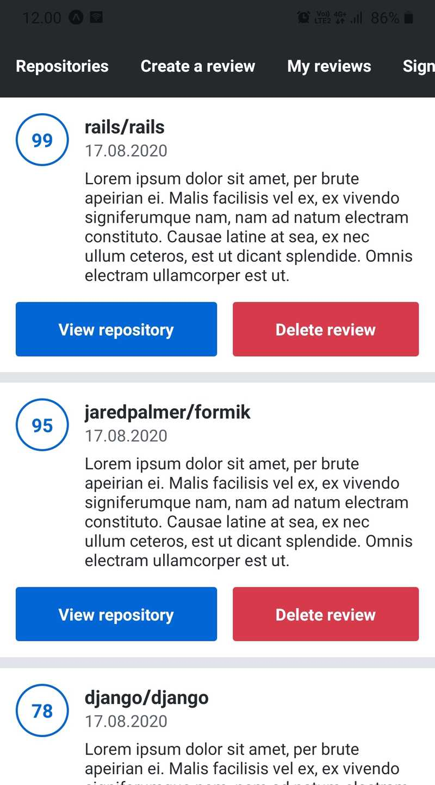    
Al presionar el botón delete debe seguir una alerta de confirmación. Si el usuario confirma la eliminación, la revisión se elimina. De lo contrario, la eliminación se descarta. Puede implementar la confirmación utilizando el módulo [Alerta](https://reactnative.dev/docs/alert). Tenga en cuenta que llamar al método `Alert.alert` no abrirá ninguna ventana en la vista previa web de Expo. Use la aplicación móvil Expo o un emulador para ver cómo se ve la ventana de alerta.  
Aquí está la alerta de confirmación que debería aparecer una vez que el usuario presione el botón delete:    
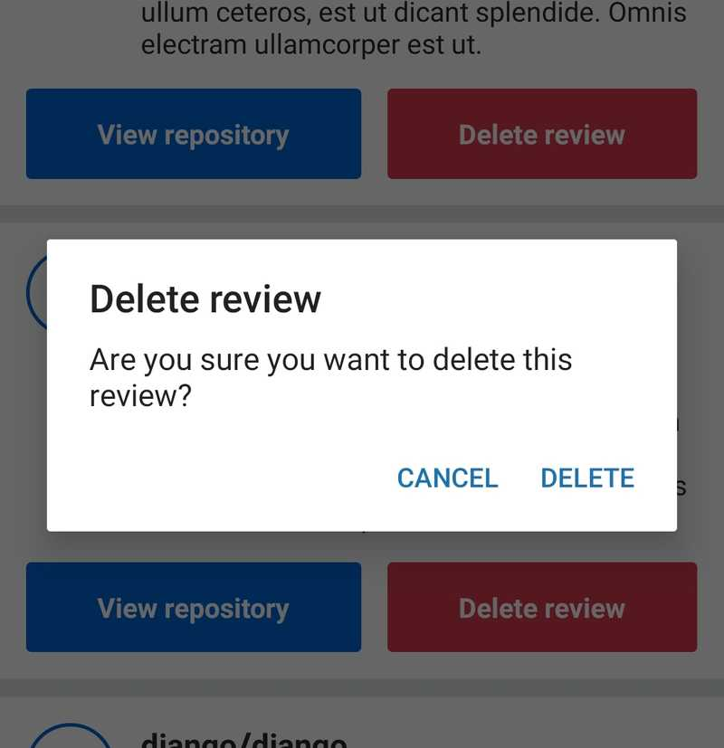    
Puede eliminar una revisión mediante la mutación `deleteReview`. Esta mutación tiene un solo argumento, que es el id de la revisión que se eliminará. Una vez realizada la mutación, la forma más sencilla de actualizar la consulta de la lista de revisión es llamar a la función [refetch](https://www.apollographql.com/docs/react/data/queries#refetching).
