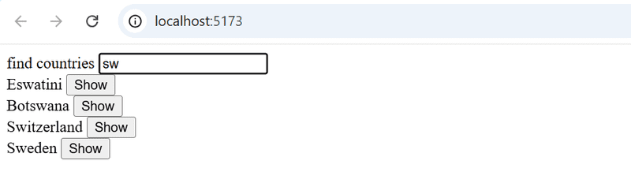
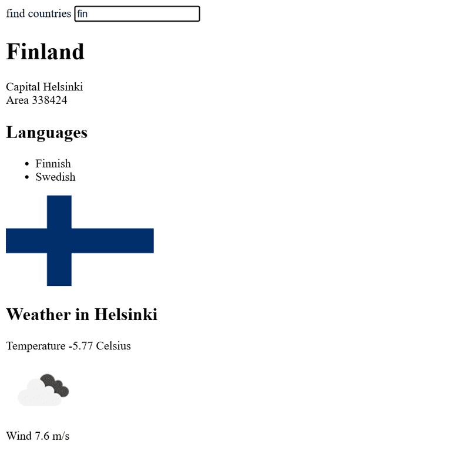

> [!IMPORTANT]
> **Información del curso** → Ejercicios 2.1, 2.2, 2.3, 2.4, 2.5 → Carpeta llamada **"info-curso"**.  
> **La Agenda Telefónica** → Ejercicios 2.6, 2.7, 2.8, 2.9*, 2.10, 2.11, 2.12, 2.13, 2.14, 2.15*, 2.16, 2.17* → Carpeta llamada **agenda-telefonica**.  
> **Datos de países** → Ejercicios 2.18*, 2.19*, 2.20* → Carpeta llamada **datos-de-paises**.  
> La carpeta llamada **"imagenes"** contiene únicamente las imágenes que se muestran en este archivo README.md.  

# Ejercicios 2.1.-2.5.

## 2.1: Información del curso paso 6

Terminemos el código para renderizar el contenido del curso de los ejercicios 1.1 - 1.5. Puedes comenzar con el código de las respuestas modelo. Las respuestas modelo para la parte 1 se pueden encontrar yendo al [sistema de envío](https://studies.cs.helsinki.fi/stats/courses/fullstackopen), haciendo clic en _my submissions_ en la parte superior, y en la fila correspondiente a la parte 1, bajo la columna _solutions_, haciendo clic en _show_. Para ver la solución al ejercicio de _courseinfo_, haz clic dentro de la carpeta src en **App.jsx** para visualizar el código.

**Ten en cuenta que si copias un proyecto de un lugar a otro, es posible que debas eliminar el directorio _node_modules_ e instalar las dependencias nuevamente con el comando npm install antes de poder iniciar la aplicación.**  
En general, no se recomienda copiar todo el contenido de un proyecto y/o agregar el directorio _node_modules_ al sistema de control de versiones.  
Cambiemos el componente _App_ de la siguiente manera:

```jsx
const App = () => {
  const course = {
    id: 1,
    name: "Half Stack application development",
    parts: [
      {
        name: "Fundamentals of React",
        exercises: 10,
        id: 1,
      },
      {
        name: "Using props to pass data",
        exercises: 7,
        id: 2,
      },
      {
        name: "State of a component",
        exercises: 14,
        id: 3,
      },
    ],
  };

  return <Course course={course} />;
};

export default App;
```

Define un componente responsable de formatear un solo curso llamado _Course_.  
La estructura de componentes de la aplicación puede ser, por ejemplo, la siguiente:

```plaintext
App
  Course
    Header
    Content
      Part
      Part
      ...
```

Por lo tanto, el componente _Course_ contiene los componentes definidos en la parte anterior, que son responsables de renderizar el nombre del curso y sus partes.  
La página renderizada puede verse, por ejemplo, de la siguiente manera:  
  
Aún no necesitas la suma de los ejercicios.  
La aplicación debe funcionar _independientemente del número de partes que tenga un curso_, así que asegúrate de que la aplicación funcione si agregas o quitas partes de un curso.  
¡Asegúrate de que la consola no muestre errores!

## 2.2: Información del curso paso 7

Muestra también la suma de los ejercicios del curso.  


## 2.3\*: Información del curso paso 8

Si aún no lo has hecho, calcula la suma de los ejercicios con el método de array [reduce](https://developer.mozilla.org/es/docs/Web/JavaScript/Reference/Global_Objects/Array/reduce).  
**Consejo profesional:** cuando tu código se ve así:

```jsx
const total = parts.reduce((s, p) => someMagicHere);
```

y no funciona, vale la pena usar _console.log_, que requiere que la función de flecha se escriba en su forma más larga:

```jsx
const total = parts.reduce((s, p) => {
  console.log("what is happening", s, p);
  return someMagicHere;
});
```

**¿No funciona?**: Utiliza tu motor de búsqueda para buscar cómo se utiliza **reduce** en un **Array de Objetos**.

## 2.4: Información del curso paso 9

Ampliemos nuestra aplicación para permitir un _número arbitrario_ de cursos:

```jsx
const App = () => {
  const courses = [
    {
      name: "Half Stack application development",
      id: 1,
      parts: [
        {
          name: "Fundamentals of React",
          exercises: 10,
          id: 1,
        },
        {
          name: "Using props to pass data",
          exercises: 7,
          id: 2,
        },
        {
          name: "State of a component",
          exercises: 14,
          id: 3,
        },
        {
          name: "Redux",
          exercises: 11,
          id: 4,
        },
      ],
    },
    {
      name: "Node.js",
      id: 2,
      parts: [
        {
          name: "Routing",
          exercises: 3,
          id: 1,
        },
        {
          name: "Middlewares",
          exercises: 7,
          id: 2,
        },
      ],
    },
  ];

  return <div>// ...</div>;
};
```

La aplicación puede, por ejemplo, verse así:  


## 2.5: Módulo separado paso 10

Declara el componente _Course_ como un módulo separado, que se importa en el componente _App_. Puedes incluir todos los subcomponentes del curso en el mismo módulo.

# Ejercicios 2.6.-2.10.

En el primer ejercicio, comenzaremos a trabajar en una aplicación que se continuara desarrollando en los ejercicios posteriores. En conjuntos de ejercicios relacionados, es suficiente con presentar la versión final de tu aplicación. También puedes realizar un commit por separado después de haber terminado cada parte del conjunto de ejercicios, pero no es necesario hacerlo.

## 2.6: La Agenda Telefónica Paso 1

Creemos una agenda telefónica sencilla. **_En esta parte solo agregaremos nombres a la agenda_**.  
Comencemos por implementar la adición de una persona a la agenda.  
Puedes utilizar el siguiente código como punto de partida para el componente _App_ de tu aplicación:

```jsx
import { useState } from "react";

const App = () => {
  const [persons, setPersons] = useState([{ name: "Arto Hellas" }]);
  const [newName, setNewName] = useState("");

  return (
    <div>
      <h2>Phonebook</h2>
      <form>
        <div>
          name: <input />
        </div>
        <div>
          <button type="submit">add</button>
        </div>
      </form>
      <h2>Numbers</h2>
      ...
    </div>
  );
};

export default App;
```

El estado de **newName** está destinado a controlar el elemento input del formulario.  
A veces puede resultar útil representar el estado y otras variables como texto con fines de depuración. Puedes agregar temporalmente el siguiente elemento al componente renderizado:

```jsx
<div>debug: {newName}</div>
```

También es importante poner lo que aprendimos en el capítulo [depuración de aplicaciones React](https://fullstackopen.com/es/part1/un_estado_mas_complejo_depurando_aplicaciones_react) de la parte uno en buen uso. La extensión [React developer tools](https://chromewebstore.google.com/detail/react-developer-tools/fmkadmapgofadopljbjfkapdkoienihi?pli=1) especialmente, es increíblemente útil para rastrear los cambios que ocurren en el estado de la aplicación.  
Después de terminar este ejercicio, su aplicación debería verse así:  
  
¡Ten en cuenta el uso de la extensión de herramientas de desarrollo React en la imagen de arriba!  
**NB**:

- puedes utilizar el nombre de la persona como valor de la propiedad _key_
- ¡recuerda evitar la acción predeterminada de enviar formularios HTML!

## 2.7: La Agenda Telefónica Paso 2

Evita que el usuario pueda agregar nombres que ya existen en la agenda telefónica. Los arrays de JavaScript tienen numerosos [métodos](https://developer.mozilla.org/es/docs/Web/JavaScript/Reference/Global_Objects/Array) adecuados para realizar esta tarea.  
Emite una advertencia con el comando [alert](https://developer.mozilla.org/es/docs/Web/API/Window/alert) cuando se intente realizar una acción de este tipo:  
  
**Sugerencia:** cuando estés formando cadenas que contienen valores de variables, se recomienda utilizar una [plantilla de cadena](https://developer.mozilla.org/es/docs/Web/JavaScript/Reference/Template_literals):

```jsx
`${newName} is already added to phonebook`;
```

Si la variable **newName** tiene el valor _Arto Hellas_, la expresión de la plantilla de cadena regresa la cadena

```plaintext
`Arto Hellas is already added to phonebook`
```

Lo mismo se podría hacer en una forma más similar a Java usando el operador de sumar:

```jsx
newName + " is already added to phonebook";
```

Usar plantillas de cadenas es la opción más idiomática y el signo de un verdadero profesional de JavaScript.

## 2.8: La Agenda Telefónica Paso 3

Amplía tu aplicación permitiendo a los usuarios agregar números de teléfono a la agenda telefónica. Deberás agregar un segundo elemento _input_ al formulario (junto con su propio controlador de eventos):

```html
<form>
  <div>name: <input /></div>
  <div>number: <input /></div>
  <div><button type="submit">add</button></div>
</form>
```

En este punto, la aplicación podría verse así. La imagen también muestra el estado de la aplicación con la ayuda de [React developer tools](https://chromewebstore.google.com/detail/react-developer-tools/fmkadmapgofadopljbjfkapdkoienihi):  


## 2.9\*: La Agenda Telefónica Paso 4

Implementa un campo de búsqueda que pueda usarse para filtrar la lista de personas por nombre:  
  
Puedes implementar el campo de búsqueda como un elemento _input_ que se coloca fuera del formulario HTML. La lógica de filtrado que se muestra en la imagen _no distingue entre mayúsculas y minúsculas_, lo que significa que el término de búsqueda _arto_ también devuelve resultados que contienen Arto con una A mayúscula.  
**NB:** Cuando trabajes en una nueva funcionalidad, a menudo es útil "codificar" algunos datos ficticios en tu aplicación, por ejemplo

```jsx
const App = () => {
  const [persons, setPersons] = useState([
    { name: "Arto Hellas", number: "040-123456", id: 1 },
    { name: "Ada Lovelace", number: "39-44-5323523", id: 2 },
    { name: "Dan Abramov", number: "12-43-234345", id: 3 },
    { name: "Mary Poppendieck", number: "39-23-6423122", id: 4 },
  ]);

  // ...
};
```

Esto evita tener que ingresar datos manualmente en tu aplicación para probar tu nueva funcionalidad.

## 2.10: La Agenda Telefónica Paso 5

Si has implementado tu aplicación en un solo componente, refactoriza extrayendo las partes adecuadas en nuevos componentes. Mantén el estado de la aplicación y todos los controladores de eventos en el componente raíz de _App_.  
Es suficiente extraer **tres** componentes de la aplicación. Buenos candidatos para componentes separados son, por ejemplo, el filtro de búsqueda, el formulario para agregar nuevas personas a la agenda telefónica, un componente que muestra a todas las personas de la agenda telefónica y un componente que muestra los detalles de una sola persona.  
El componente raíz de la aplicación podría verse similar a esto después de la refactorización. El componente raíz refactorizado a continuación solo representa los títulos y permite que los componentes extraídos se encarguen del resto.

```jsx
const App = () => {
  // ...

  return (
    <div>
      <h2>Phonebook</h2>

      <Filter ... />

      <h3>Add a new</h3>

      <PersonForm
        ...
      />

      <h3>Numbers</h3>

      <Persons ... />
    </div>
  )
}
```

**NB:** Es posible que tengas problemas en este ejercicio si defines tus componentes "en el lugar equivocado". Ahora sería un buen momento para recordar el capítulo [no definir componentes dentro de los componentes](https://fullstackopen.com/es/part1/un_estado_mas_complejo_depurando_aplicaciones_react#no-definir-componentes-dentro-de-los-componentes) de la última parte.

# Ejercicio 2.11.

## 2.11: La Agenda Telefónica Paso 6

Continuamos con el desarrollo de la agenda telefónica. Almacena el estado inicial de la aplicación en el archivo _db.json_, que debe ubicarse en la raíz del proyecto.

```json
{
  "persons": [
    {
      "name": "Arto Hellas",
      "number": "040-123456",
      "id": 1
    },
    {
      "name": "Ada Lovelace",
      "number": "39-44-5323523",
      "id": 2
    },
    {
      "name": "Dan Abramov",
      "number": "12-43-234345",
      "id": 3
    },
    {
      "name": "Mary Poppendieck",
      "number": "39-23-6423122",
      "id": 4
    }
  ]
}
```

Inicia json-server en el puerto 3001 y asegúrate de que el servidor devuelve la lista de personas yendo a la dirección http://localhost:3001/persons en el navegador.  
Si recibes el siguiente mensaje de error:

```txt
events.js:182
      throw er; // Unhandled 'error' event
      ^

Error: listen EADDRINUSE 0.0.0.0:3001
    at Object._errnoException (util.js:1019:11)
    at _exceptionWithHostPort (util.js:1041:20)
```

significa que el puerto 3001 ya está en uso por otra aplicación, por ejemplo en uso por un servidor json que ya se está ejecutando. Cierra la otra aplicación o cambia el puerto en caso de que no funcione.  
Modifica la aplicación de modo que el estado inicial de los datos se obtenga del servidor mediante la librería _axios_. Completa la obtención de los datos con un [Effect hook](https://react.dev/reference/react/useEffect).

# Ejercicios 2.12-2.15

## 2.12: La Agenda Telefónica paso 7

Volvamos a nuestra aplicación de agenda telefónica.  
Actualmente, los números que se agregan a la agenda telefónica no se guardan en un servidor backend. Soluciona esta situación.

## 2.13: La Agenda Telefónica paso 8

Extrae el código que maneja la comunicación con el backend en su propio módulo siguiendo el ejemplo mostrado anteriormente en esta parte del material del curso.

## 2.14: La Agenda Telefónica paso 9

Permite a los usuarios eliminar entradas de la agenda telefónica. La eliminación se puede hacer a través de un botón dedicado para cada persona en la lista de la agenda telefónica. Puedes confirmar la acción del usuario utilizando el método [window.confirm](https://developer.mozilla.org/es/docs/Web/API/Window/confirm):  
  
El recurso asociado a una persona en el backend se puede eliminar haciendo una solicitud HTTP DELETE a la URL del recurso. Si estamos eliminando, por ejemplo, a una persona que tiene el _id_ 2, tendríamos que hacer una solicitud HTTP DELETE a la URL _localhost:3001/persons/2_. No se envía ningún dato con la solicitud.  
Puedes hacer una solicitud HTTP DELETE con la librería [axios](https://github.com/axios/axios) de la misma manera que hacemos todas las demás solicitudes.  
**NB:** No puedes usar el nombre delete para una variable porque es una palabra reservada en JavaScript. Por ejemplo, lo siguiente no es posible:

```js
// use some other name for variable!
const delete = (id) => {
  // ...
}


```

## 2.15\*: La Agenda Telefónica paso 10

_¿Por qué hay un asterisco en el ejercicio? Consulta [aquí](https://fullstackopen.com/es/part0/informacion_general#tomando-el-curso) para obtener la explicación._  
Cambia la funcionalidad para que si se agrega un número a un usuario que ya existe, el nuevo número reemplace al antiguo. Se recomienda usar el método HTTP PUT para actualizar el número de teléfono.  
Si la información de la persona ya está en la agenda telefónica, la aplicación puede pedirle al usuario que confirme la acción:  


# Ejercicios 2.16-2.17

## 2.16: Agenda Telefónica paso 11

Usa el ejemplo de [mensaje de error mejorado](https://fullstackopen.com/es/part2/agregar_estilos_a_la_aplicacion_react#mensaje-de-error-mejorado) de la parte 2 como guía para mostrar una notificación que dure unos segundos después de que se ejecute una operación exitosa (se agrega una persona o se cambia un número):
  

## 2.17\*: Agenda Telefónica paso 12

Abre tu aplicación en dos navegadores. **Si eliminas a una persona en el navegador 1** poco antes de intentar _cambiar el número de teléfono de la persona_ en el navegador 2, obtendrás los siguientes mensajes de error:    
  
Soluciona el problema según el ejemplo mostrado en [promesas y errores](https://fullstackopen.com/es/part2/alterando_datos_en_el_servidor#promesas-y-errores) en la parte 2. Modifica el ejemplo para que se muestre un mensaje cuando la operación no tiene éxito. Los mensajes mostrados para eventos exitosos y no exitosos deben lucir diferentes:  
  
**Nota** que incluso si manejas la excepción, el primer mensaje de error "404" todavía se imprime en la consola. Pero no deberías ver "Uncaught (in promise) Error".

# Ejercicios 2.18.-2.20.

## 2.18\* Datos de países, paso 1

En https://studies.cs.helsinki.fi/restcountries/ puedes encontrar un servicio que ofrece mucha información sobre diferentes países en un formato legible por máquinas a través de la API REST. Crea una aplicación que te permita ver información de diferentes países.  
La interfaz de usuario es muy simple. El país que se mostrará se encuentra escribiendo una consulta de búsqueda en el campo de búsqueda.    
Si hay demasiados países (más de 10) que coinciden con la consulta, se le pide al usuario que haga su consulta más específica:  
  
Si hay diez o menos países, pero más de uno, se muestran todos los países que coinciden con la consulta:  
  
Cuando solo hay un país que coincide con la consulta, se muestran los datos básicos del país (por ejemplo, capital y área), su bandera y los idiomas hablados:  
  
**NB**: Es suficiente que tu aplicación funcione para la mayoría de los países. Algunos países, como _Sudán_, pueden ser difíciles de admitir ya que el nombre del país es parte del nombre de otro país, _Sudán del Sur_. No es necesario que te preocupes por estos casos especiales.

## 2.19\*: Datos de países, paso 2

**Todavía hay mucho por hacer en esta parte, ¡así que no te atasques en este ejercicio!**  
Mejora la aplicación del ejercicio anterior, de modo que cuando se muestren los nombres de varios países en la página, haya un botón junto al nombre del país que, al presionarlo, muestra la vista de ese país:    
  
En este ejercicio, también es suficiente que tu aplicación funcione para la mayoría de los países. Se pueden ignorar los países cuyo nombre aparece en el nombre de otro país, como _Sudán_.

## 2.20\*: Datos de países, paso 3

Agrega a la vista que muestra los datos de un solo país el informe meteorológico para la capital de ese país. Hay docenas de proveedores de datos meteorológicos. Una API sugerida es https://openweathermap.org. Ten en cuenta que puede pasar algunos minutos hasta que una clave API generada sea válida.  
  
Si usas OpenWeatherMap, [aquí](https://openweathermap.org/weather-conditions#Icon-list) tienes la descripción de cómo obtener iconos meteorológicos.  
**NB:** En algunos navegadores (como Firefox), la API elegida puede enviar una respuesta de error, lo que indica que no se admite el cifrado HTTPS, aunque la URL de la solicitud comience con http://. Este problema se puede solucionar completando el ejercicio con Chrome.  
**NB:** Necesitas una clave API para usar casi todos los servicios meteorológicos. ¡No guardes la clave API en GitHub! Ni codifiques la clave API en tu código fuente. En su lugar, utiliza una [variable de entorno](https://es.vite.dev/guide/env-and-mode.html) para guardar la clave.  
Suponiendo que la clave API es 54l41n3n4v41m34rv0, cuando la aplicación se inicia de la siguiente manera:

```plaintext
export VITE_SOME_KEY=54l41n3n4v41m34rv0 && npm run dev // Para Linux/macOS Bash
($env:VITE_SOME_KEY="54l41n3n4v41m34rv0") -and (npm run dev) // Para Windows PowerShell
set "VITE_SOME_KEY=54l41n3n4v41m34rv0" && npm run dev // Para Windows cmd.exe
```

puedes acceder al valor de la clave desde el objeto **import.meta.env**:

```plaintext
const api_key = import.meta.env.VITE_SOME_KEY
// variable api_key ahora tiene el valor configurado
```

Ten en cuenta que deberás reiniciar el servidor para aplicar los cambios.
