# Ejercicios 5.1. - 5.4.

Ahora crearemos un frontend para el backend de la lista de blogs que creamos en la última parte. Puedes usar [esta aplicación](https://github.com/fullstack-hy2020/bloglist-frontend) de GitHub como base para tu solución. Debes conectar tu backend con un proxy como se muestra en [la parte 3](https://fullstackopen.com/es/part3/despliegue_de_la_aplicacion_a_internet#proxy).  
Es suficiente con enviar tu solución terminada. Puedes hacer un commit después de cada ejercicio, pero eso no es necesario.  
Los primeros ejercicios revisan todo lo que hemos aprendido sobre React hasta ahora. Pueden ser un desafío, especialmente si tu backend está incompleto. Podría ser mejor usar el backend de la respuesta modelo de la parte 4.  
Mientras realizas los ejercicios, recuerda todos los métodos de depuración de los que hemos hablado, especialmente mirar a la consola.  
**Advertencia**: Si notas que estás mezclando los comandos _async/await_ y _then_, hay un 99.9% de probabilidades de que estés haciendo algo mal. Utiliza uno u otro, nunca ambos.

## 5.1: Frontend de la Lista de Blogs, paso 1

Clona la aplicación de [GitHub](https://github.com/fullstack-hy2020/bloglist-frontend) con el comando:

```bash
git clone https://github.com/fullstack-hy2020/bloglist-frontend
```

_Elimina la configuración de git de la aplicación clonada_

```bash
cd bloglist-frontend   // ve al repositorio clonado
rm -rf .git
```

La aplicación se inicia de la forma habitual, pero primero debes instalar sus dependencias:

```bash
npm install
npm run dev
```

Implementa la funcionalidad de inicio de sesión en el frontend. El token devuelto con un inicio de sesión exitoso se guarda en el estado _user_ de la aplicación.  
Si un usuario no ha iniciado sesión, _solo_ se verá el formulario de inicio de sesión.  
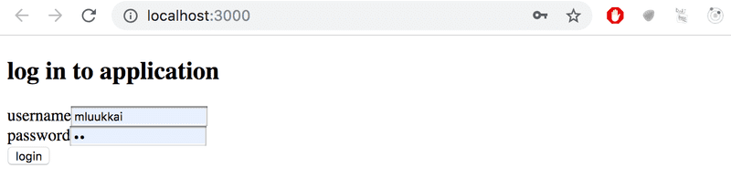  
Si el usuario ha iniciado sesión, se muestra el nombre del usuario y una lista de blogs.  
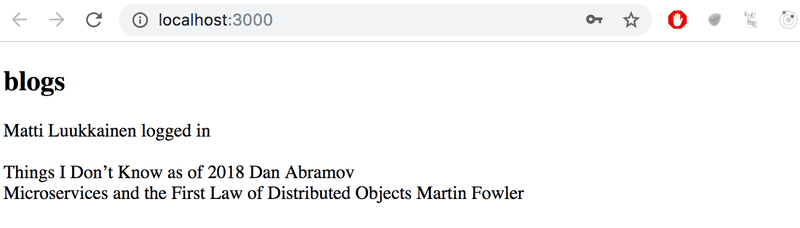  
Los detalles de usuario del usuario que inició sesión no tienen que guardarse todavía en el local storage.  
**NB** Puedes implementar el rendering condicional del formulario de inicio de sesión así, por ejemplo:

```jsx
  if (user === null) {
    return (
      <div>
        <h2>Log in to application</h2>
        <form>
          //...
        </form>
      </div>
    )
  }

  return (
    <div>
      <h2>blogs</h2>
      {blogs.map(blog =>
        <Blog key={blog.id} blog={blog} />
      )}
    </div>
  )
}
```

## 5.2: Frontend de la Lista de Blogs, paso 2

Haz que el inicio de sesión sea "permanente" mediante el use de local storage. También implementa una forma de cerrar sesión.  
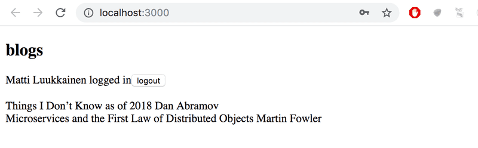  
Asegúrate de que el navegador no recuerde los detalles del usuario después de cerrar la sesión.

## 5.3: Frontend de la Lista de Blogs, paso 3

Expande tu aplicación para permitir que un usuario que haya iniciado sesión agregue nuevos blogs:  
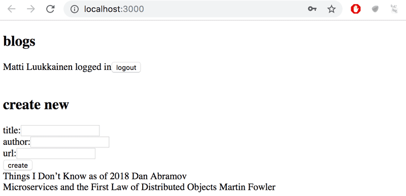

## 5.4: Frontend de la Lista de Blogs, paso 4

Implementa notificaciones que informen al usuario sobre operaciones exitosas y no exitosas en la parte superior de la página. Por ejemplo, cuando se agrega un nuevo blog, se puede mostrar la siguiente notificación:  
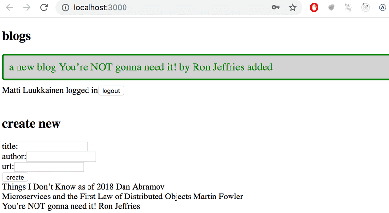  
Un inicio de sesión fallido puede mostrar la siguiente notificación:  
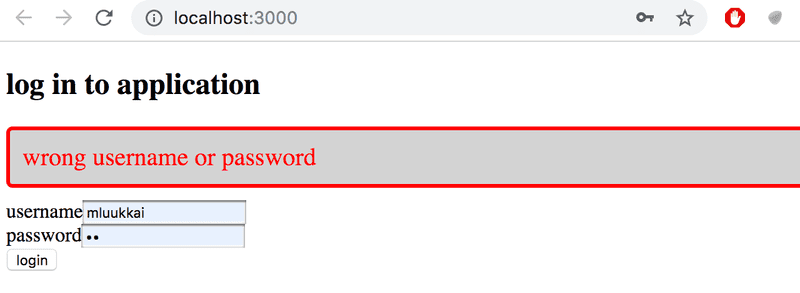  
Las notificaciones deben estar visibles durante unos segundos. No es obligatorio agregar colores.

# Ejercicios 5.5. - 5.11.

## 5.5 Frontend de la Lista de Blogs, paso 5

Cambia el formulario para crear publicaciones de blog para que solo se muestre cuando sea apropiado. Utiliza una funcionalidad similar a la que se mostró [anteriormente en esta parte del material del curso](https://fullstackopen.com/es/part5/props_children_y_proptypes#mostrando-el-formulario-de-inicio-de-sesion-solo-cuando-sea-apropiado). Si lo deseas, puedes utilizar el componente _Togglable_ definido en la parte 5.  
Por defecto, el formulario no es visible  
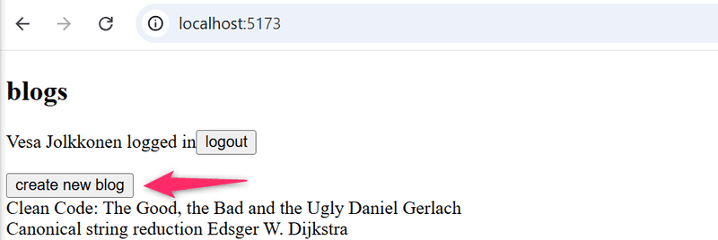  
Se expande cuando se hace clic en el botón _create new blog_  
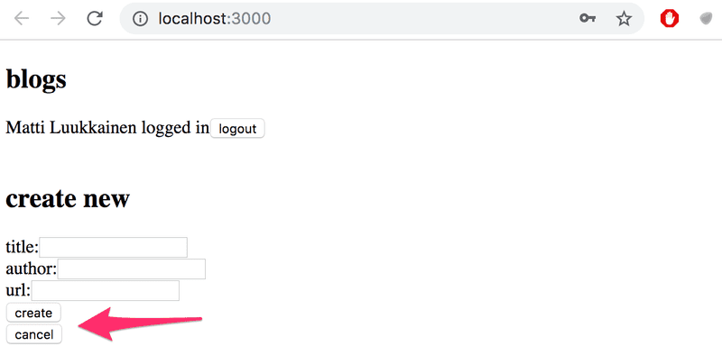  
El formulario se esconde otra vez luego de que un nuevo blog es creado.

## 5.6 Frontend de la Lista de Blogs, paso 6

Separa el formulario para crear un nuevo blog en su propio componente (si aún no lo has hecho) y mueve todos los estados necesarios para crear un nuevo blog a este componente.  
El componente debe funcionar como el componente _NoteForm_ del [material](https://fullstackopen.com/es/part5/props_children_y_proptypes) de esta parte.

## 5.7 Frontend de la Lista de Blogs, paso 7

Agreguemos un botón a cada blog, que controla si se muestran o no todos los detalles sobre el blog.  
Los detalles completos del blog se abren cuando se hace clic en el botón.  
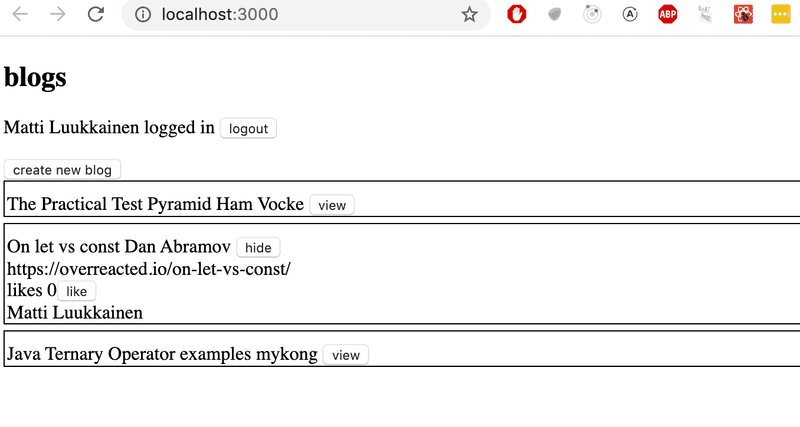  
Y los detalles se ocultan cuando se vuelve a hacer clic en el botón.  
En este punto, el botón _like_ no necesita hacer nada.  
La aplicación que se muestra en la imagen tiene un poco de CSS adicional para mejorar su apariencia.  
Es fácil agregar estilos a la aplicación como se muestra en la parte 2 usando estilos [en línea](https://fullstackopen.com/es/part2/agregar_estilos_a_la_aplicacion_react#estilos-en-linea):

```jsx
const Blog = ({ blog }) => {
  const blogStyle = {
    paddingTop: 10,
    paddingLeft: 2,
    border: "solid",
    borderWidth: 1,
    marginBottom: 5,
  };

  return (
    <div style={blogStyle}>
      <div>
        {blog.title} {blog.author}
      </div>
      // ...
    </div>
  );
};
```

**NB**: Aunque la funcionalidad implementada en esta parte es casi idéntica a la funcionalidad proporcionada por el componente _Togglable_, no se puede usar directamente para lograr el comportamiento deseado. La solución más fácil sería agregar un estado al componente blog que controle si todos los detalles están siendo mostrados o no.

## 5.8: Frontend de la Lista de Blogs, paso 8

Implementa la funcionalidad para el botón like. Los likes aumentan al hacer un solicitud HTTP **PUT** a la dirección única de la publicación del blog en el backend.  
Dado que la operación de backend reemplaza toda la publicación del blog, deberás enviar todos sus campos en el cuerpo de la solicitud. Si deseas agregar un like a la siguiente publicación de blog:

```javascript
{
  _id: "5a43fde2cbd20b12a2c34e91",
  user: {
    _id: "5a43e6b6c37f3d065eaaa581",
    username: "mluukkai",
    name: "Matti Luukkainen"
  },
  likes: 0,
  author: "Joel Spolsky",
  title: "The Joel Test: 12 Steps to Better Code",
  url: "https://www.joelonsoftware.com/2000/08/09/the-joel-test-12-steps-to-better-code/"
},
```

Deberías realizar una solicitud HTTP PUT a la dirección _/api/blogs/5a43fde2cbd20b12a2c34e91_ con los siguientes datos de solicitud:

```javascript
{
  user: "5a43e6b6c37f3d065eaaa581",
  likes: 1,
  author: "Joel Spolsky",
  title: "The Joel Test: 12 Steps to Better Code",
  url: "https://www.joelonsoftware.com/2000/08/09/the-joel-test-12-steps-to-better-code/"
}
```

El Backend también debe ser actualizado para manejar la referencia al usuario.

## 5.9: Frontend de la lista de Blogs, paso 9

Nos damos cuenta de que algo está mal. Cuando se da "me gusta" a un blog en la app, el nombre del usuario que añadió el blog no se muestra en sus detalles:  
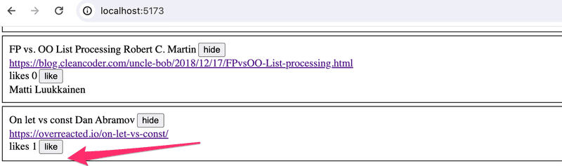  
Cuando se recarga el navegador, la información de la persona se muestra. Esto no es aceptable, averigua dónde está el problema y realiza la corrección necesaria.  
Por supuesto, es posible que ya hayas hecho todo correctamente y el problema no ocurra en tu código. En ese caso, puedes continuar.

## 5.10: Frontend de la Lista de Blogs, paso 10

Modifica la aplicación para enumerar las publicaciones de blog por el número de _likes_. La clasificación se puede hacer con el método de array [sort](https://developer.mozilla.org/es/docs/Web/JavaScript/Reference/Global_Objects/Array/sort).

## 5.11: Frontend de la Lista de Blogs, paso 11

Agrega un nuevo botón para eliminar publicaciones de blog. También implementa la lógica para eliminar publicaciones de blog en el backend.  
Tu aplicación podría verse así:  
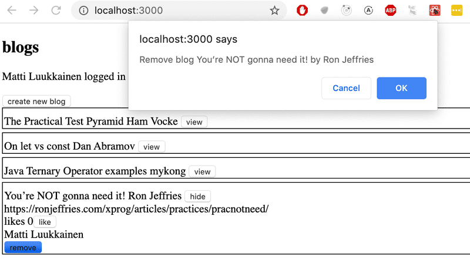  
El cuadro de diálogo de confirmación para eliminar una publicación de blog es fácil de implementar con la función [window.confirm](https://developer.mozilla.org/es/docs/Web/API/Window/confirm).  
Muestra el botón para eliminar una publicación de blog solo si la publicación de blog fue agregada por el usuario.

# Ejercicio 5.12.

## 5.12: Frontend de la Lista de Blogs, paso 12

Define PropTypes para uno de los componentes de tu aplicación y agrega ESlint al proyecto. Define la configuración según tu preferencia. Corrige todos los errores del linter.  
Vite ha instalado ESlint en el proyecto por defecto, así que todo lo que queda por hacer es definir tu configuración deseada en el archivo ._eslintrc.cjs_.

# Ejercicios 5.13. - 5.16.

## 5.13: Pruebas de Listas de Blogs, paso 1

Realiza una prueba que verifique que el componente que muestra un blog muestre el título y el autor del blog, pero no muestre su URL o el número de likes por defecto  
Agrega clases de CSS al componente para ayudar con las pruebas según sea necesario.

## 5.14: Pruebas de Listas de Blogs, paso 2

Realiza una prueba que verifique que la URL del blog y el número de likes se muestran cuando se hace clic en el botón que controla los detalles mostrados.

## 5.15: Pruebas de Listas de Blogs, paso 3

Realiza una prueba que garantice que si se hace clic dos veces en el botón _like_, se llama dos veces al controlador de eventos que el componente recibió como props.

## 5.16: Pruebas de Listas de Blogs, paso 4

Haz una prueba para el nuevo formulario de blog. La prueba debe verificar que el formulario llama al controlador de eventos que recibió como props con los detalles correctos cuando se crea un nuevo blog.

# Ejercicios 5.17. - 5.23.

En los últimos ejercicios de esta parte, hagamos algunas pruebas E2E para la aplicación de blog. El material anterior debería ser suficiente para hacer la mayoría de los ejercicios. Sin embargo, definitivamente deberías leer la [documentación](https://playwright.dev/docs/intro) de Playwright y la [descripción de la API](https://playwright.dev/docs/api/class-playwright), al menos las secciones mencionadas al final del capítulo anterior.

## 5.17: Pruebas de Extremo a Extremo de la Lista de Blogs, paso 1

Crea un nuevo proyecto npm para pruebas y configura Playwright allí.  
Haz una prueba para asegurarte de que la aplicación muestra el formulario de inicio de sesión por defecto.  
El cuerpo de la prueba debería ser el siguiente:

```javascript
const { test, expect, beforeEach, describe } = require("@playwright/test");

describe("Blog app", () => {
  beforeEach(async ({ page }) => {
    await page.goto("http://localhost:5173");
  });

  test("Login form is shown", async ({ page }) => {
    // ...
  });
});
```

## 5.18: Pruebas de Extremo a Extremo de la Lista de Blogs, paso 2

Realiza pruebas para iniciar sesión. Prueba tanto los intentos de inicio de sesión exitosos y los no exitosos. Crea un nuevo usuario en el bloque **beforeEach** para las pruebas.  
El cuerpo de las pruebas se extiende de la siguiente manera

```javascript
const { test, expect, beforeEach, describe } = require("@playwright/test");

describe("Blog app", () => {
  beforeEach(async ({ page, request }) => {
    // vacía la base de datos aquí
    // crea un usuario para el backend aquí
    // ...
  });

  test("Login form is shown", async ({ page }) => {
    // ...
  });

  describe("Login", () => {
    test("succeeds with correct credentials", async ({ page }) => {
      // ...
    });

    test("fails with wrong credentials", async ({ page }) => {
      // ...
    });
  });
});
```

El bloque _beforeEach_ debe vaciar la base de datos utilizando, por ejemplo, el método de formateo que usamos en el [material](https://fullstackopen.com/es/part5/pruebas_de_extremo_a_extremo_playwright#controlando-el-estado-de-la-base-de-datos).

## 5.19: Pruebas de Extremo a Extremo de la Lista de Blogs, paso 3

Crea una prueba que compruebe que un usuario que ha iniciado sesión puede crear un nuevo blog. El cuerpo de la prueba podría ser el siguiente

```javascript
describe("When logged in", () => {
  beforeEach(async ({ page }) => {
    // ...
  });

  test("a new blog can be created", async ({ page }) => {
    // ...
  });
});
```

La prueba debe garantizar que un nuevo blog es visible en la lista de todos los blogs.

## 5.20: Pruebas de Extremo a Extremo de la Lista de Blogs, paso 4

Haz una prueba que compruebe que el blog puede editarse.

## 5.21: Pruebas de Extremo a Extremo de la Lista de Blogs, paso 5

Realiza una prueba para asegurarte de que el usuario que creó un blog pueda eliminarlo. Si utilizas el dialogo **window.confirm** en la operación de eliminación, quizás tengas que googlear como usar el dialogo en las pruebas de Playwright

## 5.22: Pruebas de Extremo a Extremo de la Lista de Blogs, paso 6

Realiza una prueba para asegurarte de que solo el creador puede ver el botón delete de un blog, nadie más.

## 5.23: Pruebas de Extremo a Extremo de la Lista de Blogs, paso 7

Realiza una prueba que verifique que los blogs estén ordenados de acuerdo con los likes, el blog con más likes en primer lugar.  
_Este ejercicio puede ser un poco más complicado que los anteriores_.

# Ejercicios 5.17. - 5.23.

En los últimos ejercicios de esta parte haremos algunas pruebas E2E para nuestra aplicación de blog. El material de esta parte debería ser suficiente para completar los ejercicios. También deberías consultar la [documentación](https://docs.cypress.io/app/get-started/why-cypress#In-a-nutshell) de Cypress. Probablemente sea la mejor documentación que he visto para un proyecto de código abierto.  
Recomiendo especialmente leer [Introducción a Cypress](https://docs.cypress.io/app/core-concepts/introduction-to-cypress#Cypress-Can-Be-Simple-Sometimes), que afirma que

```plaintext
Esta es la guía más importante para comprender cómo realizar pruebas con Cypress. Léela. Entiéndela.
```

## 5.17: Pruebas de End To End de la Lista de Blogs, paso 1

Configura Cypress para tu proyecto. Realiza una prueba para comprobar que la aplicación muestra el formulario de inicio de sesión de forma predeterminada.  
La estructura de la prueba debe ser la siguiente

```javascript
describe("Blog app", function () {
  beforeEach(function () {
    cy.visit("http://localhost:5173");
  });

  it("Login form is shown", function () {
    // ...
  });
});
```

## 5.18: Pruebas de End To End de la Lista de Blogs, paso 2

Realiza pruebas para iniciar sesión. Prueba tanto los intentos de inicio de sesión exitosos y los no exitosos. Crea un nuevo usuario en el bloque _beforeEach_ para las pruebas.  
El cuerpo de las pruebas se extiende de la siguiente manera

```javascript
describe("Blog app", function () {
  beforeEach(function () {
    // vacía la base de datos aquí
    // crea un usuario para el backend aquí
    cy.visit("http://localhost:5173");
  });

  it("Login form is shown", function () {
    // ...
  });

  describe("Login", function () {
    it("succeeds with correct credentials", function () {
      // ...
    });

    it("fails with wrong credentials", function () {
      // ...
    });
  });
});
```

El bloque _beforeEach_ debe vaciar la base de datos utilizando, por ejemplo, el método de formateo que usamos en el [material](https://fullstackopen.com/es/part5/pruebas_de_extremo_a_extremo_cypress#controlando-el-estado-de-la-base-de-datos).  
_Ejercicio adicional opcional_: comprueba que la notificación que se muestra con el inicio de sesión fallido se muestra en rojo.

## 5.19: Pruebas de End To End de la Lista de Blogs, paso 3

Realiza una prueba que compruebe que un usuario que ha iniciado sesión puede crear un nuevo blog. La estructura de la prueba podría ser la siguiente

```javascript
describe("Blog app", function () {
  // ...

  describe("When logged in", function () {
    beforeEach(function () {
      // ...
    });

    it("A blog can be created", function () {
      // ...
    });
  });
});
```

La prueba debe garantizar que se agregue un nuevo blog a la lista de todos los blogs.

## 5.20: Pruebas de End To End de la Lista de Blogs, paso 4

Haz una prueba que compruebe que al usuario le puede gustar ("like") un blog.

## 5.21: Pruebas de End To End de la Lista de Blogs, paso 5

Realiza una prueba para asegurarte de que el usuario que creó un blog pueda eliminarlo.

## 5.22: Pruebas de End To End de la Lista de Blogs, paso 6

Realiza una prueba para asegurarte de que solo el creador puede ver el botón delete de un blog, nadie más.

## 5.23: Pruebas de End To End de la Lista de Blogs, paso 7

Realiza una prueba que verifique que los blogs estén ordenados de acuerdo con los likes, con el blog con más likes en primer lugar.  
_Este ejercicio puede ser un poco más complicado que los anteriores_. Una posible solución es agregar cierta clase para el elemento que cubre el contenido del blog y luego usar el método [eq](https://docs.cypress.io/api/commands/eq#Syntax) para obtener el elemento en un índice específico:

```javascript
cy.get(".blog").eq(0).should("contain", "The title with the most likes");
cy.get(".blog").eq(1).should("contain", "The title with the second most likes");
```

Ten en cuenta que podrías terminar teniendo problemas si haces clic en el botón "Like" muchas veces seguidas. Puede ser que Cypress haga clic tan rápido que no tenga tiempo de actualizar el estado de la aplicación entre los clics. Una solución para esto es esperar a que se actualice la cantidad de Likes entre todos los clics.
