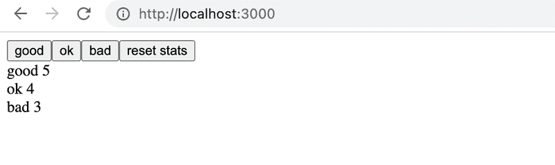
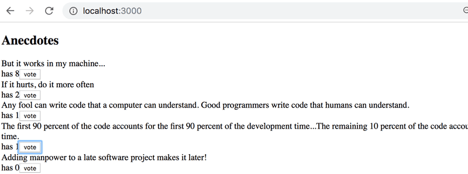
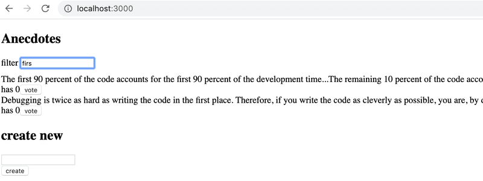
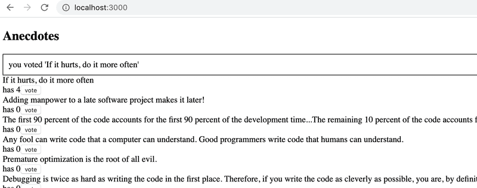
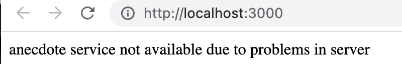
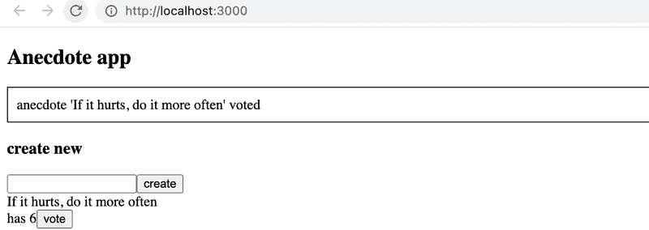
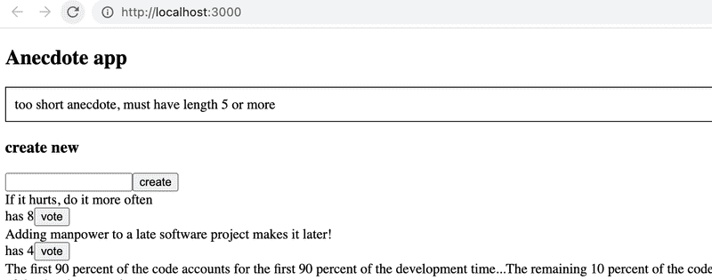

# Ejercicios 6.1.- 6.2.

Hagamos una versión simplificada del ejercicio unicafe de la parte 1. Manejemos la administración del estado con Redux.  
Puedes tomar el código de este repositorio https://github.com/fullstack-hy2020/unicafe-redux para la base de tu proyecto.  
_Comienza eliminando la configuración git del repositorio clonado e instalando dependencias_

```bash
cd unicafe-redux   // go to the directory of cloned repository
rm -rf .git
npm install
```

## 6.1: Unicafe Revisitado, paso 1

Antes de implementar la funcionalidad de la UI(interfaz de usuario), implementemos la funcionalidad requerida por el store.  
Tenemos que guardar el número de cada tipo de feedback en el store, por lo que la forma del estado en el store es:

```javascript
{
  good: 5,
  ok: 4,
  bad: 2
}
```

El proyecto tiene la siguiente base para un reducer:

```javascript
const initialState = {
  good: 0,
  ok: 0,
  bad: 0,
};

const counterReducer = (state = initialState, action) => {
  console.log(action);
  switch (action.type) {
    case "GOOD":
      return state;
    case "OK":
      return state;
    case "BAD":
      return state;
    case "ZERO":
      return state;
    default:
      return state;
  }
};

export default counterReducer;
```

y una base para sus pruebas

```javascript
import deepFreeze from "deep-freeze";
import counterReducer from "./reducer";

describe("unicafe reducer", () => {
  const initialState = {
    good: 0,
    ok: 0,
    bad: 0,
  };

  test("should return a proper initial state when called with undefined state", () => {
    const state = {};
    const action = {
      type: "DO_NOTHING",
    };

    const newState = counterReducer(undefined, action);
    expect(newState).toEqual(initialState);
  });

  test("good is incremented", () => {
    const action = {
      type: "GOOD",
    };
    const state = initialState;

    deepFreeze(state);
    const newState = counterReducer(state, action);
    expect(newState).toEqual({
      good: 1,
      ok: 0,
      bad: 0,
    });
  });
});
```

**Implementa el reducer y sus pruebas.**  
En las pruebas, asegúrate de que el reducer sea una _función inmutable_ con la librería _deep-freeze_. Asegúrate de que la primera prueba proporcionada pase, porque Redux espera que el reducer devuelva el estado original cuando se llama con un primer parámetro - que representa el estado previo - con el valor _undefined_.  
Comienza expandiendo el reducer para que pasen ambas pruebas. Luego agrega el resto de las pruebas y finalmente la funcionalidad que están probando.  
Un buen modelo para el reducer es el ejemplo anterior de [redux-notas](https://fullstackopen.com/es/part6/flux_architecture_y_redux#redux-notas).

## 6.2: Unicafe Revisitado, paso 2

Ahora implementa la funcionalidad real de la aplicación.  
Tu aplicación puede tener una apariencia modesta, nada más se necesitan 3 botones y el número de calificaciones para cada tipo:  


# Ejercicios 6.3. - 6.8.

Hagamos una nueva versión de la aplicación de votación de anécdotas de la parte 1. Toma el proyecto de este repositorio https://github.com/fullstack-hy2020/redux-anecdotes como base de tu solución.  
Si clonas el proyecto en un repositorio de git existente, _elimina la configuración de git de la aplicación clonada_:

```bash
cd redux-anecdotes  // go to the cloned repository
rm -rf .git
```

La aplicación se puede iniciar como de costumbre, pero primero debes instalar las dependencias:

```bash
npm install
npm run dev
```

Después de completar estos ejercicios, tu aplicación debería verse así:  


## 6.3: Anécdotas, paso 1

Implementa la funcionalidad para votar anécdotas. La cantidad de votos debe guardarse en una store de Redux.

## 6.4: Anécdotas, paso 2

Implementa la funcionalidad para agregar nuevas anécdotas.  
Puedes mantener el formulario no controlado, como hicimos [antes](https://fullstackopen.com/es/part6/flux_architecture_y_redux#formulario-no-controlado).

## 6.5: Anécdotas, paso 3

Asegúrate de que las anécdotas estén ordenadas por número de votos.

## 6.6: Anécdotas, paso 4

Si aún no lo haz hecho, separa la creación de objetos de acción en funciones [action creator](https://read.reduxbook.com/markdown/part1/04-action-creators.html) y colócalos en el archivo _src/reducers/anecdoteReducer.js_, así que haz lo que hemos estado haciendo desde el capítulo [action creators](https://fullstackopen.com/es/part6/flux_architecture_y_redux#action-creators).

## 6.7: Anécdotas, paso 5

Separa la creación de nuevas anécdotas en su propio componente llamado _AnecdoteForm_. Mueve toda la lógica para crear una nueva anécdota en este nuevo componente.

## 6.8: Anécdotas, paso 6

Separa el renderizado de la lista de anécdotas en su propio componente llamado _AnecdoteList_. Mueve toda la lógica relacionada con la votación de una anécdota a este nuevo componente.  
Ahora, el componente _App_ debería verse así:

```jsx
import AnecdoteForm from "./components/AnecdoteForm";
import AnecdoteList from "./components/AnecdoteList";

const App = () => {
  return (
    <div>
      <h2>Anecdotes</h2>
      <AnecdoteList />
      <AnecdoteForm />
    </div>
  );
};

export default App;
```

# Ejercicio 6.9

## 6.9 Mejores Anécdotas, paso 7

Implementa el filtrado para las anécdotas que se muestran al usuario.  
  
Almacena el estado del filtro en el store de Redux. Se recomienda crear un nuevo reducer, action creators y un reducer combinado para el store utilizando la función _combineReducers_.  
Crea un nuevo componente _Filter_ para mostrar los filtros. Puedes utilizar el siguiente código como punto de partida:

```jsx
const Filter = () => {
  const handleChange = (event) => {
    // input-field value is in variable event.target.value
  };
  const style = {
    marginBottom: 10,
  };

  return (
    <div style={style}>
      filter <input onChange={handleChange} />
    </div>
  );
};

export default Filter;
```

# Ejercicios 6.10. - 6.13.

Continuemos trabajando en la aplicación de anécdotas que comenzamos en el ejercicio 6.3, usando Redux Toolkit.

## 6.10 Mejores Anécdotas, paso 8

Instala Redux Toolkit en el proyecto. Mueve la creación del store de Redux a su propio archivo _store.js_ y utiliza la función **configureStore** para crear el store.  
Cambia la definición del _filter reducer_ y _sus action creators_ para usar la función **createSlice** de Redux Toolkit.  
También, comienza a utilizar Redux DevTools para depurar el estado de la aplicación fácilmente.

## 6.11 Mejores Anécdotas, paso 9

Cambia también la definición de _anecdote reducer_ y _sus action creators_ para usar la función **createSlice** de Redux Toolkit.  
Nota de implementación: cuando utilices Redux Toolkit para devolver el estado inicial de las anécdotas, será inmutable, por lo que tendrás que copiarlo para ordenarlas, o te encontraras con el error "TypeError: Cannot assign to read only property". Puedes usar la sintaxis spread para hacer una copia del array. En vez de:

```javascript
anecdotes.sort();
```

Escribe:

```javascript
[...anecdotes].sort();
```

## 6.12 Mejores Anécdotas, paso 10

La aplicación tiene el esqueleto del componente _Notification_ listo para utilizarlo:

```jsx
const Notification = () => {
  const style = {
    border: "solid",
    padding: 10,
    borderWidth: 1,
  };
  return <div style={style}>render here notification...</div>;
};

export default Notification;
```

Extiende el componente para que muestre el mensaje almacenado en el store de redux, haciendo que el componente tome la siguiente forma:

```jsx
import { useSelector } from "react-redux";

const Notification = () => {
  const notification = useSelector(/* something here */);
  const style = {
    border: "solid",
    padding: 10,
    borderWidth: 1,
  };
  return <div style={style}>{notification}</div>;
};
```

Tendrás que realizar cambios en el reducer existente de la aplicación. Crea un reducer separado para la nueva funcionalidad usando la función **createSlice** de Redux Toolkit.  
La aplicación no tiene que utilizar el componente _Notification_ completamente en este punto de los ejercicios. Es suficiente con que la aplicación muestre el valor inicial establecido para el mensaje en el _notificationReducer_.

## 6.13 Mejores Anécdotas, paso 11

Extiende la aplicación para que utilice el componente _Notification_ para mostrar un mensaje durante cinco segundos cuando el usuario vote por una anécdota o cree una nueva anécdota:  
  
Se recomienda crear [action creators](https://redux-toolkit.js.org/api/createSlice#reducers) independientes para configurar y eliminar notificaciones.

# Ejercicios 6.14. - 6.15.

## 6.14 Anécdotas y el Backend, paso 1

Cuando la aplicación se inicie, obtén las anécdotas del backend implementado usando json-server.  
Como datos de backend iniciales, puedes usar, por ejemplo, [esto](https://github.com/fullstack-hy2020/misc/blob/master/anecdotes.json).

## 6.15 Anécdotas y el Backend, paso 2

Modifica la creación de nuevas anécdotas, de forma que las anécdotas se almacenen en el backend.

# Ejercicios 6.16. - 6.19.

## 6.16 Anécdotas y el Backend, paso 3

Modifica la inicialización de la store de Redux para que suceda utilizando action creators asíncronos, los cuales son posibles gracias a la librería Redux Thunk.

## 6.17 Anécdotas y el Backend, paso 4

También modifica la creación de una nueva anécdota para que suceda usando action creators asíncronos, hecho posible por la librería Redux Thunk.

## 6.18 Anécdotas y el Backend, paso 5

La votación aún no guarda los cambios en el backend. Arregla la situación con la ayuda de la librería Redux Thunk.

## 6.19 Anécdotas y el Backend, paso 6

La creación de notificaciones sigue siendo un poco tediosa, ya que hay que realizar dos acciones y utilizar la función **setTimeout**:

```javascript
dispatch(setNotification(`new anecdote '${content}'`));
setTimeout(() => {
  dispatch(clearNotification());
}, 5000);
```

Crea un action creator, que te permita proveer la notificación de la siguiente manera:

```javascript
dispatch(setNotification(`you voted '${anecdote.content}'`, 10));
```

El primer parámetro es el texto que sera renderizado y el segundo parámetro es el tiempo durante el cual se mostrara la notificación en segundos.  
Implementa el uso de esta notificación mejorada en tu aplicación.

# Ejercicios 6.20. - 6.22.

Ahora hagamos una nueva versión de la aplicación de anécdotas que use a la librería React Query. Usa [este proyecto](https://github.com/fullstack-hy2020/query-anecdotes) como punto de partida. El proyecto tiene un JSON Server instalado, la operación del cual se ha modificado ligeramente (revisa el archivo **server.js** para más detalles). Inicia el servidor con _npm run server_.

## Ejercicio 6.20

Implementa la obtención de anécdotas del servidor usando React Query.    
La aplicación debe funcionar de tal manera que si hay problemas para comunicarse con el servidor, solo se mostrará una página de error:  
    
Puedes encontrar [aquí](https://tanstack.com/query/latest/docs/framework/react/guides/queries) información sobre cómo detectar posibles errores.  
Puedes simular un problema con el servidor apagando el JSON Server. Ten en cuenta que en una situación problemática, la consulta primero está en el estado _isLoading_ durante un tiempo, porque si una solicitud falla, React Query intenta la solicitud varias veces antes de que indique que la solicitud no es exitosa. Opcionalmente, puedes especificar que no se realicen reintentos:

```javascript
const result = useQuery({
  queryKey: ["anecdotes"],
  queryFn: getAnecdotes,
  retry: false,
});
```

o que la solicitud se vuelva a intentar solo una vez más:

```javascript
const result = useQuery({
  queryKey: ["anecdotes"],
  queryFn: getAnecdotes,
  retry: 1,
});
```

## Ejercicio 6.21

Implementa la adición de nuevas anécdotas al servidor usando React Query. La aplicación debe renderizar una nueva anécdota por defecto. Ten en cuenta que el contenido de la anécdota debe tener al menos 5 caracteres de longitud, de lo contrario el servidor rechazará la solicitud POST. No tienes que preocuparte por el control de errores ahora.

## Ejercicio 6.22

Implementa la votación de anécdotas usando nuevamente React Query. La aplicación debe renderizar automáticamente el número aumentado de votos para la anécdota votada.

# Ejercicios 6.23. - 6.24.

## Ejercicio 6.23.

La aplicación tiene un componente _Notification_ para mostrar notificaciones al usuario.  
Implementa la gestión del estado de las notificaciones para la aplicación utilizando el hook useReducer y el contexto. La notificación debe informar al usuario cuando se crea una nueva anécdota o cuando se vota por ella:
  
La notificación se muestra durante cinco segundos.

## Ejercicio 6.24.

Como se indicó en el ejercicio 6.21, el servidor requiere que el contenido de la anécdota a agregar tenga al menos 5 caracteres de longitud. Ahora implementa el manejo de errores para la inserción. En la práctica, es suficiente mostrar una notificación al usuario en caso de una solicitud POST fallida:  
  
La condición de error debe manejarse en la función de callback registrada para ello, consulta [aquí](https://tanstack.com/query/latest/docs/framework/react/reference/useMutation) cómo registrar una función.
