# Ejercicios 7.1. - 7.3.

Volvamos a trabajar con anécdotas. Utiliza la aplicación de anécdotas sin redux que se encuentra en el repositorio https://github.com/fullstack-hy2020/routed-anecdotes como punto de partida para los ejercicios.  
Si clonas el proyecto en un repositorio de git existente, recuerda _eliminar la configuración de git de la aplicación clonada_:

```bash
cd routed-anecdotes   // primero vé al directorio del repositorio clonado
rm -rf .git
```

La aplicación se inicia de la forma habitual, pero primero debes instalar sus dependencias:

```bash
npm install
npm run dev
```

## 7.1: Anécdotas Enrutadas, paso 1

Agrega React Router a la aplicación para que al hacer clic en los enlaces del componente _Menu_, se pueda cambiar la vista.  
En la raíz de la aplicación, es decir, la ruta **/**, muestra la lista de anécdotas:  
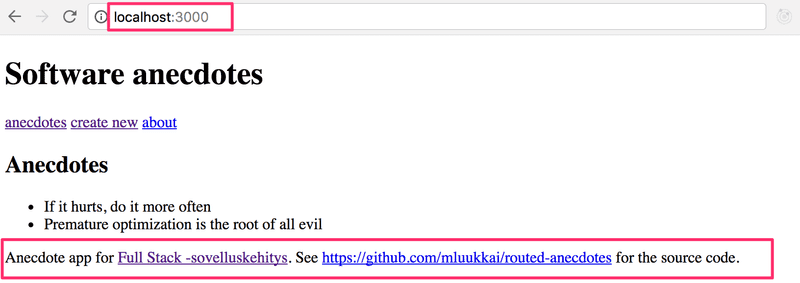  
El componente _Footer_ siempre debe estar visible en la parte inferior.  
La creación de una nueva anécdota debería ocurrir en la ruta _create_:  
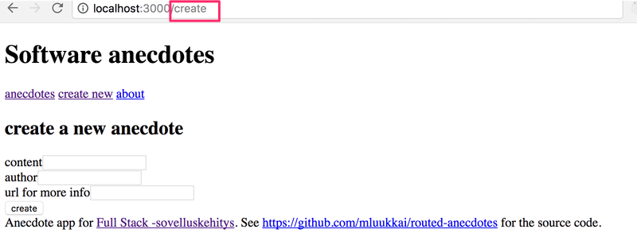

## 7.2: Anécdotas Enrutadas, paso 2

Implementa una vista para mostrar una sola anécdota:  
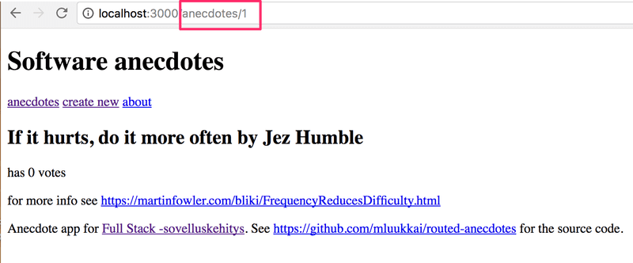  
La navegación a la página que muestra la anécdota única se realiza haciendo clic en el nombre de esa anécdota.  
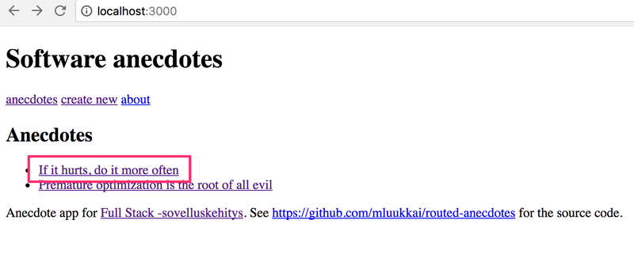

## 7.3: Anécdotas Enrutadas, paso 3

La funcionalidad predeterminada del formulario de creación es bastante confusa, porque parece que no sucede nada después de crear una nueva anécdota utilizando el formulario.  
Mejora la funcionalidad de tal manera que después de crear una nueva anécdota la aplicación pasa automáticamente a mostrar la vista de todas las anécdotas y al usuario se le muestra una notificación informándole de esta creación exitosa durante los próximos cinco segundos:  
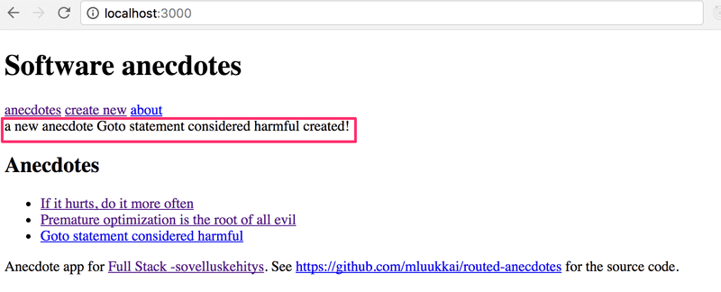

# Ejercicios 7.4. - 7.8.

Continuaremos con la aplicación de los [ejercicios](https://fullstackopen.com/es/part7/react_router#ejercicios-7-1-7-3) del capítulo de [react router](https://fullstackopen.com/es/part7/react_router).

## 7.4: Anécdotas y Hooks paso 1

Simplifica el formulario de creación de anécdotas de tu aplicación con el hook personalizado **useField** que definimos anteriormente.  
Un lugar natural para guardar los hooks personalizados en tu aplicación es el archivo _/src/hooks/index.js_.  
Si utilizas la [exportación nombrada](https://developer.mozilla.org/es/docs/Web/JavaScript/Reference/Statements/export#descripci%C3%B3n) en lugar de la exportación predeterminada:

```javascript
import { useState } from "react";

export const useField = (type) => {
  const [value, setValue] = useState("");

  const onChange = (event) => {
    setValue(event.target.value);
  };

  return {
    type,
    value,
    onChange,
  };
};

// los módulos pueden tener muchas exportaciones nombradas

export const useAnotherHook = () => {
  // ...
};
```

Luego, la [importación](https://developer.mozilla.org/es/docs/Web/JavaScript/Reference/Statements/import) ocurre de la siguiente manera:

```javascript
import { useField } from "./hooks";

const App = () => {
  // ...
  const username = useField("text");
  // ...
};
```

## 7.5: Anécdotas y Hooks paso 2

Agrega un botón al formulario que puedas usar para borrar todos los campos de entrada:  
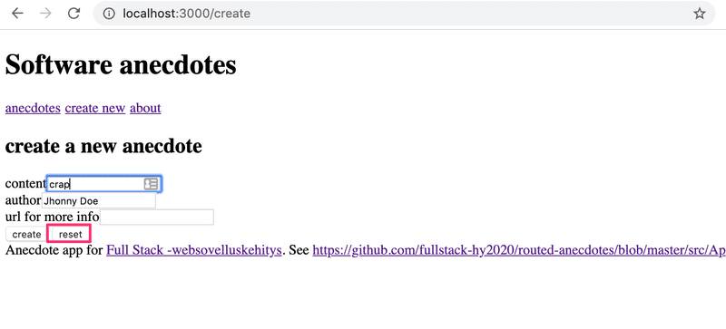  
Amplia la funcionalidad del hook _useField_ para que ofrezca una nueva operación _reset_ para limpiar el campo.  
Dependiendo de tu solución, es posible que veas la siguiente advertencia en tu consola:  
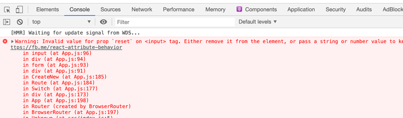  
Volveremos a esta advertencia en el próximo ejercicio.

## 7.6: Anécdotas y Hooks paso 3

Si tu solución no provocó que apareciera una advertencia en la consola, ya has terminado este ejercicio.  
Si ves la advertencia `Invalid value for prop reset on <input> tag` en la consola, realiza los cambios necesarios para deshacerte de ella.  
El motivo de esta advertencia es que después de realizar los cambios en tu aplicación, la siguiente expresión:

```jsx
<input {...content} />
```

Esencialmente, es lo mismo que esto:

```jsx
<input
  value={content.value}
  type={content.type}
  onChange={content.onChange}
  reset={content.reset}
/>
```

El elemento _input_ no debe recibir un atributo _reset_.  
Una solución simple sería no usar la sintaxis de spread y escribir todos los formularios de esta manera:

```jsx
<input
  value={username.value}
  type={username.type}
  onChange={username.onChange}
/>
```

Si hiciéramos esto, perderíamos gran parte del beneficio proporcionado por el hook _useField_. En su lugar, busca una solución al problema, pero que aún sea fácil de usar con la sintaxis de spread.

## 7.7: Hook de País

Volvamos a los ejercicios [2.18-20](https://fullstackopen.com/es/part2/agregar_estilos_a_la_aplicacion_react#ejercicios-2-18-2-20).  
Utilza el código de https://github.com/fullstack-hy2020/country-hook como punto de partida.  
La aplicación se puede utilizar para buscar detalles de países desde la interfaz https://studies.cs.helsinki.fi/restcountries/. Si se encuentra a un país, se muestran sus detalles:  
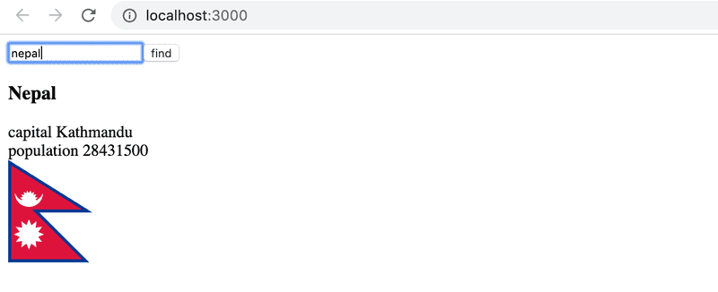  
Si no se encuentra ningún país, se le muestra un mensaje al usuario  
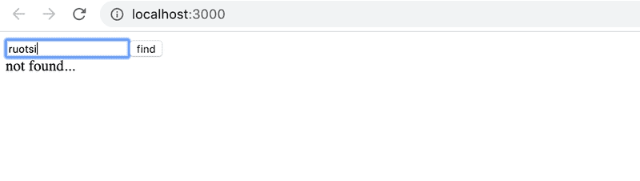  
Por lo demás, la aplicación está completa, pero en este ejercicio debes implementar un hook personalizado `useCountry`, que se pueda utilizar para buscar los detalles del país dado al hook como parámetro.  
Usa el endpoint [name](https://studies.cs.helsinki.fi/restcountries/) de la API para obtener los detalles del país en un hook `useEffect` dentro de su hook personalizado.  
Ten en cuenta que en este ejercicio es esencial utilizar el [segundo parámetro](https://react.dev/reference/react/useEffect#parameters) de useEffect para controlar cuándo se ejecuta la función de efecto.

## 7.8: Hooks Definitivos

El código de la aplicación responsable de comunicarse con el backend de la aplicación de notas de las partes anteriores se ve así:

```javascript
import axios from "axios";
const baseUrl = "/api/notes";

let token = null;

const setToken = (newToken) => {
  token = `bearer ${newToken}`;
};

const getAll = async () => {
  const response = await axios.get(baseUrl);
  return response.data;
};

const create = async (newObject) => {
  const config = {
    headers: { Authorization: token },
  };

  const response = await axios.post(baseUrl, newObject, config);
  return response.data;
};

const update = async (id, newObject) => {
  const response = await axios.put(`${baseUrl}/${id}`, newObject);
  return response.data;
};

export default { getAll, create, update, setToken };
```

Notamos que el código de ninguna manera es especifico al hecho de que nuestra aplicación gestiona notas. Excluyendo el valor de la variable `baseUrl`, el mismo código podría reutilizarse en la aplicación de publicación de blogs para tratar la comunicación con el backend.  
Extrae el código para comunicarse con el backend en su propio hook `useResource`. Es suficiente implementar la búsqueda de todos los recursos y la creación de un nuevo recurso.  
Puedes hacer el ejercicio en el proyecto que se encuentra en el repositorio https://github.com/fullstack-hy2020/ultimate-hooks. El componente _App_ del proyecto es el siguiente:

```jsx
const App = () => {
  const content = useField("text");
  const name = useField("text");
  const number = useField("text");

  const [notes, noteService] = useResource("http://localhost:3005/notes");
  const [persons, personService] = useResource("http://localhost:3005/persons");

  const handleNoteSubmit = (event) => {
    event.preventDefault();
    noteService.create({ content: content.value });
  };

  const handlePersonSubmit = (event) => {
    event.preventDefault();
    personService.create({ name: name.value, number: number.value });
  };

  return (
    <div>
      <h2>notes</h2>
      <form onSubmit={handleNoteSubmit}>
        <input {...content} />
        <button>create</button>
      </form>
      {notes.map((n) => (
        <p key={n.id}>{n.content}</p>
      ))}

      <h2>persons</h2>
      <form onSubmit={handlePersonSubmit}>
        name <input {...name} /> <br />
        number <input {...number} />
        <button>create</button>
      </form>
      {persons.map((n) => (
        <p key={n.id}>
          {n.name} {n.number}
        </p>
      ))}
    </div>
  );
};
```

El hook personalizado `useResource` devuelve un array de dos elementos al igual que los hooks de estado. El primer elemento del array contiene todos los recursos individuales y el segundo elemento del array es un objeto que se puede usar para manipular la colección de recursos y crear nuevos.  
Si implementas el hook correctamente, se puede usar tanto para notas como para números de teléfono (inicia el servidor con el comando `npm run server` en el puerto 3005).

# Ejercicios 7.9. - 7.21.

## 7.9: Formateo Automático de Código

En las partes anteriores, usamos ESLint para asegurarnos de que el código siga las convenciones definidas. [Prettier](https://prettier.io/) es otra forma de hacer lo mismo. Según la documentación, Prettier es _un formateador de código opinado_, es decir, Prettier no solo controla el estilo del código sino que también lo formatea de acuerdo con la definición.  
Prettier es fácil de integrar en el editor de código para que cuando se guarde, se formatee automáticamente.  
Integra Prettier en tu aplicación y configúralo para que funcione con tu editor.

# Administración de Estado: Redux

_Hay dos versiones alternativas para elegir para los ejercicios 7.10-7.13: puedes hacer la administración de estado de la aplicación utilizando Redux o React Query y Context_. Si deseas maximizar tu aprendizaje, ¡deberías hacer ambas versiones!

## 7.10: Redux, Paso 1

Refactoriza la aplicación para que utilice Redux para administrar los datos de la notificación.

## 7.11: Redux, Paso 2

`Ten en cuenta` que este y los dos ejercicios siguientes son bastante laboriosos pero increíblemente educativos.  
Almacena la información sobre publicaciones de blog en el store de Redux. En este ejercicio basta con que puedas ver los blogs en el backend y crear un nuevo blog.  
Puedes administrar el estado para iniciar sesión y crear nuevas publicaciones de blog utilizando el estado interno de los componentes de React.

## 7.12: Redux, Paso 3

Amplía tu solución para que sea posible volver a dar me gusta y eliminar un blog.

## 7.13: Redux, Paso 4

Almacena la información sobre el usuario que inició sesión en el store de Redux.

# Administración de estado: React Query y Context

_Hay dos versiones alternativas para elegir para los ejercicios 7.10-7.13: puedes hacer la administración de estado de la aplicación utilizando Redux o React Query y Context_. Si deseas maximizar tu aprendizaje, ¡deberías hacer ambas versiones!

## 7.10: React Query y Context, paso 1

Refactoriza la aplicación para usar el hook useReducer para administrar los datos de la notificación.

## 7.11: React Query y Context, paso 2

Utiliza React Query para administrar el estado de las publicaciones de blog. En este ejercicio basta con que puedas ver los blogs en el backend y que puedas crear un nuevo blog.  
Puedes administrar el estado para iniciar sesión y crear nuevas publicaciones de blog utilizando el estado interno de los componentes de React.

## 7.12: React Query y Context, paso 3

Amplía tu solución para que sea posible volver a dar me gusta y eliminar un blog.

## 7.13: React Query y Context, paso 4

Usa el hook useReducer y context para administrar los datos del usuario que inició sesión.

# Vistas

El resto de las tareas son comunes tanto para las versiones de Redux como para la de React Query

## 7.14: Vista de usuarios

Implementa una vista en la aplicación que muestre toda la información básica relacionada con los usuarios:  
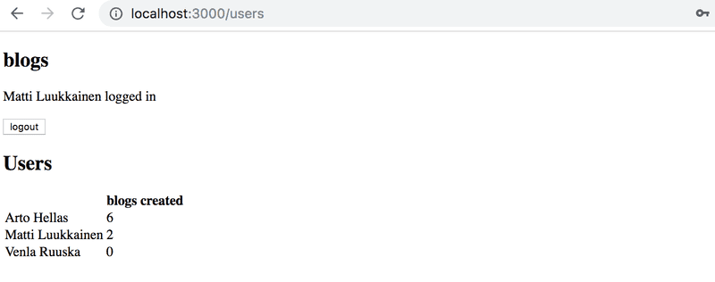

## 7.15: Vista de Usuario Individual

Implementa una vista para usuarios individuales, que muestre todas las publicaciones de blog agregadas por ese usuario:  
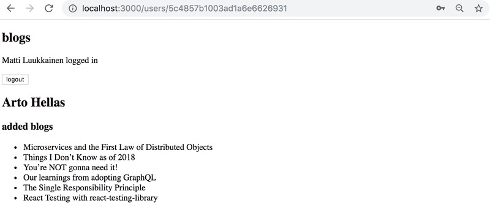  
Puedes acceder a esta vista haciendo clic en el nombre del usuario en la vista que enumera a todos los usuarios:  
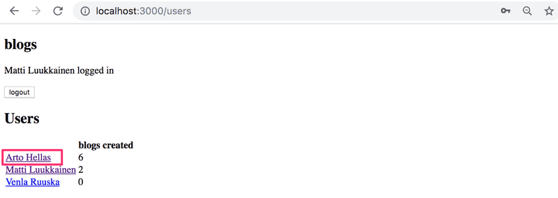  
**NB**: es casi seguro que encontrarás el siguiente mensaje de error durante este ejercicio:  
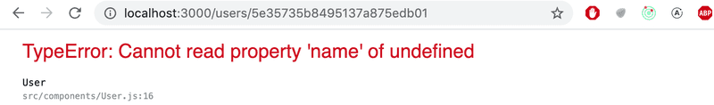  
El mensaje de error aparecerá si actualizas la página de usuario individual.  
La causa del problema es que cuando navegamos directamente a la página de un usuario individual, la aplicación React aún no ha recibido los datos del backend. Una solución para este problema es utilizar la renderización condicional:

```jsx
const User = () => {
  const user = ...

  if (!user) {
    return null
  }

  return (
    <div>
      // ...
    </div>
  )
}
```

## 7.16: Vista de Blog

Implementa una vista separada para las publicaciones de blog. Puedes modelar el diseño de tu vista a partir del siguiente ejemplo:  
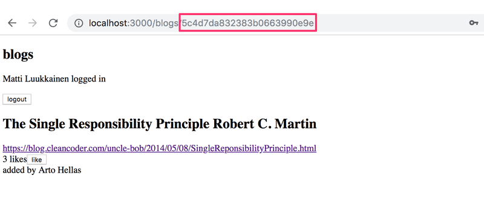  
Los usuarios deberían poder acceder a esta vista haciendo clic en el nombre de la publicación del blog en la vista que enumera todas las publicaciones de blog.
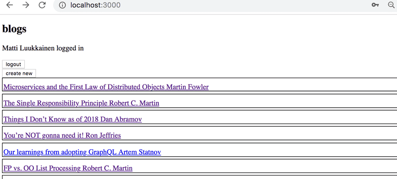  
Una vez que hayas terminado con este ejercicio, la funcionalidad que se implementó en el ejercicio 5.7 ya no es necesaria. Al hacer clic en una publicación de blog, ya no es necesario expandir el elemento en la lista y mostrar los detalles de la publicación de blog.

## 7.17: Navegación

Implementa un menú de navegación para la aplicación:  
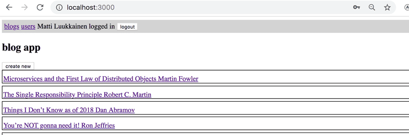  

## 7.18: Comentarios, paso 1

Implementa la funcionalidad para comentar las publicaciones de blog:  
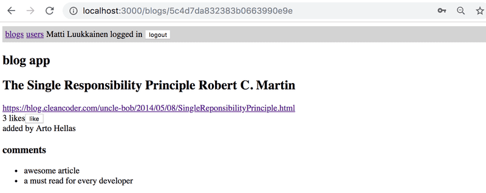    
Los comentarios deben ser anónimos, lo que significa que no están asociados al usuario que dejó el comentario.    
En este ejercicio basta con que el frontend muestre solo los comentarios que recibe la aplicación del backend.    
Un mecanismo apropiado para agregar comentarios a una publicación de blog sería una solicitud HTTP POST al endpoint _api/blogs/:id/comments_.

## 7.19: Comentarios, paso 2

Amplía tu aplicación para que los usuarios puedan agregar comentarios a las publicaciones de blog desde el frontend:  
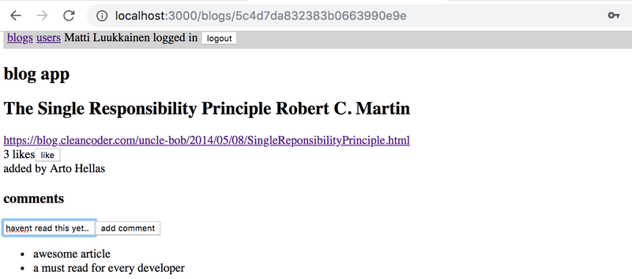

## 7.20: Estilos, paso 1

Mejora la apariencia de tu aplicación aplicando uno de los métodos que se muestran en el material del curso.

## 7.21: Estilos, paso 2

Puedes marcar este ejercicio como finalizado si utilizas una hora o más para darle estilos a tu aplicación.
