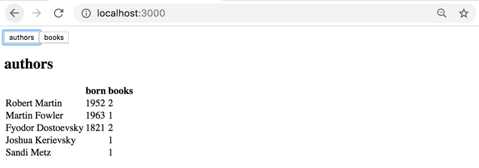
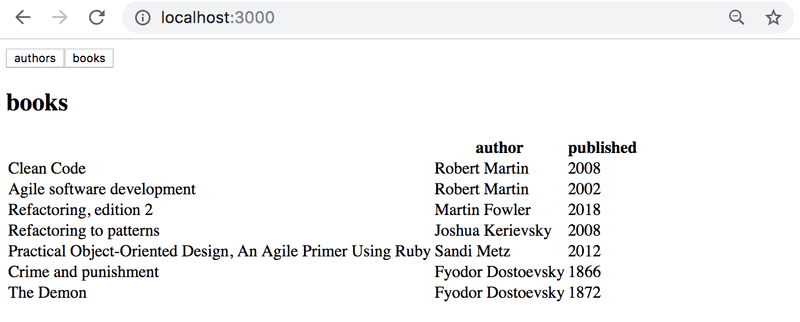
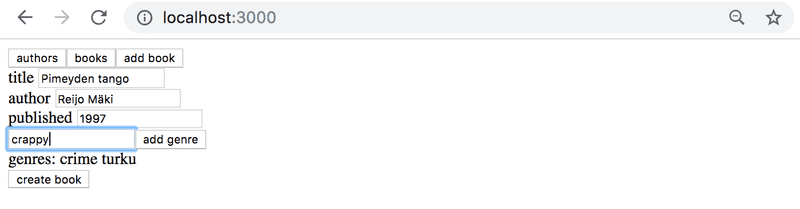
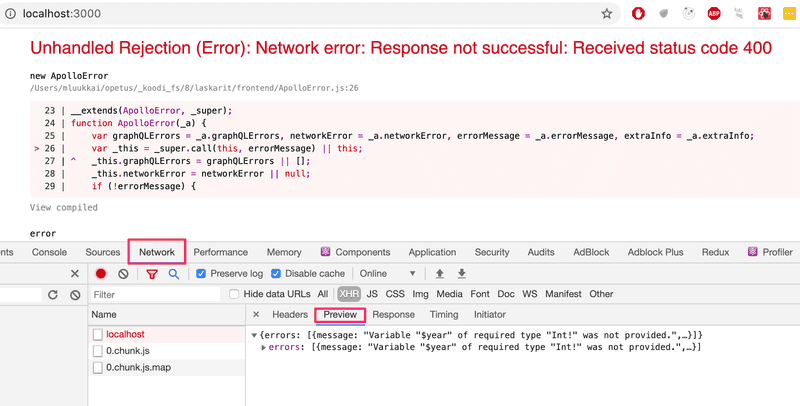
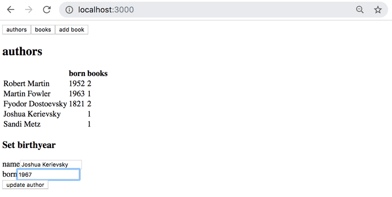
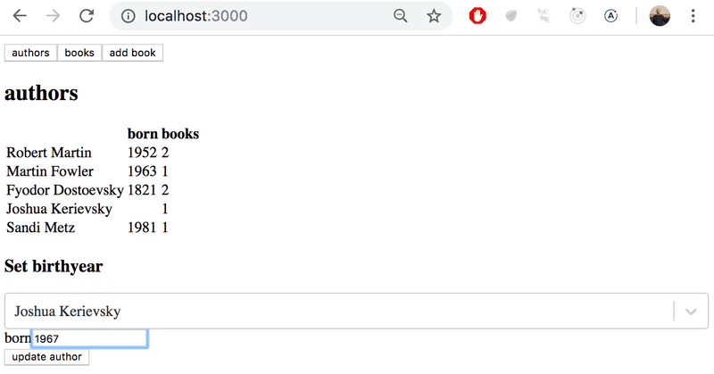
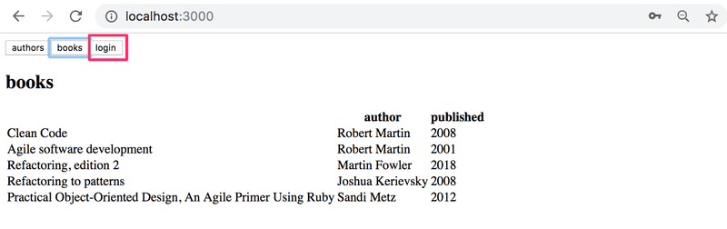
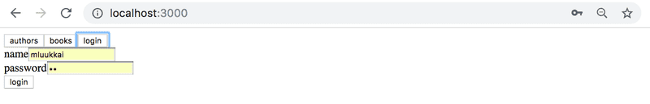
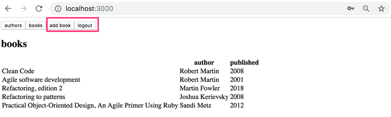
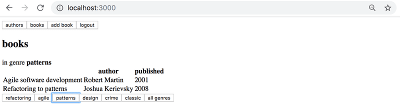

> [!IMPORTANT]  
> **El número de libros y autores** → Ejercicio 8.1 → Carpeta llamada **"biblioteca-backend"**.         
> **Todos los libros** → Ejercicio 8.2 → Carpeta llamada **"biblioteca-backend"**.   
> **Todos los autores** → Ejercicio 8.3 → Carpeta llamada **"biblioteca-backend"**.       
> **Libros de un autor** → Ejercicio 8.4 → Carpeta llamada **"biblioteca-backend"**.  
> **Libros por género** → Ejercicio 8.5 → Carpeta llamada **"biblioteca-backend"**.  
> **Agregar un libro** → Ejercicio 8.6 → Carpeta llamada **"biblioteca-backend"**.       
> **Actualización del año de nacimiento de un autor** → Ejercicio 8.7 → Carpeta llamada **"biblioteca-backend"**.     
> **Vista de autores** → Ejercicio 8.8 → Carpeta llamada **"library-frontend"**.       
> **Vista de Libros** → Ejercicio 8.9 → Carpeta llamada **"library-frontend"**.  
> **Agregar un libro** → Ejercicio 8.10 → Carpeta llamada **"library-frontend"**.    
> **Año de nacimiento del autor** → Ejercicio 8.11 → Carpeta llamada **"library-frontend"**.       
> **Año de nacimiento del autor avanzado** → Ejercicio 8.12 → Carpeta llamada **"library-frontend"**.  
> **Base de datos** → Ejercicios 8.13, 8.14, 8.15 → Carpeta llamada **"biblioteca-backend"**.  
> **usuario e inicio de sesión** → Ejercicio 8.16 → Carpeta llamada **"biblioteca-backend"**.  
> **Listado de libros** → Ejercicio 8.17 → Carpeta llamada **"library-frontend"**.    
> **Iniciar sesión** → Ejercicio 8.18 → Carpeta llamada **"library-frontend"**.       
> **Libros por género** → Ejercicios 8.19, 8.20 → Carpeta llamada **"library-frontend"**.   
> **libros por género con GraphQL** → Ejercicio 8.21 → Carpeta llamada **"library-frontend"**.    
> **Caché actualizado y recomendaciones de libros** → Ejercicio 8.22 → Carpeta llamada **"library-frontend"**.         
> **Suscripciones - servidor** → Ejercicio 8.23 → Carpeta llamada **"biblioteca-backend"**.   
> **Suscripciones - cliente** → Ejercicios 8.24, 8.25 → Carpeta llamada **"library-frontend"**.  
> **n + 1** → Ejercicio 8.26 → Carpeta llamada **"biblioteca-backend"**.     
> La carpeta llamada **"imagenes"** contiene únicamente las imágenes que se muestran en este archivo README.md. 

# Ejercicios 8.1. - 8.7

A través de los ejercicios, implementaremos un backend GraphQL para una pequeña biblioteca. Comience con [este archivo](https://github.com/fullstack-hy2020/misc/blob/master/library-backend.js). ¡Recuerde `npm init` e instalar dependencias!  
Tenga en cuenta que el código no funciona inicialmente porque la definición del esquema no está completa.

## 8.1: El número de libros y autores

Implementar consultas `bookCount` y `authorCount` que devuelven el número de libros y el número de autores.  
La consulta

```graphql
query {
  bookCount
  authorCount
}
```

debe devolver

```json
{
  "data": {
    "bookCount": 7,
    "authorCount": 5
  }
}
```

## 8.2: Todos los libros

Implementar la consulta `allBooks`, que devuelve los detalles de todos los libros.  
Al final, el usuario debería poder realizar la siguiente consulta:

```graphql
query {
  allBooks {
    title
    author
    published
    genres
  }
}
```

## 8.3: Todos los autores

Implementar la consulta `allAuthors`, que devuelve los detalles de todos autores. La respuesta debe incluir un campo `bookCount` que contenga el número de libros que ha escrito el autor.  
Por ejemplo, la consulta

```graphql
query {
  allAuthors {
    name
    bookCount
  }
}
```

debería devolver

```json
{
  "data": {
    "allAuthors": [
      {
        "name": "Robert Martin",
        "bookCount": 2
      },
      {
        "name": "Martin Fowler",
        "bookCount": 1
      },
      {
        "name": "Fyodor Dostoevsky",
        "bookCount": 2
      },
      {
        "name": "Joshua Kerievsky",
        "bookCount": 1
      },
      {
        "name": "Sandi Metz",
        "bookCount": 1
      }
    ]
  }
}
```

## 8.4: Libros de un autor

Modifique la consulta `allBooks` para que un usuario pueda dar un parámetro opcional _author_. La respuesta debe incluir solo libros escritos por ese autor.  
Por ejemplo, la consulta

```graphql
query {
  allBooks(author: "Robert Martin") {
    title
  }
}
```

debería devolver

```json
{
  "data": {
    "allBooks": [
      {
        "title": "Clean Code"
      },
      {
        "title": "Agile software development"
      }
    ]
  }
}
```

## 8.5: Libros por género

Modifique la consulta `allBooks` para que un usuario pueda dar un parámetro opcional _genre_. La respuesta debe incluir solo libros de ese género.  
Por ejemplo, la consulta

```graphql
query {
  allBooks(genre: "refactoring") {
    title
    author
  }
}
```

debería devolver

```json
{
  "data": {
    "allBooks": [
      {
        "title": "Clean Code",
        "author": "Robert Martin"
      },
      {
        "title": "Refactoring, edition 2",
        "author": "Martin Fowler"
      },
      {
        "title": "Refactoring to patterns",
        "author": "Joshua Kerievsky"
      },
      {
        "title": "Practical Object-Oriented Design, An Agile Primer Using Ruby",
        "author": "Sandi Metz"
      }
    ]
  }
}
```

La consulta debe funcionar cuando ambos parámetros opcionales son proporcionados:

```graphql
query {
  allBooks(author: "Robert Martin", genre: "refactoring") {
    title
    author
  }
}
```

## 8.6: Agregar un libro

Implementar la mutación `addBook`, que puede ser usado así:

```graphql
mutation {
  addBook(
    title: "NoSQL Distilled"
    author: "Martin Fowler"
    published: 2012
    genres: ["database", "nosql"]
  ) {
    title
    author
  }
}
```

La mutación funciona incluso si el autor no está todavía guardado en el servidor:

```graphql
mutation {
  addBook(
    title: "Pimeyden tango"
    author: "Reijo Mäki"
    published: 1997
    genres: ["crime"]
  ) {
    title
    author
  }
}
```

Si el autor aún no está guardado en el servidor , se agrega un nuevo autor al sistema. Los años de nacimiento de los autores aún no se guardan en el servidor, entonces la consulta

```graphql
query {
  allAuthors {
    name
    born
    bookCount
  }
}
```

devuelve

```json
{
  "data": {
    "allAuthors": [
      // ...
      {
        "name": "Reijo Mäki",
        "born": null,
        "bookCount": 1
      }
    ]
  }
}
```

## 8.7: Actualización del año de nacimiento de un autor

Implemente la mutación `editAuthor`, que se puede usar para establecer un año de nacimiento para un autor. La mutación se usa así

```graphql
mutation {
  editAuthor(name: "Reijo Mäki", setBornTo: 1958) {
    name
    born
  }
}
```

Si se encuentra el autor correcto, la operación devuelve el autor editado:

```json
{
  "data": {
    "editAuthor": {
      "name": "Reijo Mäki",
      "born": 1958
    }
  }
}
```

Si el autor no está en el sistema, se devuelve null:

```json
{
  "data": {
    "editAuthor": null
  }
}
```

# Ejercicios 8.8. - 8.12

A través de estos ejercicios, implementaremos una interfaz para la librería GraphQL.  
Tome [este proyecto](https://github.com/fullstack-hy2020/library-frontend) para comenzar su aplicación.  
Puede implementar su aplicación usando los componentes de apoyo de renderizado _Query_ y _Mutation_ del Apollo Client, o usando los ganchos proporcionados por Apollo Client 3.0 versión beta.

## 8.8: Vista de autores

Implemente una vista de Autores para mostrar los detalles de todos los autores en una página de la siguiente manera:  


## 8.9: Vista de Libros

Implemente una vista de Libros para mostrar en una página todos los demás detalles de todos los libros, excepto sus géneros.  


## 8.10: Agregar un libro

Implemente la posibilidad de agregar nuevos libros a su aplicación. La funcionalidad puede verse así:  
  
Asegúrese de que las vistas de Autores y Libros se mantengan actualizadas después de agregar un nuevo libro.  
En caso de problemas al realizar consultas o mutaciones, verifique desde la consola del desarrollador cuál es la respuesta del servidor:  


## 8.11: Año de nacimiento del autor

Implementar una posibilidad para establecer el año de nacimiento de los autores. Puede crear una nueva vista para configurar el año de nacimiento o colocarla en la vista Autores:
  
Asegúrese de que la vista Autores se mantenga actualizada después de establecer un año de nacimiento.

## 8.12: Año de nacimiento del autor avanzado

Cambie el formulario del año de nacimiento para que solo se pueda establecer un año de nacimiento para un autor existente. Utilice la biblioteca [select-tag](https://react.dev/reference/react-dom/components/select), [react-select](https://github.com/JedWatson/react-select) o algún otro mecanismo.    
Una solución con la librería react-select tiene el siguiente aspecto:  


# Ejercicios 8.13. - 8.16

Los siguientes ejercicios probablemente rompan su frontend. No se preocupe por ello todavía; el frontend se arreglará y ampliará en el próximo capítulo.

## 8.13: Base de datos, parte 1

Cambie la aplicación de la biblioteca para que guarde los datos en una base de datos. Puede encontrar el _esquema de mongoose_ para libros y autores desde [aquí](https://github.com/fullstack-hy2020/misc/blob/master/library-schema.md).  
Cambiemos un poco el esquema de graphql del libro

```graphql
type Book {
  title: String!
  published: Int!
  author: Author!
  genres: [String!]!
  id: ID!
}
```

para que en lugar de solo el nombre del autor, el objeto libro contenga todos los detalles del autor.  
Puede asumir que el usuario no intentará agregar libros o autores defectuosos, por lo que no tiene que preocuparse por los errores de validación.  
Las siguientes cosas _no_ tienen que funcionar todavía:

- consulta/query `allBooks` con parámetros
- campo `bookCount` de un objeto de autor
- campo `author` de un libro
- mutación `editAuthor`

**Nota**: a pesar de que el autor ahora es un _objeto_ dentro de un libro, el esquema para agregar un libro puede permanecer igual, solo el _nombre_ del autor se da como parámetro

```graphql
type Mutation {
  addBook(
    title: String!
    author: String!
    published: Int!
    genres: [String!]!
  ): Book!

  editAuthor(name: String!, setBornTo: Int!): Author
}
```

## 8.14 : Base de datos, parte 2

Complete el programa para que funcionen todas las consultas (excepto `allBooks` con el parámetro `author`) y mutaciones.  
Con respecto al parámetro _genre_ de la consulta de todos los libros, la situación es un poco más desafiante. La solución es simple, pero encontrarla puede ser un dolor de cabeza. Puede beneficiarse de [esto](https://www.mongodb.com/docs/manual/tutorial/query-array-of-documents/).

## 8.15 Base de datos, parte 3

Complete el programa de modo que los errores de validación de la base de datos (por ejemplo, título de libro o nombre del autor demasiado corto) se manejen con sensatez. Esto significa que hacen que se emita un [GraphQLError](https://www.apollographql.com/docs/apollo-server/data/errors#custom-errors) con un mensaje de error adecuado.

## 8.16 usuario e inicio de sesión

Agregue administración de usuarios a su aplicación. Expanda el esquema así:

```graphql
type User {
  username: String!
  favoriteGenre: String!
  id: ID!
}

type Token {
  value: String!
}

type Query {
  // ..
  me: User
}

type Mutation {
  // ...
  createUser(
    username: String!
    favoriteGenre: String!
  ): User
  login(
    username: String!
    password: String!
  ): Token
}
```

Cree resolutores para la consulta `me` y las nuevas mutaciones `createUser` y `login`. Como en el material del curso, puede asumir que todos los usuarios tienen la misma contraseña codificada.  
Haga que las mutaciones `addBook` y `editAuthor` sean posibles solo si la solicitud incluye un token válido.  
(No se preocupe por arreglar el frontend todavía.)

# Ejercicios 8.17. - 8.22

## 8.17 Listado de libros

Después de que el backend cambia, la lista de libros ya no funciona. Arreglalo.

## 8.18 Iniciar sesión

Agregar libros nuevos y cambiar el año de nacimiento de un autor no funcionan porque requieren que el usuario inicie sesión.  
Aún no es necesario manejar los errores de validación.  
Puede decidir cómo se verá el inicio de sesión en la interfaz de usuario. Una posible solución es convertir el formulario de inicio de sesión en una vista separada a la que se puede acceder a través de un menú de navegación  
  
El formulario de inicio de sesión:  
  
Cuando un usuario inicia sesión, la navegación cambia para mostrar las funcionalidades que solo puede realizar un usuario registrado:  


## 8.19 Libros por género, parte 1

Complete su solicitud para filtrar la lista de libros por género. Su solución podría verse así:  
  
En este ejercicio, el filtrado se puede hacer usando solo React.

## 8.20 Libros por género, parte 2

Implemente una vista que muestre todos los libros según el género favorito del usuario que haya iniciado sesión.  


## 8.21 libros por género con GraphQL

En los dos ejercicios anteriores, el filtrado se podría haber hecho usando solo React. Para completar este ejercicio, debe volver a realizar el filtrado de los libros según un género seleccionado (que se realizó en el ejercicio 8.19) usando una consulta GraphQL al servidor. Si ya lo hizo, no tiene que hacer nada.  
Este y los siguientes ejercicios son bastante **desafiantes** como debería ser a esta altura del curso. Es posible que desee completar primero los más fáciles en la [siguiente parte](https://fullstackopen.com/en/part8/fragments_and_subscriptions)

## 8.22 Caché actualizado y recomendaciones de libros

Si ya realizó el ejercicio anterior, es decir, buscar los libros en un género con GraphQL, asegúrese de alguna manera de que la vista de libros se mantenga actualizada. Por lo tanto, cuando se agrega un nuevo libro, la vista de libros se actualiza **al menos** cuando se presiona un botón de selección de género.  
_Cuando no se realiza la selección de un nuevo género, no es necesario actualizar la vista_.

# Ejercicios 8.23. - 8.26.

## 8.23: Suscripciones - servidor

Realiza una implementación de backend para la suscripción `bookAdded`, que devuelve los detalles de todos los libros nuevos a sus suscriptores.

## 8.24: Suscripciones - cliente, parte 1

Comience a usar suscripciones en el cliente y suscríbase a bookAdded. Cuando se agregan nuevos libros, notifique al usuario. Cualquier método funciona. Por ejemplo, puede utilizar la función [window.alert](https://developer.mozilla.org/en-US/docs/Web/API/Window/alert).

## 8.25: Suscripciones - cliente, parte 2

Mantenga actualizada la vista de la aplicación cuando el servidor notifique sobre nuevos libros. Puede probar su implementación abriendo la aplicación en dos pestañas del navegador y agregando un nuevo libro en una pestaña. Agregar el nuevo libro debería actualizar la vista en ambas pestañas.

## 8.26: n + 1

Resuelve el problema n + 1 de la siguiente consulta usando cualquier método que te guste

```graphql
query {
  allAuthors {
    name
    bookCount
  }
}
```
