# Ejercicios 9.1. - 9.3.

**setup**  
Los ejercicios 9.1. - 9.7. se realizarán todos en el mismo proyecto de node. Crea el proyecto en un directorio vacío con `npm init` e instale los paquetes ts-node y typescript. Cree también el archivo `tsconfig.json` en el directorio con el siguiente contenido:

```json
{
  "compilerOptions": {
    "noImplicitAny": true
  }
}
```

La opción del compilador [noImplicitAny](https://www.typescriptlang.org/tsconfig/#noImplicitAny), que hace que sea obligatorio tener tipos para todas las variables utilizadas.

## 9.1 Índice de masa corporal

Crea el código de este ejercicio en el archivo `bmiCalculator.ts`  
Escribe una función `calculateBmi` que cuente el [IMC](https://es.wikipedia.org/wiki/%C3%8Dndice_de_masa_corporal) según la altura (en centímetros) y el peso (en kilogramos) y que luego devuelva un mensaje que se adapte a los resultados.  
Llama a la función en el mismo archivo con parámetros fijos e imprime el resultado. El código

```typescript
console.log(calculateBmi(180, 74));
```

debe imprimir el siguiente mensaje

```bash
Normal (healthy weight)
```

Crea un script npm para ejecutar el programa con el comando `npm run calculateBmi`

## 9.2 Calculadora de ejercicio

Crea el código de este ejercicio en el archivo `exerciseCalculator.ts`  
Escribe una función `calculateExercises` que calcule el tiempo promedio de las `horas diarias de ejercicio` y lo compare con la `cantidad objetivo` de horas diarias y devuelva un objeto que incluya los siguientes valores:

- el número de días
- el número de días de entrenamiento
- el valor objetivo original
- el tiempo promedio calculado
- valor booleano que describe si se alcanzó el objetivo
- una calificación entre los números 1-3 que indica qué tan bien se cumplen las horas. Puedes decidir la métrica por tu cuenta.
- un valor de texto que explique la calificación, puedes inventar las explicaciones

Las horas de ejercicio diarias se asignan a la función como un [array](https://www.typescriptlang.org/docs/handbook/2/everyday-types.html#arrays) que contiene el número de horas de ejercicio de cada día en el período de entrenamiento. P.ej. una semana con 3 horas de entrenamiento el lunes, ninguna el martes, 2 horas el miércoles, 4,5 horas el jueves y así sucesivamente estaría representada por el siguiente array:

```typescript
[3, 0, 2, 4.5, 0, 3, 1];
```

Para el objeto Result, debe crear un [interface](https://www.typescriptlang.org/docs/handbook/2/everyday-types.html#interfaces).  
Si llamas a la función con los parámetros [3, 0, 2, 4.5, 0, 3, 1] y 2 , debería devolver:

```typescript
{
  periodLength: 7,
  trainingDays: 5,
  success: false,
  rating: 2,
  ratingDescription: 'not too bad but could be better',
  target: 2,
  average: 1.9285714285714286
}
```

Crea un script `npm run calculateExercises` para llamar a la función con valores fijos.

## 9.3 Línea de comando

Cambia los ejercicios anteriores para que puedas dar los parámetros de `bmiCalculator` y `exerciseCalculator` como argumentos de línea de comando.  
Tu programa podría funcionar, por ejemplo. de la siguiente manera:

```bash
$ npm run calculateBmi 180 91

Overweight
```

y:

```bash
$ npm run calculateExercises 2 1 0 2 4.5 0 3 1 0 4
```

```typescript
{
  periodLength: 9,
  trainingDays: 6,
  success: false,
  rating: 2,
  ratingDescription: 'not too bad but could be better',
  target: 2,
  average: 1.7222222222222223
}
```

En el ejemplo, el `primer argumento` es el valor objetivo.  
Maneja las excepciones y los errores de manera adecuada. exerciseCalculator debe aceptar entradas de diferentes longitudes. Determina tú mismo cómo recopilar toda la información necesaria.  
Un par de cosas para tener en cuenta:  
Si defines las funciones en otros módulos, deberías utilizar el [Sistema de módulos de Javascript](https://developer.mozilla.org/es/docs/Web/JavaScript/Guide/Modules), el cual, es el mismo que hemos utilizado con React cuando la importación es realizada con

```typescript
import { isNotNumber } from "./utils";
```

y la exportación

```typescript
export const isNotNumber = (argument: any): boolean => isNaN(Number(argument));

export default "this is the default...";
```

Otra nota: sorprendentemente, por algún motivo TypeScript no permite definir la misma variable en muchos archivos en el "scope de bloque", o sea, fuera de funciones (o clases):  
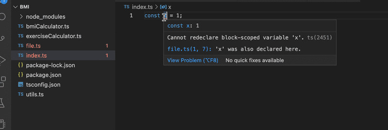  
En realidad esto no es del todo cierto. Esta regla solamente aplica a archivos que son tratados como "scripts". Un archivo es un script si no contiene ninguna declaración de exportación o importación. Si un archivo las posee, entonces el archivo es tratado como un [modulo](https://www.typescriptlang.org/docs/handbook/modules/introduction.html), `y` las variables no son definidas en el scope de bloque.

# Ejercicios 9.4. - 9.5.

## 9.4 Express

Agrega Express a tus dependencias y crea un endpoint HTTP GET `hello` que responda 'Hello Full Stack!'  
La aplicación web debe iniciarse con los comandos `npm start` en modo de producción y con `npm run dev` en modo de desarrollo, este último debe usar `ts-node-dev` para ejecutar la aplicación.  
Reemplaza también tu archivo `tsconfig.json` existente con el siguiente contenido:

```json
{
  "compilerOptions": {
    "noImplicitAny": true,
    "noImplicitReturns": true,
    "strictNullChecks": true,
    "strictPropertyInitialization": true,
    "strictBindCallApply": true,
    "noUnusedLocals": true,
    "noUnusedParameters": true,
    "noImplicitThis": true,
    "alwaysStrict": true,
    "esModuleInterop": true,
    "declaration": true
  }
}
```

¡Asegúrate de que no haya errores!

## 9.5 WebBMI

Agrega un endpoint para la calculadora de IMC que se pueda usar haciendo una solicitud HTTP GET al endpoint `bmi` y especificando el input con [query string parameters](https://en.wikipedia.org/wiki/Query_string). Por ejemplo, para obtener el IMC de una persona que tiene una altura de 180 y un peso de 72, la URL es http://localhost:3002/bmi?height=180&weight=72  
La respuesta es un json con este formato:

```json
{
  "weight": 72,
  "height": 180,
  "bmi": "Normal (healthy weight)"
}
```

Consulta la [documentación de Express](https://expressjs.com/en/5x/api.html#req.query) para obtener información sobre cómo acceder a los parámetros de consulta.  
Si los parámetros de consulta de la solicitud son del tipo incorrecto o faltan, se proporciona una respuesta con el código de estado y el mensaje de error adecuados:

```json
{
  "error": "malformatted parameters"
}
```

No copies el código de la calculadora en el archivo `index.ts`, conviértelo en un [módulo de Typescript](https://www.typescriptlang.org/docs/handbook/modules/introduction.html) que se pueda importar en `index.ts`.

# Ejercicios 9.6. - 9.7.

## 9.6 ESlint

Configura tu proyecto para utilizar la configuración de ESlint que vimos en la parte anterior y corrige todas las advertencias.

## 9.7 WebExercises

Agrega un endpoint a tu aplicación para la calculadora de ejercicio. Debe usarse haciendo una solicitud HTTP POST al endpoint http://localhost:3002/exercises con el siguiente input en el cuerpo de la solicitud:

```json
{
  "daily_exercises": [1, 0, 2, 0, 3, 0, 2.5],
  "target": 2.5
}
```

La respuesta es un json con la siguiente forma:

```json
{
  "periodLength": 7,
  "trainingDays": 4,
  "success": false,
  "rating": 1,
  "ratingDescription": "bad",
  "target": 2.5,
  "average": 1.2142857142857142
}
```

Si el cuerpo de la solicitud no tiene el formato correcto, se da una respuesta con un código de estado y un mensaje de error adecuados. El mensaje de error es

```json
{
  "error": "parameters missing"
}
```

o

```json
{
  "error": "malformatted parameters"
}
```

dependiendo del error. Esto último ocurre si los valores de entrada no tienen el tipo correcto, por ejemplo, no son números ni se pueden convertir en números.  
En este ejercicio, puede que te resulte beneficioso utilizar el tipo `any explícito` cuando manejes los datos en el body de la solicitud. Nuestra configuración de ESlint evita esto, pero puedes deshabilitar esta regla para una línea en particular insertando el siguiente comentario como la línea anterior:

```typescript
// eslint-disable-next-line @typescript-eslint/no-explicit-any
```

También podrías meterte en problemas con las reglas `no-unsafe-member-access` y `no-unsafe-assignment`. Estas reglas pueden ser ignoradas en este ejercicio.  
Ten en cuenta que debes tener una configuración correcta para poder acceder al cuerpo de la solicitud, consulta la [parte 3](https://fullstackopen.com/es/part3/node_js_y_express#recibiendo-informacion).

# Ejercicios 9.8. - 9.9.

**Antes de comenzar los ejercicios**  
Para este conjunto de ejercicios, desarrollaras un backend para un proyecto existente llamado **Patientor**, que es una aplicación simple de registros médicos para doctores que manejan diagnósticos e información básica de la salud de sus pacientes.  
El [frontend](https://github.com/fullstack-hy2020/patientor) ya ha sido creado por expertos externos y tu tarea es crear un backend para darle soporte al código existente.

## ADVERTENCIA

Bastante a menudo, VS code pierde el registro de lo que realmente esta pasando en el código y muestra advertencias relacionadas al tipo o estilo a pesar de que el código ya ha sido arreglado. Si esto sucede (a mi me ha sucedido bastante seguido), cierra y vuelve a abrir el archivo que te da problemas o simplemente reinicia el editor. También es bueno asegurarse de que todo realmente funciona ejecutando el compilador y ESlint desde la linea de comandos:

```bash
npm run tsc
npm run lint
```

Cuando lo ejecutamos en la linea de comandos obtienes el "resultado real". Entonces, ¡no confíes demasiado en el editor!

## 9.8: Patientor backend, paso 1

Inicializa un nuevo proyecto de backend que será utilizado por el frontend. Configura ESlint y tsconfig con las mismas configuraciones que se utilizan en el material. Define un endpoint que responda a las solicitudes HTTP GET para la ruta `/api/ping`.  
El proyecto debería poder ejecutarse con scripts npm, tanto en modo de desarrollo y como código compilado, en modo de producción.

## 9.9: Patientor backend, paso 2

Haz un fork y clona el proyecto [patientor](https://github.com/fullstack-hy2020/patientor). Inicia el proyecto con la ayuda del archivo README.  
Deberías poder usar el frontend sin un backend que funcione.  
Asegúrate de que el backend responda a la solicitud de ping que el `frontend` ha realizado al inicio. Verifica la herramienta para desarrolladores para asegurarte de que realmente funciona:
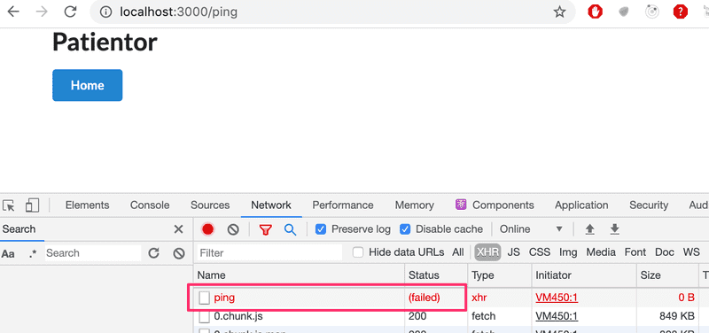  
Es posible que también quieras echarle un vistazo a la pestaña `console`. Si algo falla, la [parte 3](https://fullstackopen.com/es/part3) del curso muestra cómo se puede resolver el problema.

# Ejercicios 9.10. - 9.11.

De manera similar al servicio de vuelo de Ilari, no usamos una base de datos real en nuestra aplicación, sino que usamos datos codificados, es decir, en los archivos [diagnoses.ts](https://github.com/fullstack-hy2020/misc/blob/master/diagnoses.ts) y [patients.ts](https://github.com/fullstack-hy2020/misc/blob/master/patients.ts). Obten los archivos y guárdalos en un directorio llamado data en tu proyecto. Todas la modificaciones de datos se pueden realizar en la memoria de ejecución, por lo que durante esta parte `no es necesario escribir a un archivo`.

## 9.10: Patientor backend, paso 3

Crea un tipo `Diagnose` y utilízalo para crear un endpoint `/api/diagnoses` para obtener todos los diagnósticos con HTTP GET.  
Estructura tu código correctamente utilizando directorios y archivos con nombres apropiados.  
**Ten en cuenta** que `diagnoses` pueden contener o no el campo `latin`. Es posible que quieras utilizar [propiedades opcionales](https://www.typescriptlang.org/docs/handbook/2/everyday-types.html#optional-properties) en la definición de tipos.

## 9.11: Patientor backend, paso 4

Crea el tipo de datos `Patient` y configura un endpoint GET `/api/patients` que devuelva todos los pacientes al frontend, excluyendo el campo `ssn`. Utiliza un [tipo de utilidad](https://www.typescriptlang.org/docs/handbook/utility-types.html) para asegurarte de que estas seleccionando y devolviendo solo los campos deseados.  
En este ejercicio, puedes asumir que el campo `gender` tiene el tipo `string`.    
Prueba el endpoint con el navegador y asegúrate de que `ssn` no esté incluido en la respuesta:  
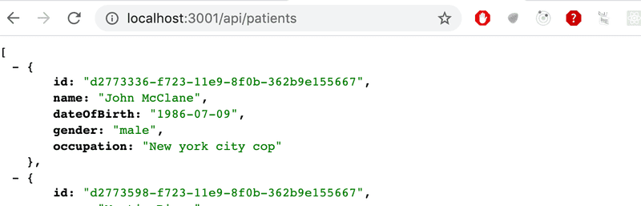    
Después de crear el endpoint, asegúrate de que el `frontend` muestre la lista de pacientes:  
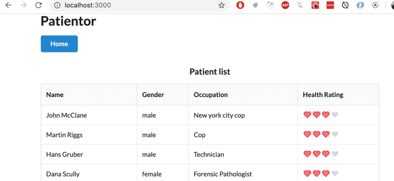

# Ejercicios 9.12. - 9.13.

## 9.12: Patientor backend, paso 5

Cree un endpoint POST `/api/patients` para agregar pacientes. Asegúrate de que también puedas agregar pacientes desde el frontend. Puedes crear ids únicos de tipo `string` usando la librería [uuid](https://github.com/uuidjs/uuid):

```typescript
import { v1 as uuid } from "uuid";
const id = uuid();
```

## 9.13: Patientor backend, paso 6

Configura parsing seguro, validación y predicado de tipos en la solicitud POST `/api/patients`.  
Refactoriza el campo `gender` para usar un [tipo enum](https://www.typescriptlang.org/docs/handbook/enums.html).

# Ejercicio 9.14.

## 9.14.

Crea una nueva aplicación Vite con TypeScript.

Este ejercicio es similar al que ya hiciste en la [Parte 1](https://fullstackopen.com/es/part1/java_script#ejercicios-1-3-1-5) del curso, pero con TypeScript y algunos ajustes adicionales. Comienza modificando el contenido de `main.tsx` a lo siguiente:

```tsx
import ReactDOM from "react-dom/client";
import App from "./App";

ReactDOM.createRoot(document.getElementById("root")!).render(<App />);
```

y `App.tsx`:

```tsx
const App = () => {
  const courseName = "Half Stack application development";
  const courseParts = [
    {
      name: "Fundamentals",
      exerciseCount: 10,
    },
    {
      name: "Using props to pass data",
      exerciseCount: 7,
    },
    {
      name: "Deeper type usage",
      exerciseCount: 14,
    },
  ];

  const totalExercises = courseParts.reduce(
    (sum, part) => sum + part.exerciseCount,
    0
  );

  return (
    <div>
      <h1>{courseName}</h1>
      <p>
        {courseParts[0].name} {courseParts[0].exerciseCount}
      </p>
      <p>
        {courseParts[1].name} {courseParts[1].exerciseCount}
      </p>
      <p>
        {courseParts[2].name} {courseParts[2].exerciseCount}
      </p>
      <p>Number of exercises {totalExercises}</p>
    </div>
  );
};

export default App;
```

y elimina los archivos innecesarios.  
Toda la aplicación ahora está en un componente. Esto no es lo que queremos, así que refactoriza el código para que conste de tres componentes: `Header`, `Content` y `Total`. Todos los datos aún se mantienen en el componente `App`, que pasa todos los datos necesarios a cada componente como props. `¡Asegúrate de agregar declaraciones de tipo para los props de cada componente!`  
El componente `Header` debe encargarse de mostrar el nombre del curso. `Content` debe mostrar los nombres de las diferentes partes y la cantidad de ejercicios en cada parte, y `Total` debe mostrar la suma total de ejercicios en todas las partes.  
El componente `App` debería verse algo así:

```tsx
const App = () => {
  // const-declarations

  return (
    <div>
      <Header name={courseName} />
      <Content ... />
      <Total ... />
    </div>
  );
};
```

# Ejercicio 9.15.

## 9.15.

Continuemos extendiendo la aplicación creada en el ejercicio 9.14. Primero, agrega la información del tipo y reemplaza la variable `courseParts` con la del ejemplo siguiente.

```typescript
interface CoursePartBase {
  name: string;
  exerciseCount: number;
}

interface CoursePartBasic extends CoursePartBase {
  description: string;
  kind: "basic";
}

interface CoursePartGroup extends CoursePartBase {
  groupProjectCount: number;
  kind: "group";
}

interface CoursePartBackground extends CoursePartBase {
  description: string;
  backgroundMaterial: string;
  kind: "background";
}

type CoursePart = CoursePartBasic | CoursePartGroup | CoursePartBackground;

const courseParts: CoursePart[] = [
  {
    name: "Fundamentals",
    exerciseCount: 10,
    description: "This is an awesome course part",
    kind: "basic",
  },
  {
    name: "Using props to pass data",
    exerciseCount: 7,
    groupProjectCount: 3,
    kind: "group",
  },
  {
    name: "Basics of type Narrowing",
    exerciseCount: 7,
    description: "How to go from unknown to string",
    kind: "basic",
  },
  {
    name: "Deeper type usage",
    exerciseCount: 14,
    description: "Confusing description",
    backgroundMaterial:
      "https://type-level-typescript.com/template-literal-types",
    kind: "background",
  },
  {
    name: "TypeScript in frontend",
    exerciseCount: 10,
    description: "a hard part",
    kind: "basic",
  },
];
```

Ahora sabemos que ambas interfaces `CoursePartBasic` y `CoursePartBackground` comparten no solo los atributos base, sino también un atributo llamado `description`, que es un string en ambas interfaces.  
Tu primera tarea es declarar una nueva interface, que incluya el atributo `description` y extienda la interfaz de `CoursePartBase`. Luego, modifica el código para que puedas eliminar el atributo `description` de `CoursePartBasic` y de `CoursePartBackground` sin obtener ningún error.  
A continuación, crea un componente `Part` que muestre todos los atributos de cada tipo de parte del curso. ¡Utiliza un switch case basado en verificación de tipos exhaustiva! Utiliza el nuevo componente en el componente `Content`.  
Por último, agrega otra parte del curso con los siguientes atributos: `name`, `exerciseCount`, `description` y `requirements`, el último siendo un array de strings. Los objetos de este tipo se ven de la siguiente manera:

```typescript
{
  name: "Backend development",
  exerciseCount: 21,
  description: "Typing the backend",
  requirements: ["nodejs", "jest"],
  kind: "special"
}
```

Luego agrega esa interfaz a la unión de tipos `CoursePart` y agrega los datos correspondientes a la variable `courseParts`. Ahora, si no has modificado tu componente `Content` correctamente, deberías recibir un error, porque aún no has agregado soporte para el cuarto tipo de parte del curso. Realiza los cambios necesarios a `Content`, para que todos los atributos de la nueva parte del curso también se muestren y el compilador no produzca ningún error.    
El resultado podría verse así:  
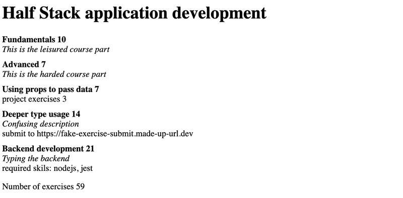

# Ejercicios 9.16 - 9.19

Ahora construyamos un frontend para la aplicación de diarios de vuelo de Ilari que fue desarrollada [en la sección anterior](https://fullstackopen.com/es/part9/tipando_una_aplicacion_express). El código fuente del backend puede encontrarse en [este repositorio de GitHub](https://github.com/fullstack-hy2020/flight-diary).

## Ejercicio 9.16

Crea una aplicación React con Typescript con configuraciones similares a las de las aplicaciones de esta sección. Obtén los diarios del backend y muéstralos en la pantalla. Haz todo el tipado requerido y asegúrate de que no hay errores de ESlint.  
Recuerda mantener abierta la pestaña network. Podría darte una pista importante...  
Puedes decidir como las entradas de los diarios son mostradas. Si lo deseas, podrías inspirarte en la figura de abajo. Ten en cuenta que la API del backend no devuelve los comentarios del diario, podrías modificarlo para que también los devuelva en la solicitud GET.

## Ejercicio 9.17

Haz que sea posible agregar nuevas entradas al diario desde el frontend. En este ejercicio puedes saltarte todas las validaciones y asumir que el usuario entra los datos en el formato correcto.

## Ejercicio 9.18

Notifica al usuario si la creación de una entrada del diario falla en el backend, muestra también el motivo del fallo.  
Por ejemplo, dale un vistazo a [esto](https://dev.to/mdmostafizurrahaman/handle-axios-error-in-typescript-4mf9) para ver como puedes estrechar los errores de Axios para que puedas hacerte con el mensaje de error.  
Tu solución podría verse así:  
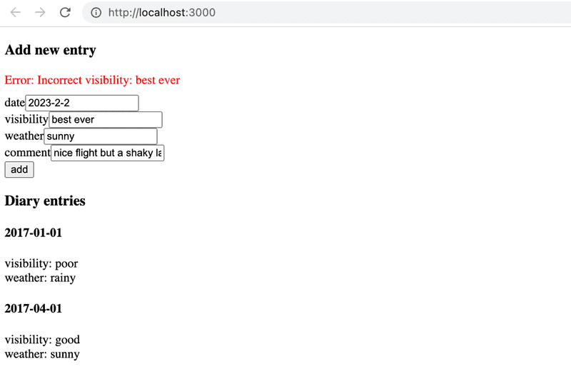

## Ejercicio 9.19

La adición de una entrada de diario ahora es muy susceptible a errores ya que el usuario puede escribir cualquier cosa en los inputs. La situación debe ser mejorada.  
Modifica el input del formulario para que la fecha se defina con un elemento de input de tipo [date](https://developer.mozilla.org/en-US/docs/Web/HTML/Reference/Elements/input/date), y el clima y la visibilidad se definan con [radio buttons](https://developer.mozilla.org/en-US/docs/Web/HTML/Reference/Elements/input/radio). Ya hemos utilizado radio buttons en la [parte 6](https://fullstackopen.com/es/part6/muchos_reducers#store-con-estado-complejo), ese material puede ser util o no...  
Tu aplicación debería estar bien tipada todo el tiempo, no debería tener ningún error de ESlint y ninguna regla de ESlint debería ser ignorada.  
Tu solución podría verse así:  


# Ejercicios 9.20. - 9.21.

Pronto agregaremos un nuevo tipo para nuestra aplicación, `Entry`, que representa una entrada de diario de paciente liviana. Consiste en el texto del diario, es decir , `description`, una fecha de creación, información sobre el especialista que la creó y posibles códigos de diagnóstico. Los códigos de diagnóstico se asignan a los códigos ICD-10 devueltos desde el endpoint `/api/diagnoses`. Nuestra implementación ingenua será que un paciente tiene un array de entradas.  
Antes de entrar en esto, hagamos algunos trabajos preparatorios.

## 9.20: Patientor, paso 1

Crea un endpoint `/api/patients/:id` en el backend que devuelva toda la información del paciente para un paciente, incluyendo el array de entradas de pacientes que todavía está vacío para todos los pacientes. Por el momento, expande los tipos del backend de la siguiente manera:

```typescript
// eslint-disable-next-line @typescript-eslint/no-empty-interface
export interface Entry {}

export interface Patient {
  id: string;
  name: string;
  ssn: string;
  occupation: string;
  gender: Gender;
  dateOfBirth: string;

  entries: Entry[];
}

export type NonSensitivePatient = Omit<Patient, "ssn" | "entries">;
```

La respuesta debe tener el siguiente aspecto:  
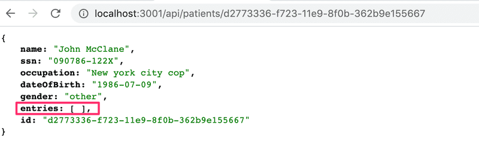

## 9.21: Patientor, paso 2

Crea una página para mostrar la información completa de un paciente en el frontend.  
El usuario debe poder acceder a la información de un paciente haciendo click en el nombre del paciente.  
Obtén los datos del endpoint creado en el ejercicio anterior.  
Puedes usar [MaterialUI](https://mui.com/material-ui/) para los nuevos componentes pero eso depende de ti ya que ahora nuestro enfoque principal es TypeScript.  
Es posible que quieras echarle un vistazo a la [parte 7](https://fullstackopen.com/es/part7/react_router) si aún no comprendes cómo funciona [React Router](https://reactrouter.com/6.28.0/start/tutorial).  
El resultado podría verse así:  
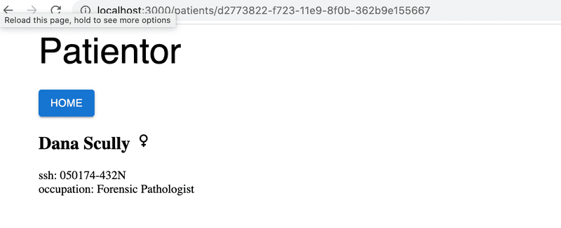  
El ejemplo usa [Material UI Icons](https://mui.com/material-ui/material-icons/) para representar los géneros.

# Ejercicios 9.22 - 9.29

¡Ahora estamos listos para darle los toques finales a la aplicación!

## 9.22: Patientor, paso 3

Define los tipos `OccupationalHealthCareEntry` y `HospitalEntry` para que se ajusten a los nuevos datos de ejemplo. Asegúrese de que su backend devuelva las entradas correctamente cuando vaya a la ruta de un paciente individual  
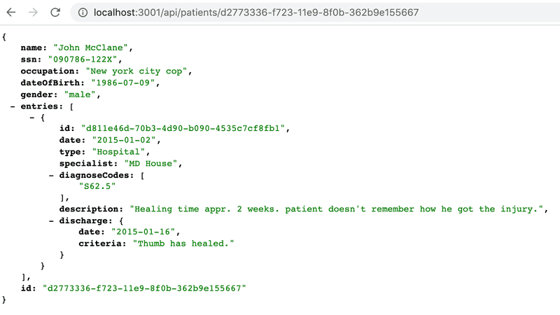

¡Utiliza los tipos correctamente en el backend! Por ahora, no es necesario hacer una validación adecuada para todos los campos de las entradas en el backend, es suficiente, por ejemplo, comprobar que campo `type` tiene un valor correcto.

## 9.23: Patientor, paso 4

Amplía la página de un paciente en el frontend para listar `date`, `description` y `diagnoseCodes` de las entradas del paciente.  
Puedes utilizar la misma definición de tipo para una `Entry` en el frontend. Para estos ejercicios, basta con copiar/pegar las definiciones del backend al frontend.  
Tu solución podría verse así:  
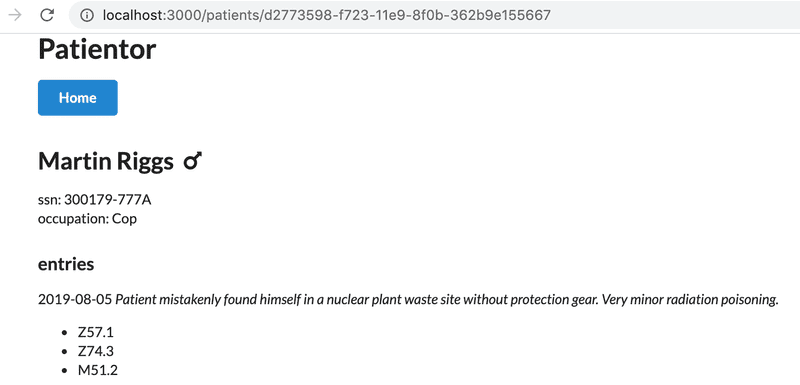

## 9.24: Patientor, paso 5

Obtén y agrega diagnósticos al estado de la aplicación desde el endpoint `/api/diagnoses`. Utiliza los nuevos datos de diagnóstico para mostrar las descripciones de los códigos de diagnóstico del paciente:  
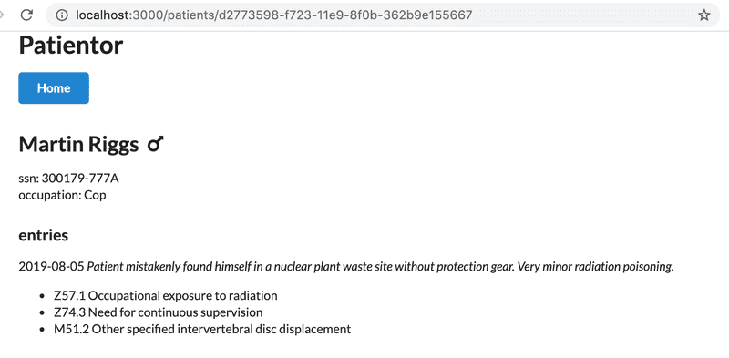

## 9.25: Patientor, paso 6

Amplía la lista de entradas en la página del paciente para incluir los detalles de la entrada, con un nuevo componente que muestra el resto de la información de las entradas de los pacientes, distinguiendo diferentes tipos entre sí.  
Podrías utilizar, por ejemplo. [Icons](https://mui.com/material-ui/material-icons/) o algún otro componente de [Material UI](https://mui.com/) para obtener imágenes apropiadas para tu listado.  
Debes utilizar un renderizado basado en `switch case` y una `comprobación de tipo exhaustiva` para que no se puedan olvidar casos.    
Como esto:  
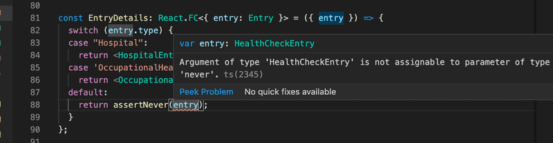    
Las entradas resultantes en la lista `podrían` verse así:    
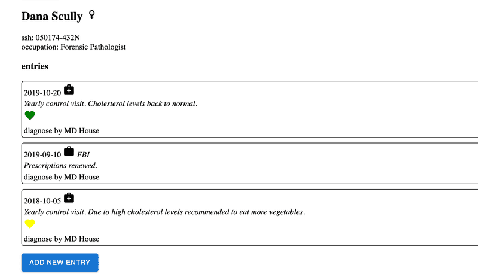

## 9.26: Patientor, paso 7

Hemos establecido que los pacientes pueden tener diferentes clases de entradas. Todavía no tenemos ninguna forma de agregarle entradas a los pacientes en nuestra aplicación, es bastante inútil como registro médico electrónico.  
Tu siguiente tarea es agregar un endpoint `/api/patients/:id/entries` a tu backend, a través del cual puedas hacer un POST para agregar una entrada para un paciente.  
Recuerda que tenemos diferentes tipos de entradas en nuestra aplicación, por lo que nuestro backend debe admitir todos esos tipos y verificar que se proporcionen al menos todos los campos obligatorios para cada tipo.  
En este ejercicio probablemente tengas que recordar [este truco](https://fullstackopen.com/es/part9/grande_finale_patientor#omit-con-uniones)  
Podrías asumir que los códigos de diagnóstico son enviados en el formato correcto y utilizar, por ejemplo, el siguiente tipo de parser para extraerlos del body de la solicitud:

```typescript
const parseDiagnosisCodes = (object: unknown): Array<Diagnosis["code"]> => {
  if (!object || typeof object !== "object" || !("diagnosisCodes" in object)) {
    // we will just trust the data to be in correct form
    return [] as Array<Diagnosis["code"]>;
  }

  return object.diagnosisCodes as Array<Diagnosis["code"]>;
};
```

## 9.27: Patientor, paso 8

Ahora que nuestro backend permite agregar entradas, queremos agregar la funcionalidad correspondiente al frontend. En este ejercicio, debes agregar un formulario para agregarle una entrada a un paciente. Un lugar intuitivo para acceder al formulario sería la página del paciente.  
En este ejercicio es suficiente `admitir un tipo de entrada`. Todos los campos del formulario pueden ser simples inputs de texto, por lo que depende del usuario ingresar valores validos.  
Tras un envío exitoso, la nueva entrada debe agregarse al paciente correcto y las entradas del paciente en la página del paciente deben actualizarse para contener la nueva entrada.  
Tu formulario podría verse así:  
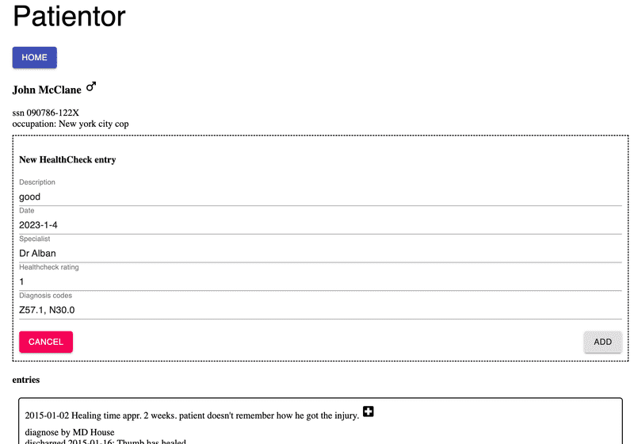  
Si el usuario ingresa valores inválidos en el formulario y el backend rechaza la adición, muestra un mensaje de error apropiado  
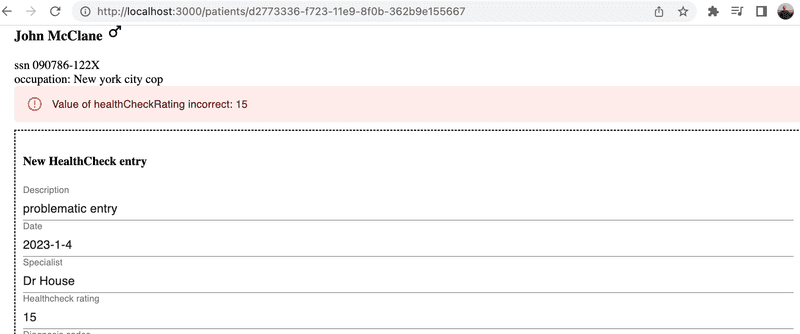

## 9.28: Patientor, paso 9

Amplía tu solución para que admita `todos los tipos de entrada`

## 9.29: Patientor, paso 10

Mejora el formulario de creación de entradas para que sea más difícil entrar fechas incorrectas, códigos de diagnóstico y ratings de salud.  
Tu formulario mejorado podría verse de esta manera:  
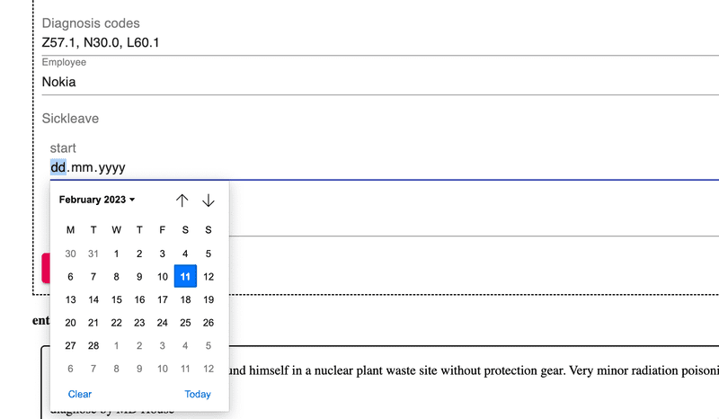  
Los códigos de diagnóstico ahora se configuran con el elemento de Material UI [multiple select](https://mui.com/material-ui/react-select/#multiple-select) y las fechas con el elemento [Input](https://mui.com/material-ui/api/input/) con el tipo [date](https://developer.mozilla.org/en-US/docs/Web/HTML/Reference/Elements/input/date).
